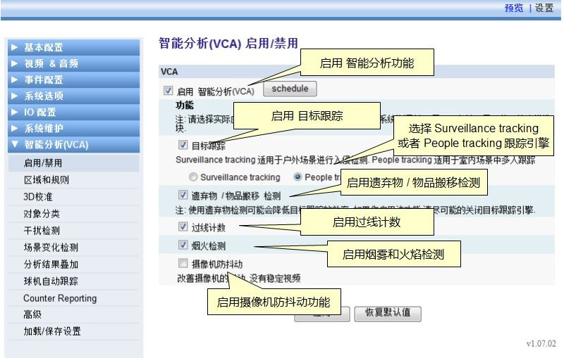

## 启用或禁用VCA

VCA默认是禁用的，在启用VCA之前，请确保此产品已经激活过。选择"智能分析（VCA）"菜单，然后点击"启用/禁用"子菜单。  
选中"启用 智能分析(VCA)"前的复选框并选择需要的模式。  
</img>

### 启用VCA
VCA功能的全局开关。如果此复选框未选中，所有的VCA功能都会被禁用。

### 目标跟踪
目标跟踪模块的全局开关，开启后会有两种不同的跟踪模式可供选择，分别适用不同的应用场景。

#### Surveillance Tracking
适用于入侵检测和一般的户外场景监视与跟踪。相邻的多个物体会被识别为一个物体进行处理。这一模式比People Tracking消耗更少的系统资源。

#### People Tracking
适用于室内场景多人跟踪。在人物间距很小的情况下仍然有较高的可靠性。目标即使被其它人物遮挡，也仍然会被系统持续追踪。  
<strong>注意：</strong>  
- People Tracking比Surveillance Tracking消耗更多的系统资源，所以使用前者时，输出视频的帧率（frame rate）可能会降低。
- 正确的三维校准可以提高系统可靠性。
- People Tracking模式需要 VCApro许可证。
 
下面两幅图展示了Surveillance Tracking和People Tracking在跟踪间距很小的人物时的不同结果。