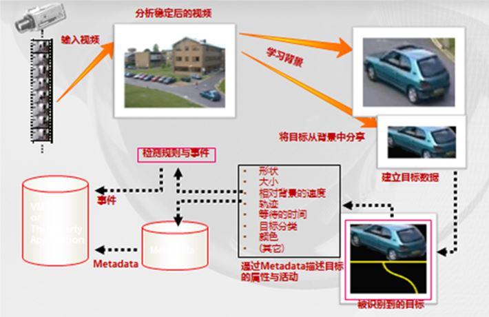

## VCA 工作原理

VCA的工作原理是将画面中移动的目标与静止背景进行分离，并使用Metadata来描述目标的相关信息，并根据相关检测规则判断是否需要发出警报。  

支持哪些网络协议  
可以支持的网络协议：QoS Layer 3 DiffServ, TCP/IP, UDP/IP, HTTP, RTSP, RTCP, RTP/UDP, RTP/TCP, mDNS, UPnP, SMTP, DHCP, DNS, DynDNS, NTP, SNMPv1/v2c/v3(MIB-II), IGMP, ICMP, SSLv2/v3, TLSv1，OnVif, RTMP