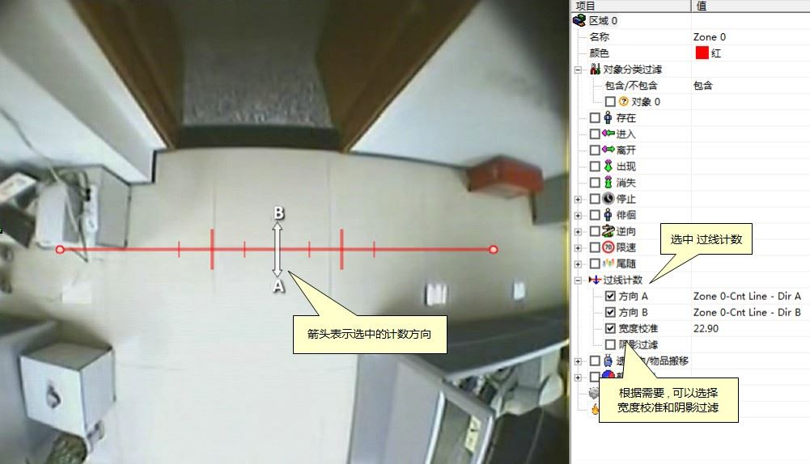
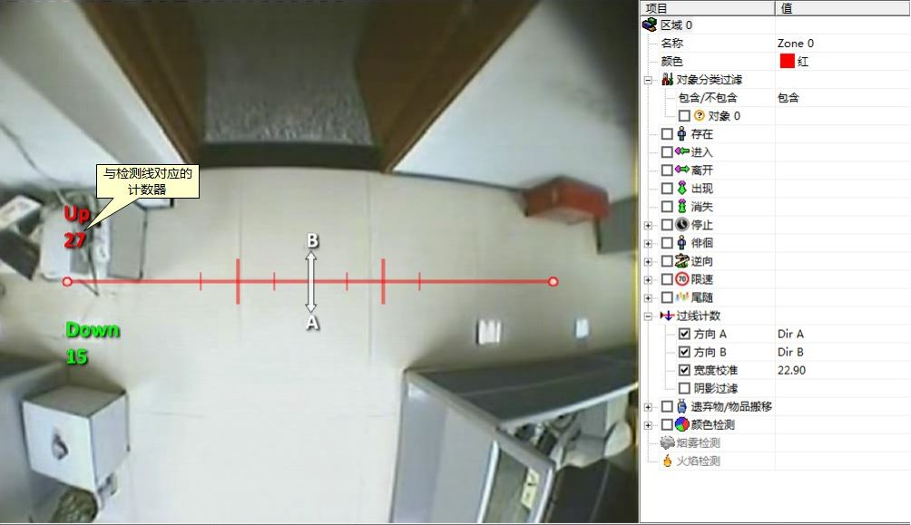
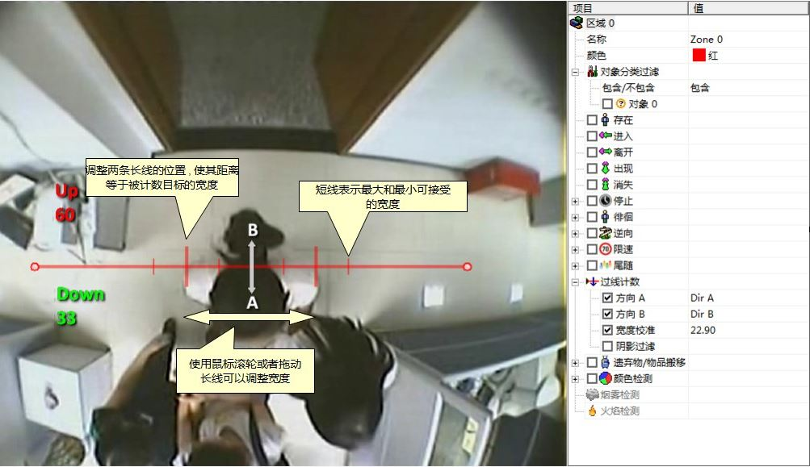
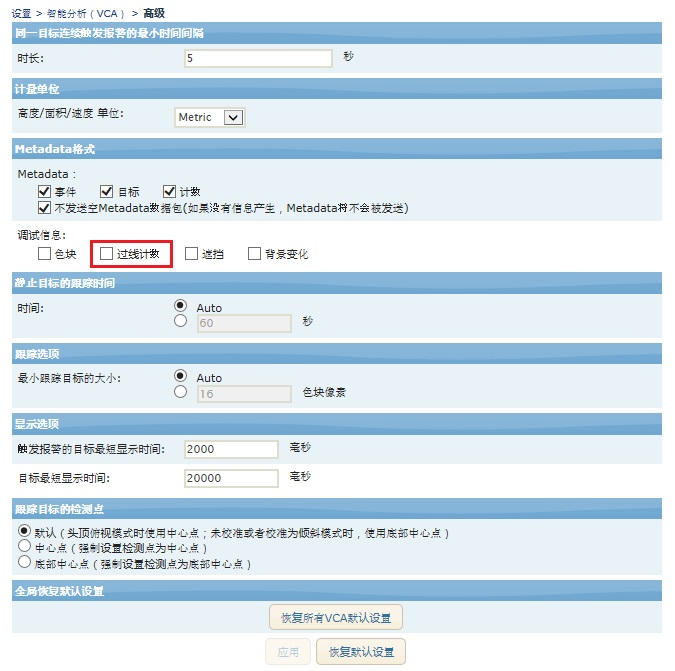
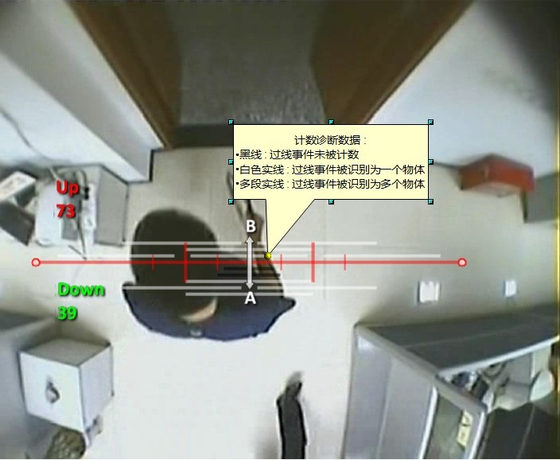

## 过线计数（Counting Line）

过线计数功能是为繁忙场景下的目标(如人和车）双向计数设计的，比如：  
 - 零售业中俯拍摄像机的人数统计。
 - 高速公路的俯拍摄像机车辆计数。

过线计数功能要求具备VCAretail许可证。与VCAsurveillance提供的计数功能相比，过线计数的效果更加精确。  
注意：每个视频通道最多可以设置5个过线计数规则。  

#### 启用过线计数
选择相应的检测线后，在右侧的规则设置窗口内，在"过线计数"前打勾即可启用此功能。物体沿设定的方向穿过检测线时会产生事件（event），多个物体同时穿过检测线时每个物体都会产生一个事件（event）。检测线产生的事件可以被关联到计数器（counter）。  

#### 为过线计数设置计数器
检测线在检测到过线物体时只是产生事件（event），如果要实际计数则需要创建并配置对应的计数器（counters）。创建计数器请参考计数器主题。  

#### 校准过线计数
为获得精确的计数，需要产生对过线计数进行校准。与VCAsurveillance不同，过线计数无法使用三维校准工具在所有场景上统一校准。因为过线计数并非全都设置为水平方向：它可以设置在任何场景的任何方向。 比如我们可以使用一个侧挂式摄像机进行垂直方向的计数。过线计数使用另外一套设置工具。检测线上与中心等距的两条细线表示过线物体的宽度，用于排除干扰和区分同时过线的多个物体。  
校准过线计数的步骤：  
- 使用鼠标选择需要校准的计数线；
- 在右侧窗口中"过线计数"规则下的"宽度校准"前打勾；
- 通过滚动鼠标滚轮或者拖动检测线上两条长的细线来调整它们的距离，使两条长的细线的间距近似等于过线计数的物体大小。
- 校准后的实际宽度显示在"过线计数"规则下的"宽度校准"一栏。这个数字表示校准宽度占整个画面宽度的百分比，我们也可以手动直接修改这个数字。
- 每条长线两侧的短线分别通过检测线的单个物体最小和最大宽度。
- 点击下方的"应用"，使所有设置生效。

#### 阴影过滤
可以启用"阴影过滤"功能消除物体影子对过线计数的影响。影子会让系统认为物体更大或者将多个物体识别为一个，从而影响计数结果。如果物体的影子确实造成计数结果不准确，则可以通过勾选"阴影过滤"来启用这一功能。只有在物体存在影子的情况下才可以开启这一功能，否则系统会将正常物体的一部分识别为影子，从而使计数结果更加不准确。  

#### 校准诊断模式
用户可以启用校准诊断模式，根据计数结果更加精确的校准过线计数。  
要启用这一模式，请在 VCA 高级设置 页面的"诊断Metadata"下勾选"过线计数"。  

启用校准诊断模式后，诊断结果以黑线或者白线的形式显示在计数线旁边。每条线代表被检测到的一个过线物体，线的长度代表过线物体的宽度。总共可以显示最近过线的五个物体，离检测线最近的线表示最后过线的物体。每条线代表某个数目的实际物体（由校准宽度决定）：  
- 黑线：过线事件未被纳入计数结果；
- 白色的实线：过线事件被识别为一个物体；
- 多段白线：过线事件被识别为多个物体，有几段白线就代表被识别为几个物体。
 
结合诊断模式下的反馈结果，可以依据实际物体大小对校准宽度进行微调，使计数结果更加准确。  

