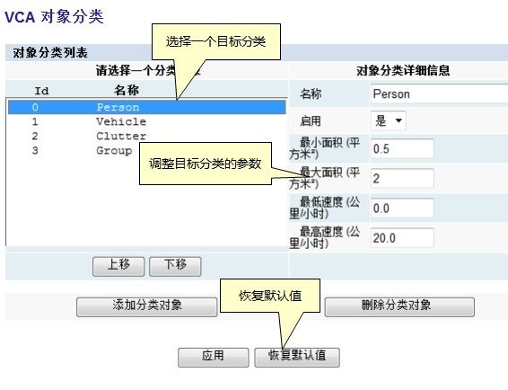

## 目标分类

在完成对摄像机的3D校准后，VCAsys可以基于目标的属性比如面积和速度对目标进行分类。系统内置了一些比较常见的分类，通常不需要修改。  
某些特殊情况下，如果需要修改某种分类的参数或者添加新的目标分类，可以点击"对象分类"进入设置页面，然后点击对应的分类进行修改。

如下图所示，可以修改目标的最小/最大速度/面积，修改完成后点击"应用"即可生效。  
没有被归入任何分类的目标会被识别为"Unclassified"。