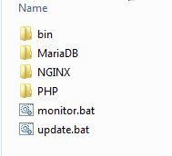
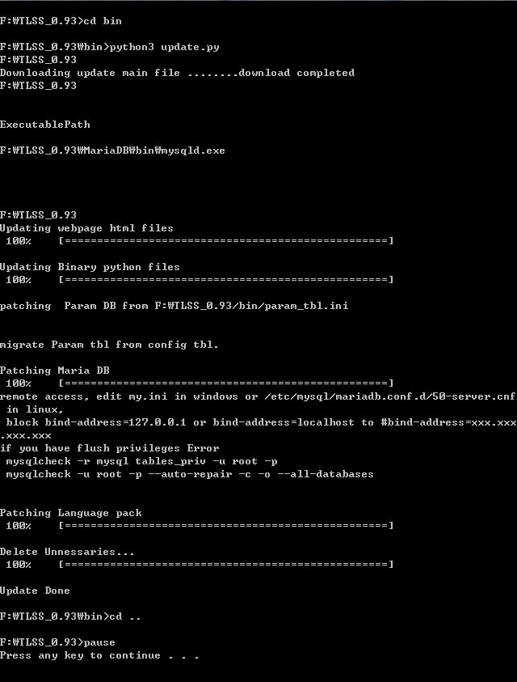
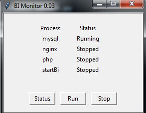

## COSILAN 安装程序-windows64, V0.93

<strong style="color: rgb(230, 0, 0);">** 不建议用 版本,建议用最新版本</strong>
- Package 内用
- Webserver : Nginx
- PHP: php-fpm
- MariaDB
- Cosilan Binary and web page

### Windows 系统上 安装方式
1. 下载最新的程序, [下载](http://49.235.119.5/download.php?file=cosilanFull093.zip)  

2. 解压  
<<注意>> 文件夹 名称中 不能放 中文字（只要英文）
D:\Cosilan_0.93\ (O)
D:\计数软件\ (X)
C:\Document and Setting\ (X) : 空格不行
  

3. <strong style="color: rgb(0, 102, 204);">如果 要保存 以前的数据， 拷贝 以前数据库 到 新的数据库文件夹</strong>
<strong style="color: rgb(0, 102, 204);">D:\TLSS_0.92\Mariadb\data => D:\TLSS_0.93\Mariadb\data</strong>  

4. 升级(update.bat) 点击 update.bat  
  

5. 运行 (monitor.bat)
  
点击 Run