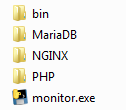
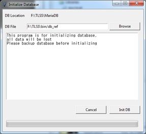
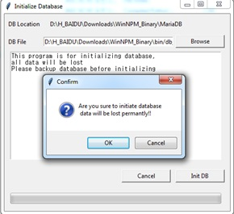
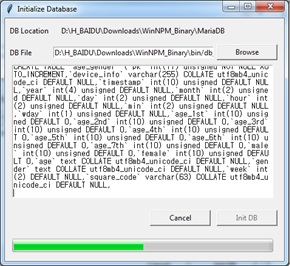
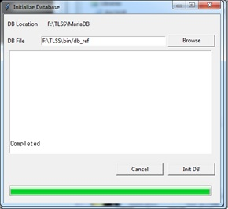
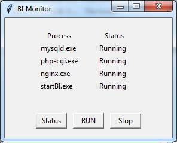
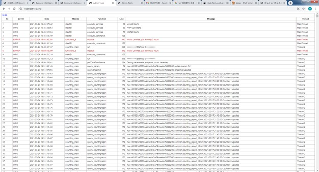

## 安装程序-windows64, V0.92

### Package 内用
- Webserver : Nginx
- PHP: php-fpm
- MariaDB
- Cosilan Binary and web page

### Windows 系统上 安装方式
1)  下载最新的程序, [下载](http://49.235.119.5/download.php?file=cosilanFullWin64.tar.gz) 

2)  解压
 <<注意>> 文件夹 名称中 不能放 中文字（只要英文）
	> D:\Cosilan\0.92\  (O)
	> D:\计数软件\    (X)

3) 初始化 数据库

5) 访问 http://localhost/log.php 或者 http://{server}/log,php

如 没有 激活码， 智能 运行 3个小时。其他 功能 没问题。