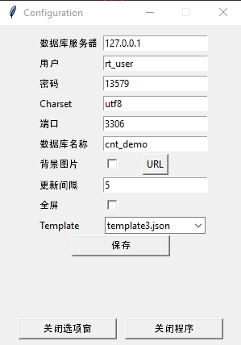
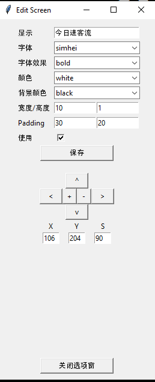
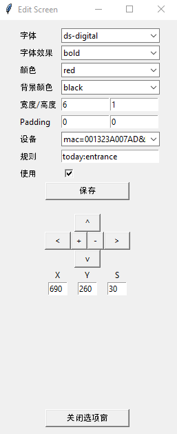
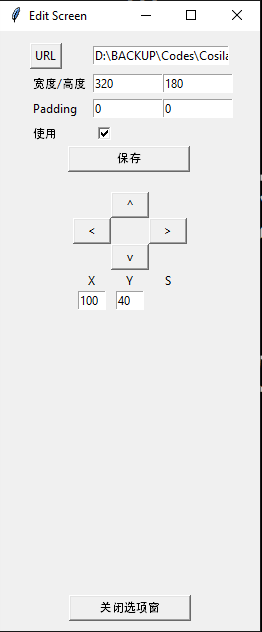
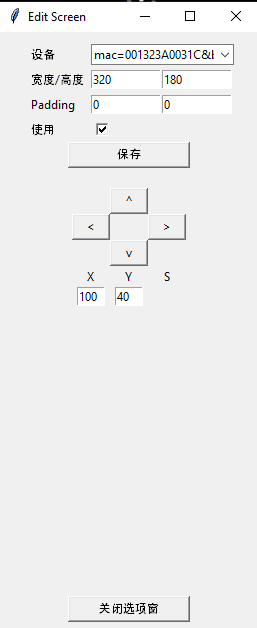

## 实时 预览数据

#### 显示画面


#### 系统 设置
按 鼠标 右侧按键 弹出 系统设置画面  

- 数据库服务器 ： 平台运行的 IP 地址
- 用户： 数据库(MariaDB 或者Mysql) 用户， 一般 rt_user
- 密码： 数据库用户密码
- charset: utf8
- 端口： 数据库 端口， 默认3306
- 数据库名称： 计数数据， 数据库名称， 默认 cnt_demo
- 背景图片： 是否用背景画面， 要选择的话 按URL可以选
- 更新间隔： 画面更新时间间隔， 1~5秒
- 全屏： 是否用全拼
- Template: 画面文件

  
#### 画面文件（Template）
鼠标 左侧按键 双击 弹出 画面设置画面  
#### [文字]

- 显示：  显示的 内用
- 字体 ： 字体
- 字体效果 ： bold, italic, normal 等
- 颜色 ： 字体 颜色
- 背景颜色 ： 字体 背景 颜色
- 宽度/高度 ： 字体箱子的 宽度跟高度
- Padding ： 字体箱子边跟 内部字体的距离（x, y）
- 使用 ： 是否 显示
- X,Y,S ： 位置X， 位置Y， 字体大小S

name 开始 label~ 或者 title~
```
{
        "color": [ "white", "black"   ],
        "flag": "y",
        "font": [ "simhei",  80, "italic" ],
        "name": "title0",
        "padding": [ 0, 0 ],
        "position": [ 607, 40 ],
        "size": [ 0, 1 ],
        "text": "客流报表"
},
```

#### [数字]

- 字体 ： 字体
- 字体效果 ： bold, italic, normal 等
- 颜色 ： 字体 颜色
- 背景颜色 ： 字体 背景 颜色
- 宽度/高度 ： 字体箱子的 宽度跟高度
- Padding ： 字体箱子边跟 内部字体的距离（x, y）
- 设备： 显示 数据的设备名称， 入显示 全设备合计 选'all'
- 规则： 显示数据的规则**
- 使用 ： 是否 显示
- X,Y,S ： 位置X， 位置Y， 字体大小S

** 规则
用法： [sum/diff/div/percent](datetime:ct_label, datetime:ct_label, ...) 
sum:合计
diff: 差异
div: 比率
percent: 百分比
datetime : today, yesterday, thismonth, thisyear

Ex)
sum(today:Entrance, today:Exit) ：显示 今天的Entrance+今天的Exit
sum(today:Entrance, today:Exit, today:Outside, yesterday:Entrance) : 显示 今天的 Entrance+Exit+Ouside+昨天的Entrance
diff(today:Entrance, today:Exit) : 显示 今天Entrance-今天Exit
div( today:Entrance, yesterday:Entrance): 显示  今天Entrance/昨天Entrance
percent( today:Entrance, yesterday:Entrance): 显示  今天Entrance/昨天Entrance *100

name 开始 number~
```
{
        "color": [ "red",  "black" ],
        "device_info": "all",
        "flag": "y",
        "font": ["ds-digital", 120, "bold"  ],
        "name": "number3",
        "padding": [ 0, 0 ],
        "position": [ 980, 770  ],
        "rule": "yesterday:entrance",
        "size": [ 8,  1 ]
},
```

#### [图片]

- URL： 显示图片的 径路
- 宽度/高度 ：图片的 宽度跟高度
- Padding ： 图片箱子边跟 内部图片的距离（x, y）
- 使用 ： 是否 显示 
- X,Y ： 位置X， 位置Y

name 开始 picture~
```
{
        "flag": "y",
        "name": "picture_D",
        "padding": [ 0,  0 ],
        "position": [ 1300,  42  ],
        "size": [ 320,  180 ],
        "url": "D:\\BACKUP\\Codes\\Cosilan\\bin\\d.png"
},
```

#### [抓拍]

- 设备： 显示 抓拍的设备名称
- 宽度/高度 ：抓拍的 宽度跟高度
- Padding ：抓拍箱子边跟 内部抓拍的距离（x, y）
- 使用 ： 是否 显示
- X,Y ： 位置X， 位置Y


name 开始 snapshot~
```
{
        "device_info": "mac=001323A007AD&brand=CAP&model=NS6202HD",
        "flag": "y",
        "name": "snapshot_B",
        "padding": [ 0,  0 ],
        "position": [ 500,  40 ],
        "size": [ 320,  180 ]
},
