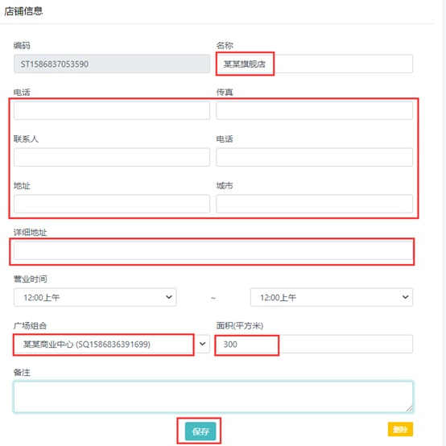
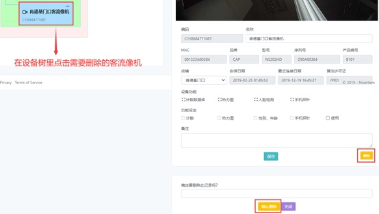

## Cosilan 网页 指南- 用户

### 一、登录客流管理平台

1）打开浏览器，输入软件所安装的电脑的IP地址，即托管服务器IP地址。

2） 输入用户名和密码。	默认账号（初始用户名）：root	初始密码：rootpass

### 二、用户账号注册
#### 新用户注册
在登陆页面点击用户注册。	本地部署客流管理平台和公有云部署客流管理平台用户注册步骤一致。  

输入子账号名称、电子邮箱、密码，点击开通账号。  
 

#### 账号授权
退出用户注册页面，用管理员账号登录客流管理平台进行受权。  
1. 点击右上角管理员，再点击“管理者项目”  

2. 点击“用户”，在“无位账号”里点击刚刚创建的子账号

3. 用户账号受权

### 三、广场和店铺是商业中心的基本分层结构。
用管理员账号登录客流管理平台，点击右上角管理员，再点击“管理者项目”，进入管理页面。  

### 添加广场
1. 点击“设备树”，再点击设备树右侧“…”弹出“添加广场”，点击“添加广场”创建新广场。  
  

2. 填写广场信息  
  

3. 添加广场完成  
  

### 添加店铺
1. 添加店铺： 点击刚刚添加的广场右侧的“…”添加店铺。  
  

2. 完善店铺信息：填写新添加的店铺名称、电话、联系人、地址等信息。  
  
3. 添加店铺完成  
  

### 删除店铺和广场
删除店铺和广场需要最高权限，即root账户权限。  
删除店铺, 点击需要删除的店铺  
  
  

### 删除广场
点击需要删除的店铺  
  

### 四、客流管理平台管理客流设备
#### 平台连接客流像机

<strong style="color: rgb(255, 153, 0);">
注：用托管服务的话， 在添加客流像机之前，客流像机的TLSS(托管服务) 和计数功能、计数报表功能要先设置好，设置步骤详见《<a href="/help/view_markdown.php?pk=37" target="_blank" style="color: rgb(255, 0, 0);">云平台摄像机终端配置指南</a>》。</strong>

每个客流像机都有一个唯一的USN码（序列号）。在客流像机里设置好TLSS(托管服务) 和计数功能、计数报表功能以后，通过客流像机的USN码在客流管理平台可以查看该像机是否已正常上线。  
步骤如下：

1. 进入管理页面
用管理员账号登录客流管理平台，点击右上角管理员，再点击“管理者项目”，进入管理页面。  

2. 进入数据库
> 点击数据库里的“parameter”参数，可以查看客流像机是否上线，有初次上线时间、最近访问时间和状态等信息。状态为绿色表示像机工作正常，平台访问客流像机的数据正常。  

#### 添加客流像机
客流像机须添加到店铺下面， 店铺的名称可以自定义修改。  
1. 添加客流像机
点击店铺右侧“…”，弹出“添加设备”，再点击“添加设备”添加客流像机。  

  

2. 完善客流像机信息并启用相应功能
点击新添加的客流像机进入客流像机功能启用界面，勾选并启用相应的功能、设置计数器标签（请注意计数器出、入方向不要弄反）  

#### 删除客流像机
删除客流像机，点删除后选择管理员账户，然后点击“确认删除”。  
