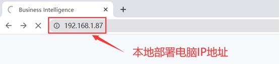
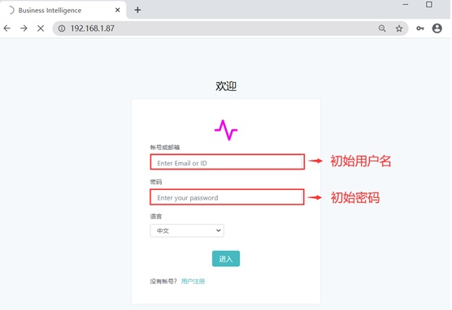
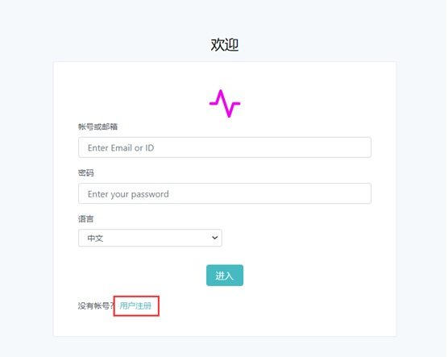
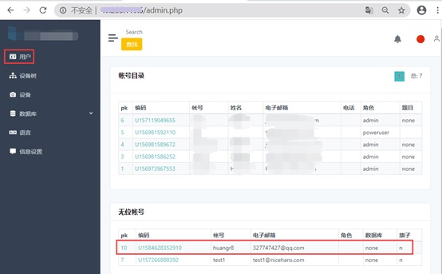

## Cosilan 网页 指南- 用户

### 一、登录客流管理平台

1）打开浏览器，输入软件所安装的电脑的IP地址，即托管服务器IP地址。

2） 输入用户名和密码。	默认账号（初始用户名）：root	初始密码：rootpass

### 二、用户账号注册
#### 新用户注册
在登陆页面点击用户注册。	本地部署客流管理平台和公有云部署客流管理平台用户注册步骤一致。  

输入子账号名称、电子邮箱、密码，点击开通账号。  
 

#### 账号授权
退出用户注册页面，用管理员账号登录客流管理平台进行受权。  
1. 点击右上角管理员，再点击“管理者项目”  

2. 点击“用户”，在“无位账号”里点击刚刚创建的子账号

3. 用户账号受权

