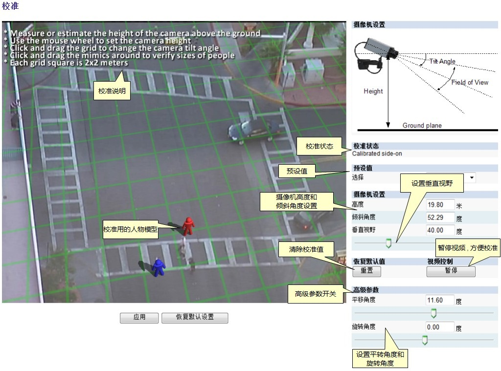
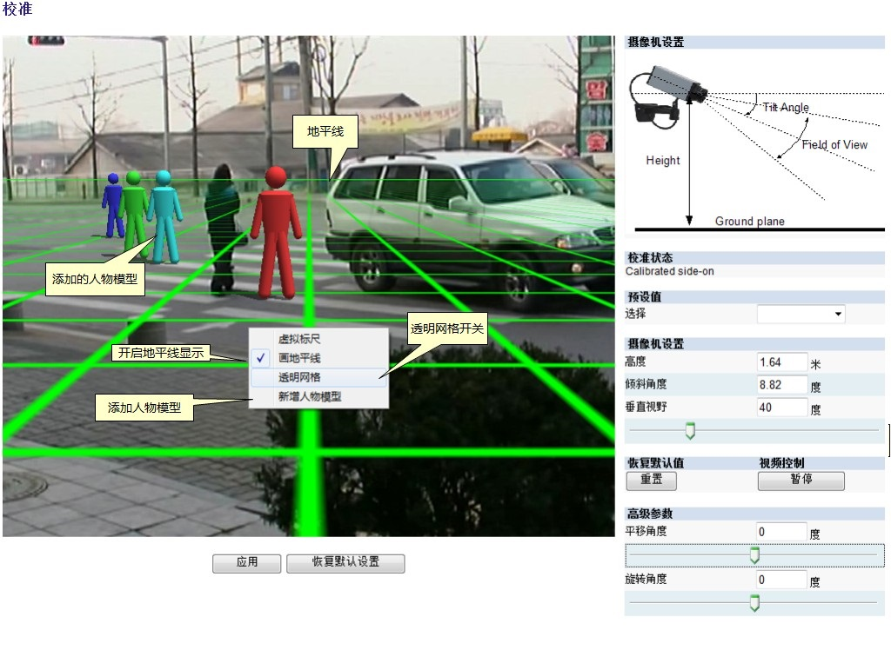
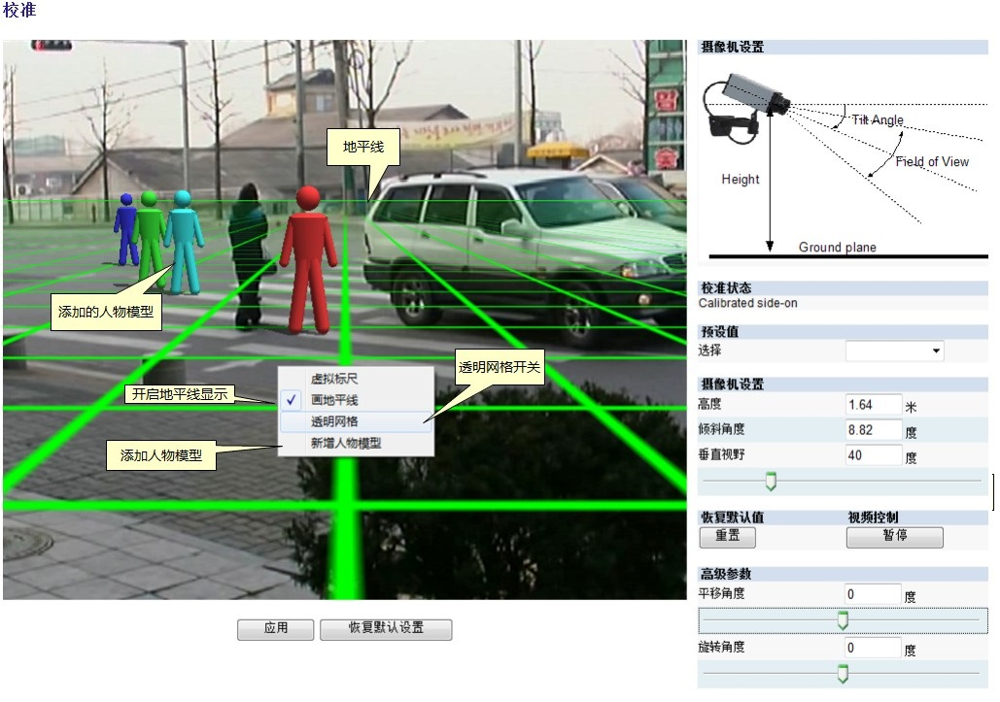
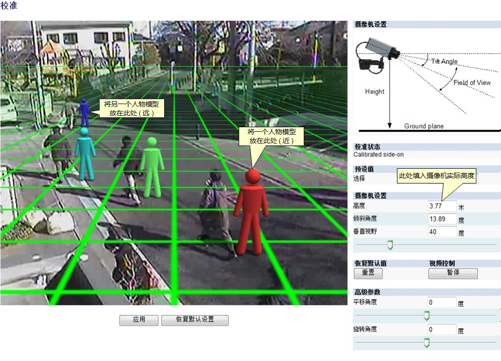
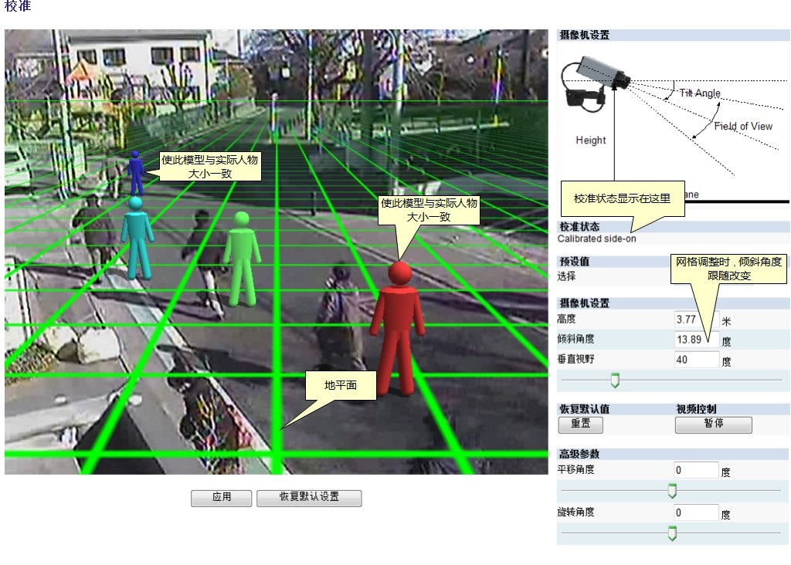
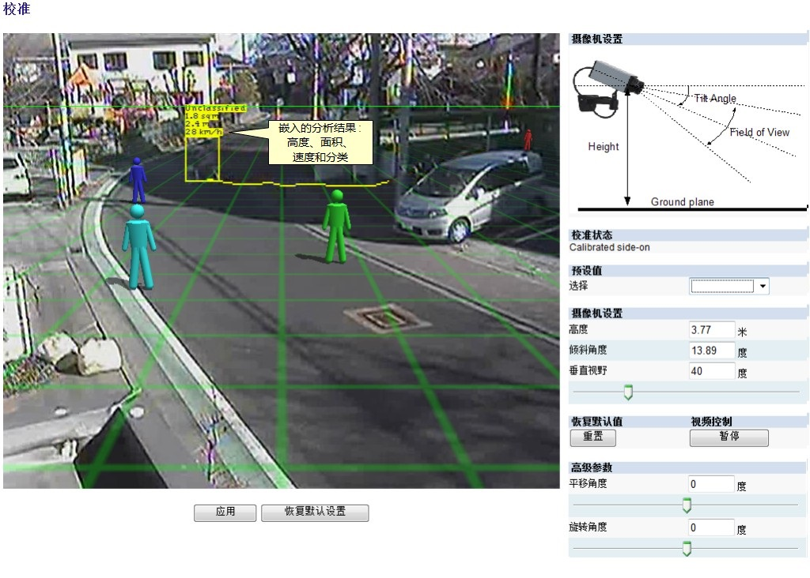
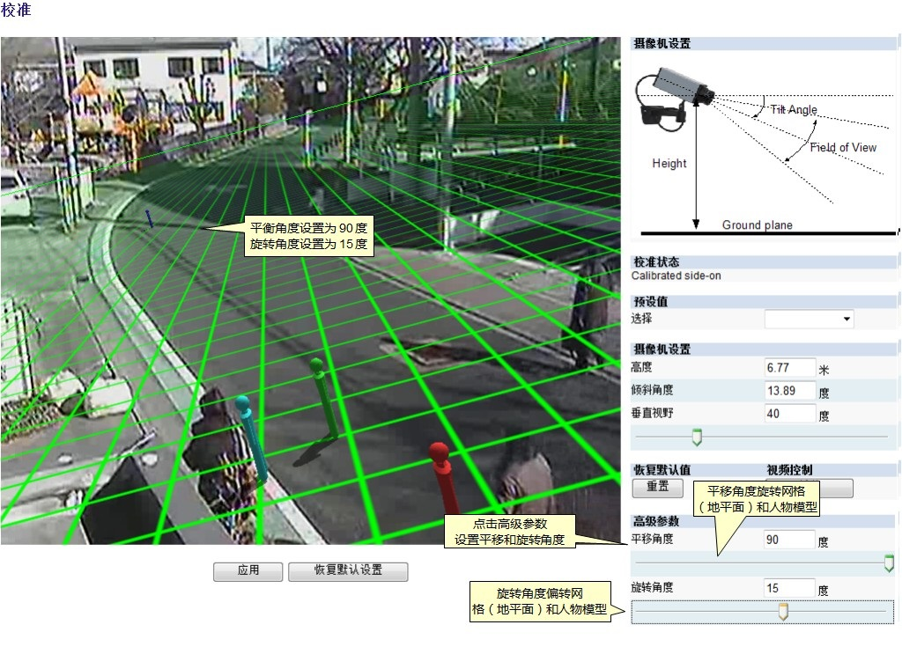
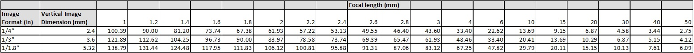
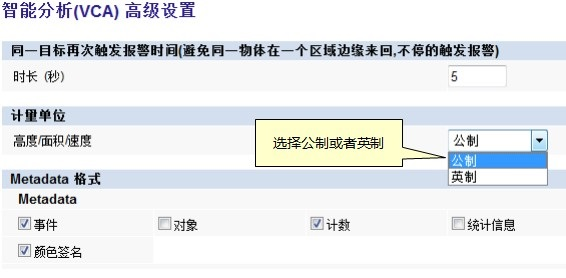

## 摄像机三维校准(3d calibration) 校准界面说明

### 摄像机三维校准 -- 校准界面说明
<strong style="color: rgb(191, 0, 0);">3D校准选项</strong>  
下面详细解释3D校准页面中的各个选项，你也可以点击 校准摄像机 主题直接开始进行3D校准。  

<strong style="color: rgb(191, 0, 0);">3D图像叠加层</strong>  
3D校准的过程中，需要使画面的各项特征与3D图像叠加层相匹配。
3D图像叠加层包含一个代表地平面的绿色的网格。地平面上是一些人物模型，这些人物模型代表实际人物在当前校准参数下的外形大小，可以用来验证人物在当前场景中的尺寸。  

<strong style="color: rgb(191, 0, 0);">使用鼠标控制</strong>  
3D校准的各项参数可以通过以下方法进行调整：  
	- 鼠标左键点击并拖动地平面，可以改变摄像机的倾斜角度。
	- 使用鼠标滚轮调整摄像机的高度。
	- 拖动右侧的滑块调整垂直视野。
	

<strong style="color: rgb(191, 0, 0);">其它图像工具</strong>  
还有一些其它的图像工具，可以使3D校准更加简便和精确。  

#### 画地平线
鼠标右键点击画面并选择"画地平线"可以在3D图像叠加层上显示地平线。如果画面中可以看到实际的地平线，则可以很方便的调整垂直角度：拖动绿色网格使视频中的地平线与3D图像叠加层的地平线相吻合即可。  

#### 新增人物模型
鼠标右键点击画面并选择"新增人物模型"。将不同的人物模型放置在不同的位置，进一步验证3D校准的设置。  

#### 透明网格
为了方便观看视频，代表地平面的网格默认是透明的。右键菜单中的"透明网格"选项用于确定其是否透明。

#### 虚拟标尺
3D校准工具里支持"虚拟标尺"功能，用于测量并验证平行于地平面的两点间的距离，比如道路的宽度，停车位的宽度等。"虚拟标尺"只能用于测量两点的水平距离，而不能用于测量高度。  

使用"虚拟标尺"时，在地平面上任意处点击右键（此时鼠标的位置即为测量的起点），在弹出的右键菜单中选择”r;虚拟标尺”，然后移动鼠标，此时鼠标旁边会实时显示出鼠标当前位置至起点的水平距离。  
要退出"虚拟标尺"功能，点击鼠标左键或者右键即可让"虚拟标尺"消失。  

### 摄像机三维校准 -- 校准摄像机
如果要计算目标的高度、面积、速度或者判断目标分类，摄像机必须进行3D校准。如果已经知道摄像机安装的高度、倾斜角度和垂直视野，那么直接将这些参数填到对应的选项并点击"应用"即可。  
如果无法确定摄像机的这些安装参数，请参考下面的详细步骤对摄像机进行3D校准。

<strong style="color: rgb(191, 0, 0);">步骤1：在场景中找到一些人物</strong>  
在场景中找到一些人物或者和人物一般大小的物体。在这些人物中找一个离摄像机比较近的，再找一个离摄像机比较远的。可以让输入视频暂停，方便准确的放置各个人物模型。 在实际人物上方或者旁边放置人物模型，在对应的选项处填入摄像机的高度或者估算出来的高度。  

<strong style="color: rgb(191, 0, 0);">步骤2：调整倾斜角度和摄像机高度</strong>
现在调整摄像机的倾斜角度和垂直视野，使近处和远程的人物模型与其旁边的实际人物大小一致。如果填入的高度值是估算的，那么此时需要同时调整高度、倾斜角度和垂直视野三个参数。

鼠标左键点击并拖动地平面，可以改变摄像机的倾斜角度；使用鼠标滚轮调整摄像机的高度；拖动右侧的滑块调整垂直视野3D校准过程中，这3个参数会实时的显示在右侧设置窗口的对应位置处。

最后，点击"应用"使所有设置生效。  

应用所有设置后，"校准状态"显示校准是否成功，如果校准成功，会显示摄像机当前的安装方式。

<strong style="color: rgb(191, 0, 0);">步骤3：验证各项设置</strong>
如果你对各项设置比较满意，可以尝试拖动人物模型到场景的各个位置并与附近的实际人物（或者人物大小的物体）做对比。
场景中验证的位置越多，校准的结果越准确。3D校准的3个参数可以按照步骤2的说明进行微调。校准界面说明 介绍了一些其它的工具，可以使校准更加准确。
3D校准完成后，场景中的物体就附加了高度、面积、速度及分类信息。如果需要在公制和英制之间更改计量单位，请参考 计量单位主题。

<strong style="color: rgb(191, 0, 0);">如果设置的参数误差太大</strong>
如果3D校准误差太大导致人物模型消失，可以点击"恢复默认设置"按钮重新进行3D校准。

### 摄像机三维校准 -- 高级参数
高级参数包括摄像机的平移（pan）角度和旋转（roll）角度，调整这两个参数不会影响已经设置好的高度、倾斜角度和垂直视野三个参数。如果摄像机进行过平移和旋转，可以尝试调整这两个参数进行校准。  
注意，调整这两个高级参数只会影响地面与摄像机的相对角度，方便校准时视频与3D图像叠加层的对齐，对其它三个校准参数不会有影响。
点击"高级参数"按钮，拖动"平移角度"和"旋转角度"下方的滑块即可对这两个参数进行分别调整。

### 垂直视野
3D校准时需要调整垂直视野，如果已经确定摄像机的垂直视野，可以直接将其填入。如果无法确定摄像机垂直视野的实际数值，可以根据感光器尺寸和摄像机焦距参考下表获得。  

如果无法使用此表格确定摄像机的垂直视野，建议将垂直视野设置为默认值：40°。

### 计量单位
高度、面积和速度叠加数据可以以公制或者英制显示，默认使用公制。用户可以在”r;高级”设置页面中修改计量单位，然后点击"应用"生效。

