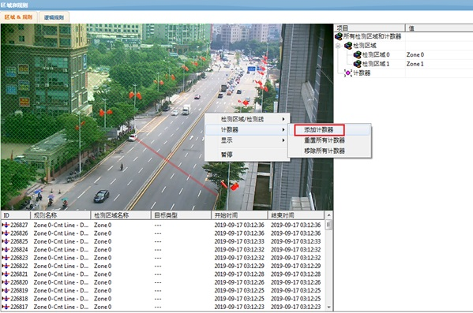
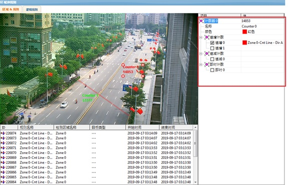

## 计数器 Counter

#### 计数器
可以通过以下方法来创建计数器：在屏幕上点击鼠标右键并选择计数器(Counter) ->添加计数器 (Add counter)：  

在右侧规则设置窗口，点击"计数器"下的"名称"一栏可以设置计数器的名称。  
计数器是由检测规则触发的。例如，如果我们要对所有进入区域0的物体进行计数，我们必须先给区域0设置物体进入的检测规则，然后在对应类别（增加、减少、即时计数）的计数器的下拉选项里面选择区域0的进入检测规则。

在这个例子里面，红色的区域是被来检测所有往北行驶的物体的。这个计数器被设置为用来计算所有往北走的物体(增加计数)。当前已经检测到2个适合规则的物体。  

<strong style="color: rgb(191, 0, 0);">增加计数（Incremental Counters）: </strong>当指定的区域被触发的话，计数器加1。  
<strong style="color: rgb(191, 0, 0);">减少计数（Decremental Counters）: </strong>当制定的区域被触发的话，计数器减1。  
<strong style="color: rgb(191, 0, 0);">即时计数（Occupancy Counters）: </strong>显示当前在此区域内的物体的数量。  

本设备支持最多使用4个数据库定期保存所有的计数器数值。用户可以查询每个数据库，将查询结果以表格、图表或者报告的形式输出。用户也可以使用Microsoft Excel直接连接数据库，对数据进行进一步的处理。  
点击"智能分析VCA"下的"Counter Reporting"菜单进入计数器的存储与报告配置页面。  
注意：此项服务要求VCApro 或者 VCAcount许可证授权。  

#### 计数器的存储与报告有三种形式：
<strong style="color: rgb(191, 0, 0);">数据库服务（Database Service）</strong>  
数据库服务最多可管理4个数据库。它可以定期记录所有的计数器数值。详细信息请参考<a href="view_markdown.php?pk=42" target="_blank">数据库服务设置页面</a>(见 [标题编号])。  

<strong style="color: rgb(191, 0, 0);">主动上传（Push Service）</strong>
主动上传服务可以将数据库记录的计数器数据主动推送至用户端，而无需用户手动查询。
注意：该项服务目前还未完全成熟。如果您需要此项服务，请联系制造商获得更多的信息。

<strong style="color: rgb(191, 0, 0);">报表服务（Reporting Service）</strong>
报表服务可以让用户查询数据库，将查询结果以报表、表格、报告的形式输出，甚至支持将数据导入Microsoft Excel(见 [标题编号])以进行进一步的处理。更多信息请参考 报表服务(见 [标题编号])。
