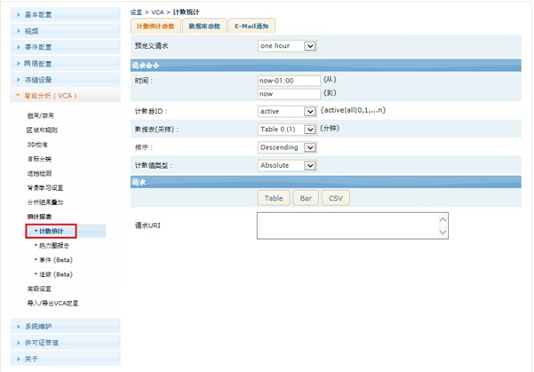
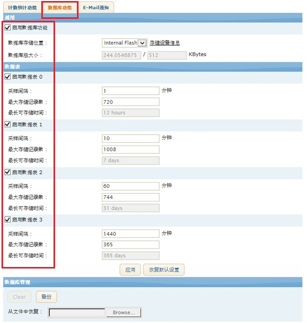
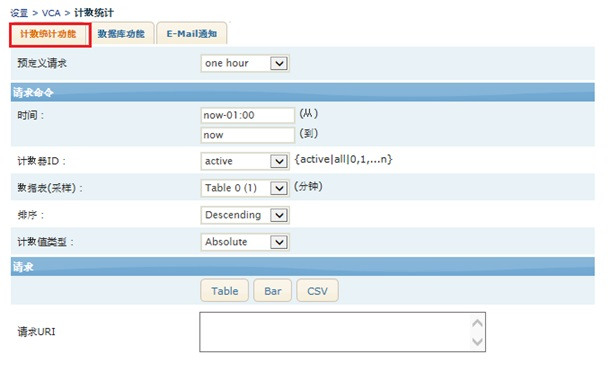
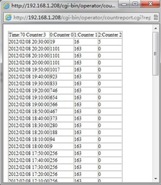
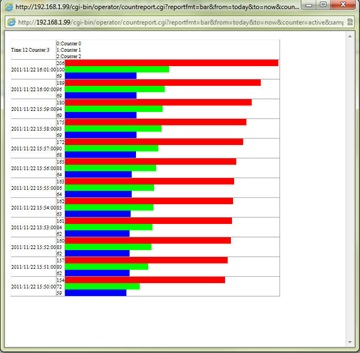
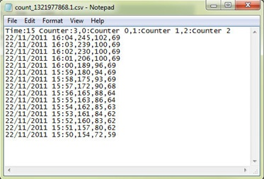

## 计数 数据库（报表）Counting Report

数据库服务负责定期将所有的计数器的数值记录至数据库，它最多可以管理4个数据库。</p><p>点击"数据库服务"进入数据库服务设置页面。  
   

<strong style="color: rgb(191, 0, 0);">启用数据库</strong>
启用或者禁用数据库服务。此选项也是计数器存储与报告服务的总开关 - 如果未开启，其它所有的数据库查询与报表功能都将不可用。

<strong style="color: rgb(191, 0, 0);">数据库存储</strong>
允许用户选择数据库表项的实际存储位置。可以选择internal flash、SD卡或者USB存储设备。如果选择的存储设备不可用，系统会自动使用internal flash 存储数据库"当前存储设备"标签显示当前用于存储数据库表项的设备。

<strong style="color: rgb(191, 0, 0);">数据库总大小</strong>
如果选择internal flash，数据库最大限制为512KB。此处显示已经使用的容量与总容量大小。  
如果设置的数据库表项占用的容量超过总容量，用户在点击"应用"时会被警告。

<strong style="color: rgb(191, 0, 0);">数据库表结构设置</strong>
数据库服务最大支持4个表（0-3）每个表以不同的时间间隔记录所有的计数器数值，这样可以方便用户获得不同时间间隔的报表。
数据库表必须按顺序启用，例如若要启用表1，那么表0必须已经启用。
- 采样间隔： 数据库采样并记录计数器的时间间隔。单位为分钟。
- 最大存储记录数 ：数据库表所能存储的最大记录条数。如果数据库表里的记录数达到”r;最大存储记录数”，那么最早的记录会被覆盖。
- 最长存储时间 ：表示数据库存储计数器数据的最长时间。可以使用下面的公式算出：
- 最长存储时间（分钟） = 采样间隔 x 最大存储记录数
 
<strong style="color: rgb(191, 0, 0);">数据库管理</strong>
对数据库进行各种操作。
- 清空：清除数据库所有表的所有数据。
- 备份： 用户以文件的形式下载数据库表，此文件可用于恢复数据库。
- 恢复： 使用之前保存的备份文件恢复数据库表。
 
<strong>读取报表</strong>  
  
报表服务设置页面实际上是选择各项查询参数以及输出结果的格式：表格、柱状图或者输出为CSV格式。系统内置了一些预定义请求，方便用户快速开始。
此页面的每项设置都有自动提示功能：将鼠标移至想要了解的选项即可获得关于这些选项的详细信息。

<strong style="color: rgb(191, 0, 0);">表格报告（Tabular Reporting）</strong>
输入各项查询参数后，点击”r;表格”按钮。输出结果为一个表格：  
  

<strong style="color: rgb(191, 0, 0);">柱状图报告（Bar Graph Reporting）</strong>
点击"Bar"按钮会弹出一个新的窗口，用于展示柱状图的查询结果。每个柱形的颜色与其代表的计数器设置的颜色相同。  
  

<strong style="color: rgb(191, 0, 0);">CSV报告（CSV Export）</strong>
点击"CSV"按钮会得到一个包含查询结果的CSV文件，用逗号分隔每个字段。
  

<strong style="color: rgb(191, 0, 0);">使用 countreport.cgi</strong>
```
格式：
http://<web serverURL>/nvc-cgi//countreport.cgi?reportfmt={report_format}&from={from_time}&to={to_time}&counter={counter_id}&sampling={sampling}&order={list_order}&value={value_format}  
```

Parameter: 
- reportfmt [ table/bar/csv/countvalue] : 报表格式 1. table: HTML报表, 2. bar: HTML柱状图, 3. csv: CSV文件, 4. countvalue: 计数值
- from [Keyword/date/seconds]: 报表开始时间 YYYY/MM/DD hh:mm
- to [ Keyword/date/seconds]: 报表终止时间 YYYY/MM/DD hh:mm
- counter [Active/all/0~19]: active: 当前显示的所有的计数器 all: 所有的计数器 0~19: 指定的计数器ID
- table [0/1/2/3] : 启用数据表
- sampling [ 0- 2147483648]: 采样间隔的报表
- order [ascending/descending]: ascending: 最老的记录在前, descending: 最新的记录在前
- value [abs/diff]: abs: 返回计数器的实际值 diff: 返回计数器相邻两次值的差值（当前值减去上一次的值）
时间:  
- YYYY/MM/DD hh:mm ： 指定时间， 2011/10/21 09:00
- second: 秒， 3600 = 1小时
- now : 现在 时间
- today: 今天00：00
- yesterday： 昨天00：00
- sunday, monday~~: 星期日， 星期一的 00：00
- this_week: 这周日00:00
- last_week: 上周日00:00
- this_month: 这月1日00:00
- last_month: 上月1日00:00
 
<strong style="color: rgb(191, 0, 0);">Table 与 Sampling</strong>  
table 指定 数据库报表id, sampling 指定 采样间隔。 需两个中一个引述，如 table1的 采样间隔 10分钟 ， table=1跟 sampling=600 是 一样的意思，有table因数，sampling 因数 没适用（ignored）  
列）  
```code 
http://192.168.3.28/cgi-bin/operator/countreport.cgi?reportfmt=table&from=today&to=now&counter=active&sampling=600&order=Descending&value=abs
http://192.168.3.28/cgi-bin/operator/countreport.cgi?reportfmt=csv&to=now-600&counter=active&sampling=600&order=Ascending&value=diff&from=now-12:00
http://192.168.3.28/cgi-bin/operator/countreport.cgi?reportfmt=csv&to=now-600&counter=active&table=1&order=Ascending&value=diff&from=now-12:00
```
