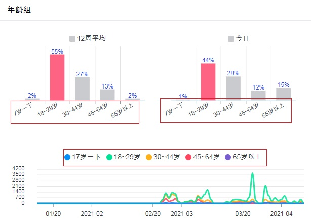

## Cosilan Config [Version 0.94]
Cosilan-设置(config.php)
访问 地址： http://{ServerIP}/config.php  
 

1. DOCUMENT TITLE: 平台主题
2. HOST TITLE： 网页名称
3. LOGO_PATH：平台 Logo，100KB 以下的 png, jpg 等 图片文件
 

1. MODE ： TLSS(托管服务）跟 主动取得数据模式
2. COUNT_EVENT： 实时数据取得功能，设备发生过线计数时即可推送到服务器，显示实时计数应用
3. COUNTING： 客流服务打开
4. FACE： 人脸检测功能打开（需要 人脸检测设备）
5. MAC_SNIFF： 手机探针功能（需要 探针设备）
6. SNAPSHOT：抓拍录像功能（因为安全问题， 没有打开）
7. PROBE_INTERVAL： 临时数据到正式数据传输间隔
8. ROOT_DIR：Linux 系统， 或者 Cosilan 服务器(Opavis)上 平台安装的 位置
9. START_ON_BOOT：Windows 系统上 服务器（电脑）重启时候 自动运行平台软件

  
1. HOST：MYSQL 数据库 设置， HOST 默认是 'localhost'
2. USER：MYSQL 数据库 设置， 数据库用户名 默认是 'ct_user'
3. PASSWORD：MYSQL 数据库 设置， 数据库密码 默认是 '13579'
4. DB：MYSQL 数据库 设置， 数据库名称 默认是 'common'
5. CHARSET：MYSQL 数据库 设置，CHAESET 默认是 'utf8'
6. RECYCLING_TIMESTAMP：common 数据库 覆盖的时间， common 数据库是 临时数据库， 移到用户数据库（cnt_demo) 后 30/90/180天 后覆盖。
  
[MYSQL设置　变更的话　MYSQL 软件上 更改， 这页的 设置上也要更改。]  

1. TLSS: 端口 设置， 用托管服务时 端口， 下图上 1）
2. COUNT_EVENT： 实时计数的时候 端口， 设备网页上 http 或者 tcp的 端口 下图上2）
3. MACSNIFF： MACSNIFF 功能上 端口， 现在还没实现
4. FACE： 人脸检测时 端口（需要人脸抓拍摄像机）， 下图上 4）
5. SNAPSHOT： 抓拍录像 端口， 还没实现
6. QUERY_DB： 远程数据查收端口， 还没实现（安全上 不公开）

** 临时数据库 common 的 设置， 要改 各项的话 数据库软件上也要改。

1. USER：用户名数据库名称
2. ACCOUNT：用户名数据库名称
3. PARAM：设备参数数据库名称
4. SNAPSHOT: 设备抓拍图片数据库名称
5. COUNTING: 计数报表数据库名称
6. COUNT_EVENT： 实时计数数据库名称
7. FACE：人脸检测数据库名称，这数据库里面放人头图像
8. HEATMAP： 热力图数据库名称
9. MAC：手机探针数据库名称
10. ACCESS_LOG： 网页访问历史数据库名称、
11. MESSAGE： 平台信息数据库名称， 还没完善， 可能 1.2版本上实现功能
  
** 管理者项目-> 数据库 -> Common DB
  
  
** 北京旷视科技有限公司 的FACE DET 功能， 帐号跟其他 设置， 开帐号后 拿到 api_key 跟 api_secret

1. HOST：Detect 算法的 API地址， api-cn.faceplusplus.com
2. API_KEY
3. API_SRCT

** 注册后 访问 https://console.faceplusplus.com.cn/app/apikey/list 上 取得 api key 和 api secret.  
  
** 中国天气网的 API, 还没实现

1. HOST
2. API_KEY
3. API_SRCT

  
1. AGE_GROUP：年龄组 设置， [0,18,30,45,65] 的话， [0~17, 18~29, 30~44, 45~64, 65~99]

  
  
1. WEB ：网页 版本
2. BIN：取得数据（从设备到平台） 软件版本

  
1. CODE： License code, 每个平台需要激活license.(时间限制）  

** 没有Lic Code 的话 取得数据软件运行3个小时后自动停止，可以看 http:{SERVERIP}/log.php 上 可以 看。

  
1. Admin ID： 管理者用户名， 一般是 admin 或者 root
2. Admin Password: 管理者密码

1. 如 ID 或者密码 不对， 显示红色的 "Admin ID or Password not match"