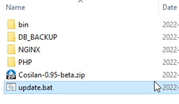
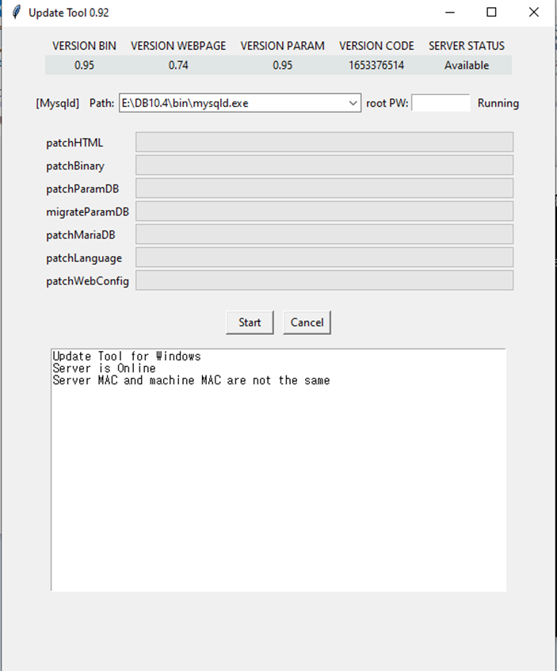
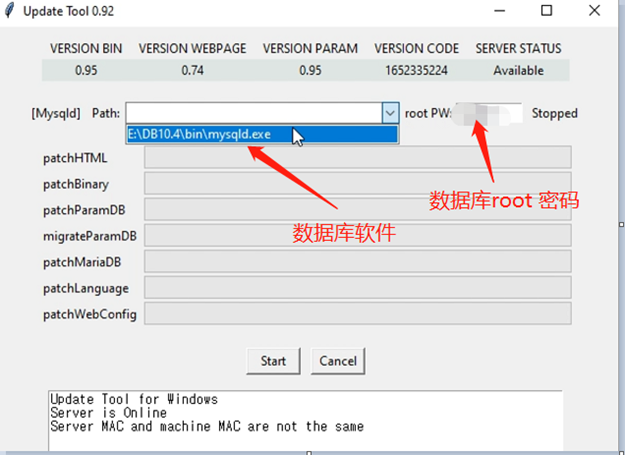
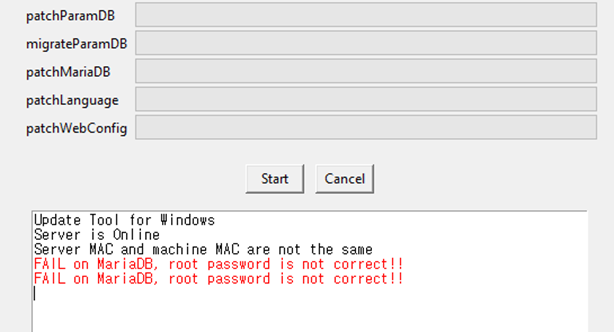
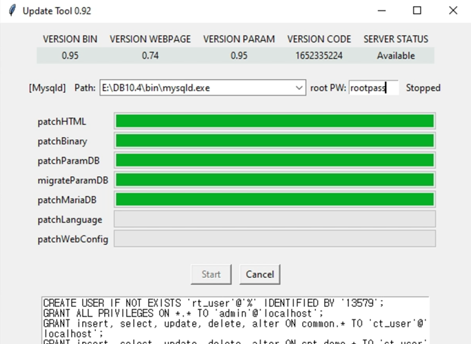
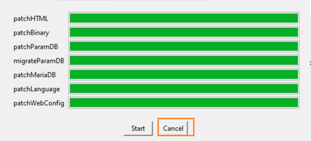
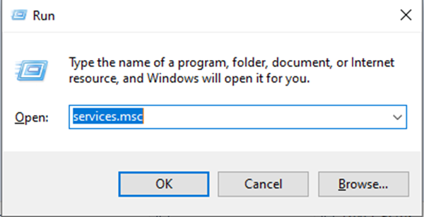
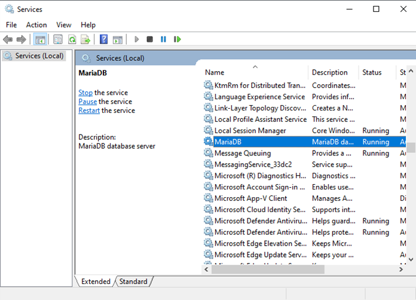
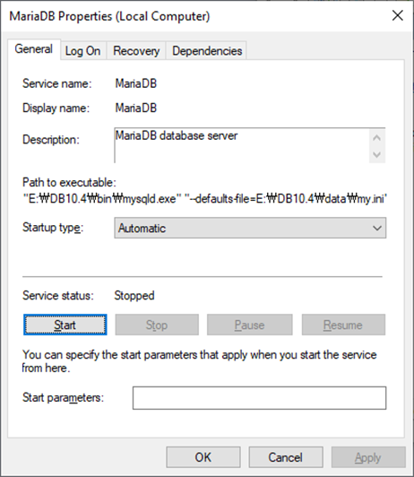

### 安装Cosilan 主程序版教程
1. [下载](http://49.235.119.5/download.php?file=cosilan096Beta.zip) : http://49.235.119.5/download.php?file=cosilan096Beta.zip
2. 点击 update.bat  
   

3. 选择 数据库软件， 输入 数据库root密码
	** 如没有安装的数据库软件 数据库不出来  

4. 密码 错， 显示 FAIL on MariaDB, root password is not correct!!  

5. 点击 Start  

6. 完了，点击 cancel  

7. 再运行 MariaDB，Windows + R , 输入 services.msc  

8. 查找 MariaDB, 打开  

9. 点击 “Stop”, 等关掉 点击 “Start”  

10. 为了 系统重启时候 自动 运行数据库Startup type “Automatic”, 点击 Apply