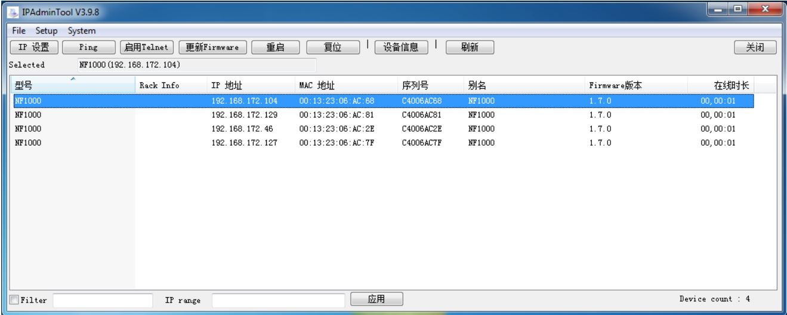

## IPAdminTool User’s Manual

IPAdminTool 自动扫描所有产品，包括网络上的编码器和摄像机，并显示产品信息，如产品名称、 IP 地址、 MAC 地址、固件信息等。
IPAdminTool 还能够更改 IP 地址或更新固件。   
为更容易地操作产品，需要了解 IPAdminTool 的其他功能和特点。  
请在 SDK 目录（\DOC）下找到“IPAdminTool User’s Manual.pdf” ，在使用此工具之前进行阅读。

在查看该产品的网页前，确保产品已安装。  
安装该产品，请参阅附带的硬件手册。硬件手册提供安装和配置的详细信息。  
如何找到您设备的 IP 地址：  
产品的默认 IP 地址可从 MAC 地址中查找到。请参考下面的图，检查如何将 MAC 地址转换到 IP 地址。  
查找到 IP 地址后，只需在 Internet Explorer 地址栏上输入地址， 然后访问产品网页。  

把设备跟电脑相连，直接用 IPAdminTool 工具进行搜索，可同时找到 4 个 IP 地址分别对应 4 路知能分析模块，可对各智能分析模块进行设置。

以下只对一路智能分析模块进行设置讲解。

#### 使用 IPAdminTool 在登录设备的步骤
1. 启动 IPAdminTool，将显示当前激活的设备的名称和信息。
2. 右键单击所需的设备，并选择 Web view。
3. 点击窗口弹出阻止对话框，然后点击运行或者保存， 安装 ActiveX 的 setup.exe。
4. 在预览界面点击设置，弹出登录用户信息，在用户名框中输入 root，密码框中输入 pass，点击确定。