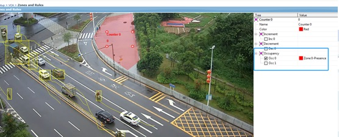
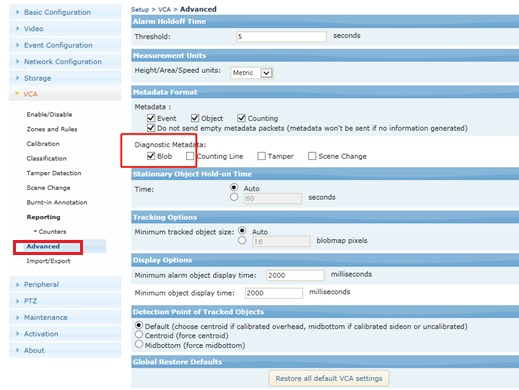
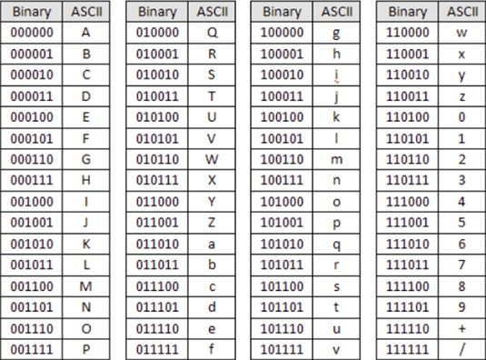
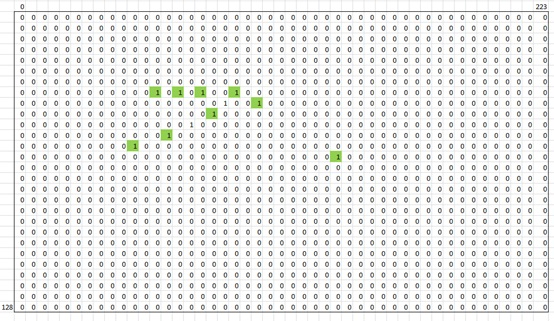
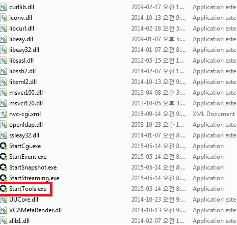
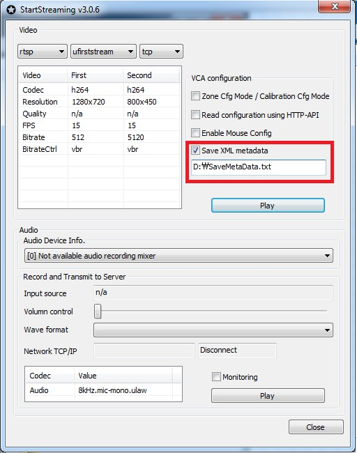

## 客流密度-用blob data

#### 做客流密度统计的方法如下：  
1. 通过画4条线框住一个区域，每条线分别统计进出人数，最终统计出区域里面剩下多少人，算出密度（此方法可以统计出检测区域的详细人数，但需要在各个方向装客流检测设备）
2. 通过计数器的即时计数功能，统计出所画区域里面的实时人数，再根据面积算出密度（此方法只适合检测区域里面人数不多的情况）
3. 通过读取BLOB data信息，统计检测区域物体所占的比例来计算客流密度（此方法一般用于广场等人口密度大的地方，不需要精确到详细的人数，只需要计算所占的大概比例，国内客流密度的计算就是用类似方法）
	
#### 2的 方式


#### 3的 方式


BLOB data数据用 RTSP 读 metadata流来得到。  
相关metadata流介绍见附件 VCAsys Metadata Format.pdf  
Metadata 是 每个帧 有 信息，
- Blob宽度, pixel
- Blob 高度, pixel
- 实际 Blob, Base64形式， 6bit Binary



Pixel 数量 ： 224*128 = 28672  
Blobdata Base 64 数量 28672/6 = 4778.6  


#### Meta data Example
```code 
<?xml version="1.0" encoding="utf-8" ?>
<vca schema_version="1.6">
<vca_hdr>
<frame_id>2185716</frame_id>
<vca_status>0</vca_status>
<trk_mode>0</trk_mode>
</vca_hdr>
<objects>
<object>
<id>17524</id>
<ch>78</ch><cs>-1</cs><ca>119</ca><cls>-1</cls><cls_name>Unclassified</cls_name>
<bb><x>41434</x><y>55006</y><w>6664</w><h>10255</h></bb>
<trail><pt><x>46663</x><y>65022</y></pt><pt><x>45822</x><y>65022</y></pt><pt><x>45082</x><y>65022</y></pt><pt><x>44158</x>
<y>65022</y></pt><pt><x>43226</x><y>64094</y></pt><pt><x>42220</x><y>62110</y></pt><pt><x>41434</x><y>60134</y></pt></trail>
<flags></flags>
</object>
</objects>
<events>
</events>
<counts>
<count>
<id>0</id>
<name>Counter 0</name>
<val>728208</val>
</count>
<count>
<id>1</id>
<name>Counter 1</name>
<val>457345</val>
</count>
<count>
<id>2</id>
<name>Counter 2</name>
<val>15045</val>
</count>
</counts>
<blobmap>
<w>224</w><h>128</h>
<data>AAAAAAAAAAAAAAAAAAAAAAAAAAAAAAAAAAAAAAAAAAAAAAAAAAAAAAAAAAAAAAAAAAAAAAAAAAAAAAAAAAAAAAAAAAAAAAAAAAAAAAAAAAAAAAAAAAAAAAAAAAAA
AAAAAAAAAAAAAAAAAAAAAAAAAAAAAAAAAAAAAAAAAAAAAAAAAAAAAAAAAAAAAAAAAAAAAAAAAAAAAAAAAAAAAAAAAAAAAAAAAAAAAAAAAAAAAAAAAAAAAAAAAAAAAAA
AAAAAAAAAAAAAAAAAAAAAAAAAAAAAAAAAAAAAAAAAAAAAAAAAAAAAAAAAAAAAAAAAAAAAAAAAAAAAAAAAAAAAAAAAAAAAAAAAAAAAAAAAAAAAAAAAAAAAAAAAAAAAAA
AAAAAAAAAAAAAAAAAAAAAAAAAAAAAAAAAAAAAAAAAAAAAAAAAAAAAAAAAAAAAAAAAAAAAAAAAAAAAAAAAAAAAAAAAAAAAAAAAAAAAAAAAAAAAAAAAAAAAAAAAAAAAAA
AAAAAAAAAAAAAAAAAAAAAAAAAAAAAAAAAAAAAAAAAAAAAAAAAAAAAAAAAAAAAAAAAAAAAAAAAAAAAAAAAAAAAAAAAAAAAAAAAAAAAAAAAAAAAAAAAAAAAAAAAAAAAAA
AAAAAAAAAAAAAEAAAAAAAAAAAAAAAAAAAAAAAAAAAAAAAAAAAAAAAAAAAAAAAAAAAAAAAAAAAAAAAAAAAAAAAAAACAAAAAAAAAAAAAAAAAAAAAAAAAAAAAAAAAAAAAAA
AAAAAAAAAAAAAAAAAAAAAAAAAAAAAAAAAAAAAAAAAAAAAAAAAAAAAAAAAAAAAAAAAAAAAAAQAAAAAAAAAAAAAAAAAAAAAAAAAAAAAAAAAAAAAxDAAAAAAAAAAAAAAAAA
AAAAAAAAAAAAAAAAAC8BIAAAAAAAAAAAAAAAAAAAAAAAAAAAAAAAAAQ8HAAAAAAAAAAAAAAAAAAAAAAAAAAAAAAAAAAAAYEAAAAAAAAAAAAAAAAAAAAAAAAAAAAAAAAAAQ
g/AAAAAAAAAAAAAAAAAAAAAAAAAAAAAAAAAAAB8DAAAAAAAAAAAAAAAAAAAAAAAAAAAAAAAAAAAw/AAAAAAAAAAAAAAAAAAAAAAAAAAAAAAAAAAAA+fAAAAAAAAAAAAAAAA
AAAAAAAAAAAAAAAAAAI4/BAAAAAAAAAAAAAAAAAAAAAAAAAAAAAAAAAAg//HAAAAAAAAAAAAAAAAAAAAAAAAAAAAAAAAAg//fAAAAAAAAAAAAAAAAAAAAAAAAAAAAAAAAAA+//HA
AAAAAAAAAAAAAAAAAAAAAAAAAAAAAAAAi//fAAAAAAAAAAAAAAAAAAAAAAAAAAAAAAAAAA8//BAAAAAAAAAAAAAAAAAAAAAAAAAAAAAAAAAg//HAAAAAAAAAAAAAAAAAAAAAAA
AAAAAAAAAAA+/YAAAAAAAAAAAAAAAAAAAAAAAAAAAAAAAAAAg/jHAAAAAAAAAAAAAAAAAAAAAAAAAAAAAAAAAA8P+AAAAAAAAAAAAAAAAAAAAAAAAAAAAAAAAAAAA/DAAAAAA
AAAAAAAAAAAAAAAAAAAAAAAAAAAAAwPAAAAAAAAAAAAAAAAAAAAAAAAAAAAAAAAAAAA+DAAAAAAAAAAAAAAAAAAAAAAAAAAAAAAAAAAAwHAAAAAAAAAAAAAAAAAAAAAAAA
AAAAAAAAAAAAfAAAAAAAAAAAAAAAAAAAAAAAAAAAAAAAAAAAAEAAAAAAAAAAAAAAAAAAAAAAAAAAAAAAAAAAAAAAAAAAAAAAAAAAAAAAAAAAAAAAAAAAAAAAAAAAAAAAAA
AAAAAAAAAAAAAAAAAAAAAAAAAAAAAAAAAAAAAAAAAAAAAAAAAAAAAAAAAAAAAAAAAAAAAAAAAAAAAAAAAAAAAAAAAAAAAAAAAAAAAAAAAAAAAAAAAAAAAAAAAAAAAAAAA
AAAAAAAAAAAAAAAAAAAAAAAAAAAAAAAAAAAAAAAAAAAAAAAAAAAAAAAAAAAAAAAAAAAAAAAAAAAAAAAAAAAAAAAAAAAAAAAAAAAAAAAAAAAAAAAAAAAAAAAAAAAAAAAAA
AAAAAAAAAAAAAAAAAAAAAAAAAAAAAAAAAAAAAAAAAAAAAAAAAAAAAAAAAAAAAAAAAAAAAAAAAAAAAAAAAAAAAAAAAAAAAAAAAAAAAAAAAAAAAAAAAAAAAAAAAAAAAAAAA
AAAAAAAAAAAAAAAAAAAAAAAAAAAAAAAAAAAAAAAAAAAAAAAAAAAAAAAAAAAAAAAAAAAAAAAAAAAAAAAAAAAAAAAAAAAAAAAAAAAAAAAAAAAAAAAAAAAAAAAAAAAAAAAAA
AAAAAAAAAAAAAAAAAAAAAAAAAAAAAAAAAAAAAAAAAAAAAAAAAAAAAAAAAAAAAAAAAAAAAAAAAAAAAAAAAAAAAAAAAAAAAAAAAAAAAAAAAAAAAAAAAAAAAAAAAAAAAAAAA
AAAAAAAAAAAAAAAAAAAAAAAAAAAAAAAAAAAAAAAAAAAAAAAAAAAAAAAAAAAAAAAAAAAAAAAAAAAAAAAAAAAAAAAAAAAAAAAAAAAAAAAAAAAAAAAAAAAAAAAAAAAAAAAAA
AAAAAAAAAAAAAAAAAAAAAAAAAAAAAAAAAAAAAAAAAAAAAAAAAAAAAAAAAAAAAAAAAAAAAAAAAAAAAAAAAAAAAAAAAAAAAAAAAAAAAAAAAAAAAAAAAAAAAAAAAAAAAAAAA
AAAAAAAAAAAAAAAAAAAAAAAAAAAAAAAAAAAAAAAAAAAAAAAAAAAAAAAAAAAAAAAAAAAAAAAAAAAAAAAAAAAAAAAAAAAAAAAAAAAAAAAAAAAAAAAAAAAAAAAAAAAAAAAAA
AAAAAAAAAAAAAAAAAAAAAAAAAAAAAAAAAAAAAAAAAAAAAAAAAAAAAAAAAAAAAAAAAAAAAAAAAAAAAAAAAAAAAAAAAAAAAAAAAAAAAAAAAAAAAAAAAAAAAAAAAAAAAAAAA
AAAAAAAAAAAAAAAAAAAAAAAAAAAAAAAAAAAAAAAAAAAAAAAAAAAAAAAAAAAAAAAAAAAAAAAAAAAAAAAAAAAAAAAAAAAAAAAAAAAAAAAAAAAAAAAAAAAAAAAAAAAAAAAAA
AAAAAAAAAAAAAAAAAAAAAAAAAAAAAAAAAAAAAAAAAAAAAAAAAAAAAAAAAAAAAAAAAAAAAAAAAAAAAAAAAAAAAAAAAAAAAAAAAAAAAAAAAAAAAAAAAAAAAAAAAAAAAAAAA
AAAAAAAAAAAAAAAAAAAAAAAAAAAAAAAAAAAAAAAAAAAAAAAAAAAAAAAAAAAAAAAAAAAAAAAAAAAAAAAAAAAAAAAAAAAAAAAAAAAAAAAAAAAAAAAAAAAAAAAAAAAAAAAAA
AAAAAAAAAAAAAAAAAAAAAAAAAAAAAAAAAAAAAAAAAAAAAAAAAAAAAAAAAAAAAAAAAAAAAAAAAAAAAAAAAAAAAAAAAAAAAAAAAAAAAAAAAAAAAAAAAAAAAAAAAAAAAAAAA
AAAAAAAAAAAAAAAAAAAAAAAAAAAAAAAAAAAAAAAAAAAAAAAAAAAAAAAAAAAAAAAAAAAAAAAAAAAAAAAAAAAAAAAAAAAAAAAAAAAAAAAAAAAAAAAAAAAAAAAAAAAAAAAAA
AAAAAAAAAAAAAAAAAAAAAAAAAYAAAAAAAAAAAAAAAAAAAAAAAAAAAAAAAAAAAAghDAAAAAAAAAAAAAAAAAAAAAAAAAAAAAAAAAAAGCAAAAAAAAAAAAAAAAAAAAAAAAAAAA
AAAAAAA+IAAAAAAAAAAAAAAAAAAAAAAAAAAAAAAAAAAA8/4BAAAAAAAAAAAAAAAAAAAAAAAAAAAAAAAAAw/jPAAAAAAAAAAAAAAAAAAAAAAAAAAAAAAAAAA///BAAAAAAAAAAAA
AAAAAAAAAAAAAAAAAAAAA8//PAAAAAAAAAAAAAAAAAAAAAAAAAAAAAAAAAg///AAAAAAAAAAAAAAAAAAAAAAAAAAAAAAAAAA+//DAAAAAAAAAAAAAAAAAAAAAAAAAAAAAAAAAw//
PAAAAAAAAAAAAAAAAAAAAAAAAAAAAAAAAAA///DAAAAAAAAAAAAAAAAAAAAAAAAAAAAAAAAA4//PAAAAAAAAAAAAAAAAAAAAAAAAAAAAAAAAAg//fAAAAAAAAAAAAAAAAAAAAAAAA
AAAAAAAAAA4//AAAAAAAAAAAAAAAAAAAAAAAAAAAAAAAAAAA8AAAAAAEAAAAAAAAAAAAAAAAAAAAAAAAAAAAAgDAAAAAwBAAAAAAAAAAAAAAAAAAAAAAAAAAAAAOAAAAAwHA
AAAAAAAAAAAAAAAAAAAAAAAAAAAAAAAAAAAeAAAAAAAAAAAAAAAAAAAAAAAAAAAAAAAAAAAA4BAAAAAAAAAAAAAAAAAAAAAAAAAAAAAAAAAAAAOAAAAAAAAAAAAAAAAAAAA
AAAAAAAAAAAAAAAAIgBAAAAAAAAAAAAAAAAAAAAAAAAAAAAAAAAAAA4PAAAAAAAAAAAAAAAAAAAAAAAAAAAAAAAAAAAg/BAAAAAAAAAAAAAAAAAAAAAAAAAAAAAAAAAAA+DAA
AAAAAAAAAAAAAAAAAAAAAAAAAAAAAAAAA4PAAAAAAAAAAAAAAAAAAAAAAAAAAAAAAAAAAAACAAAAAAAAAAAAAAAAAAAAAAAAAAAAAAAAAAAAIAAAAAAAAAAAAAAAAAAAAAAA
AAAAAAAAAAAAAgAAAAAAAAAAAAAAAAAAAAAAAAAAAAAAAAAAAAAMAAAAAAAAAAAAAAAAAAAAAAAAAAAAAAAAAAAAAAAAAAA</data>
</blobmap>
<tampermap>
<w>6</w><h>4</h>
<data>AAAA</data>
</tampermap>
<scnchgmap>
<w>6</w><h>4</h>
<data>AAAA</data>
</scnchgmap>
</vca>
```
#### 测试
提供的 SDK 里面 BIN/TOOLS/StartTool_v3.0.9 （可以 <a href="http://49.235.119.5/download.php?file=StartTool_v3.0.9.zip" target="_blank">下载</a>）  


