## 过线计数 摄像机安装 注意事项

### 过线计数功能注意事项
#### 过线计数
功能是以目标宽度为基础，在一条计数线上实现双向精确计数，可以用于室内及室外多种场景下的计数功能。  
具体操作及调试方法请参考 <strong>设置检测区域和规则->检测规则->过线计数</strong>部分。  
#### 影响过线计数准确率的因素
<strong>过线计数</strong>的原理是测算经过检测线的目标的<strong>宽度</strong>，然后与预设的<strong>标准宽度</strong>对比，以确定经过检测线的目标的数量。  
所以该功能要求目标在经过检测线时，前后目标能够明显被区分开，而不出现互相遮挡的情况（允许目标并排同时经过检测线）。  
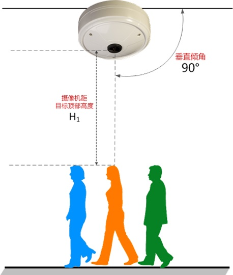

过线计数的效果受以下几个因素影响：  
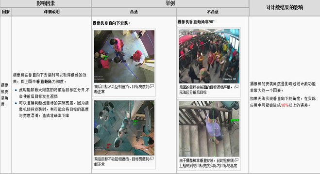
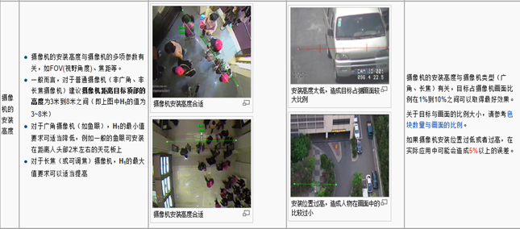
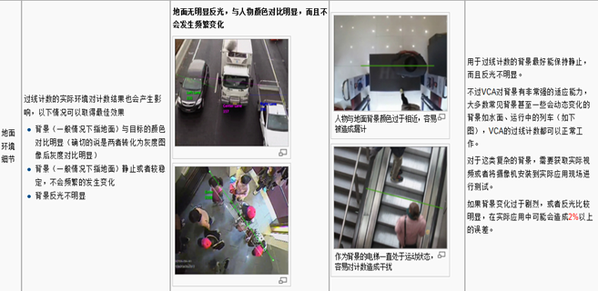
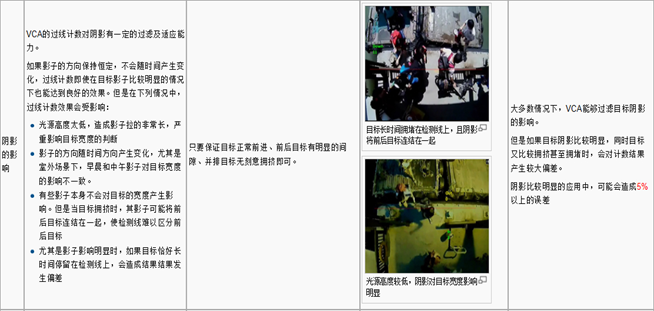
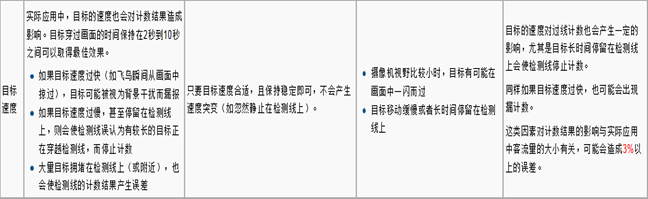
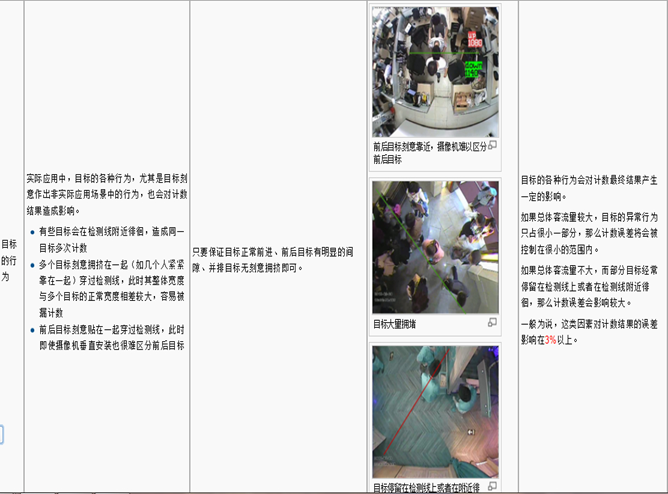

#### 交通应用中多车道计数
多车道计数的应用常见于高速公路或者高速公路出入口附近，考虑到这些场景下车辆的速度和同一车道的车辆都有一定的前后间距，这类计数应用对前后目标的区分没有太大问题，主要考虑的是不同车道间车辆的计数的干扰。  
如下图所示，受摄像机安装位置所限，这个位置如果对右侧上行的三个车道分别计数，有一定的困难。一些比较大型的车辆，可能会将左侧的上行车道遮住，造成该车道计数误差。  
所以这类安装位置的摄像机仅适合将所有上行车道统一计数（同理，所有下行车道也只能统一计数）。  
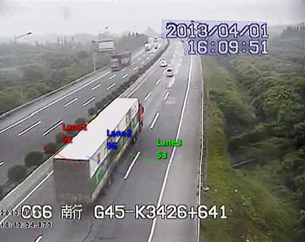

不适合多车道分别计数  
多车道计数可以参考右图安装摄像机，目的是在摄像机拍摄的画面中，每个车道的车辆互不遮挡。  
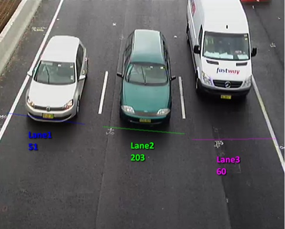

---
在使用前端摄像机或是后端软件对前景目标做目标分类时，首先需要在保证算法对目标有足够跟踪时间的前提下，再保证摄像机的倾斜角度越大越好，避免遮挡。  
此处以前端摄像机为枪机，安装场地为下图所示的场景来进行安装举例说明：  
	① 摄像机需尽量安装在被检测车道的正上方向  
	② 以焦距为2.8mm的枪机为例，安装高度最低要求为8m，理想高度为8~10m之间，如果此处天桥的高度为6m，建议在天桥上立杆（杆高2~2.5m）；摄像机倾斜角度为40~45°最佳  
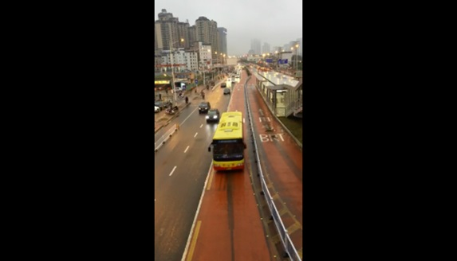

成像效果：
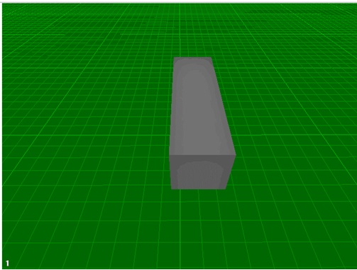

<strong style="color: red;">注意点：本文档是基于UDP 6702摄像机来编写的安装说明，在实际安装过程中，如使用的是第三方摄像机可能需要进行角度方面的微调。</strong>  

现场视频录制建议：  
- 按照下图所示的几处场景分别录制一段视频：

场景一：BRT行驶正方向
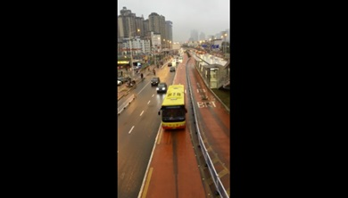

场景二：BRT行驶反方向  
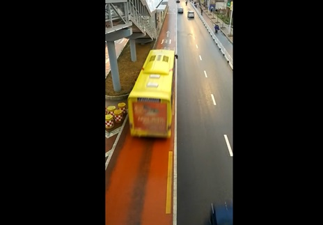

#### 实际测试中可能会碰到的问题：
1. 车辆速度通过过快，正如上述所说，要保证算法对目标有足够跟踪时间，但如果在车辆速度过快的情况下，也许会出现目标不检测的情况。  
2. 目标遮挡，摄像机倾斜角度加大，可以减少目标被遮挡的情况出现，但在一些特殊情况下，小车距BRT车距太近，可能会出现漏报。  
3. 目标分类是结合物体体积大小来工作的，如果在BRT车道有大车通过，这个目标分类算法不能完全区分开。  
4. 夜间效果不会理想（车灯，影子的影响）  
5. 阴雨天的误报会增多，以下图举例，在阴雨天，汽车在开启车灯的情况下，涉及到VCA 算法的一个瓶颈，目前暂无办法解决。    
	
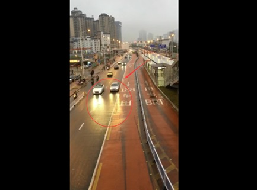
