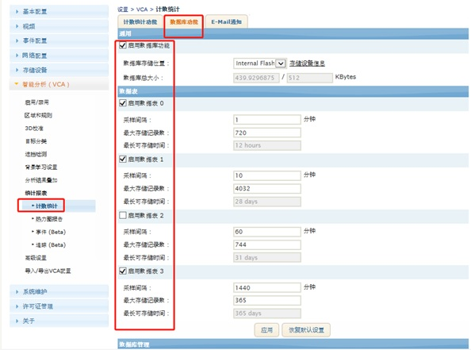
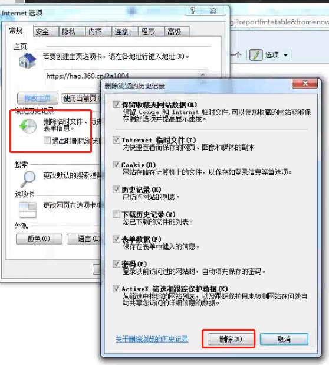

## CRPT error on 92900
一般情况， 没有适用 counting report 功能。

</img>

设备本地计数数据库在 /mnt/rwfs/countdb/  
ctreport0.db, ctreport1.db, ctreport2.db, ctreport3.db,   

初始化后没有 更新数据的话 #92900 错误 出来。  
比如 1分钟的 数据库 有数据， 但是 1小时的数据有92900 错误的话 启动数据库服务后没有达到1个小时，所以 1小时数据库没有更新过。

用 IE 打开后， 没启动这个功能 或者 显示启动 但是一直没有数据的话 可能 IE发命令问题。  
清空 IE的 使用历史

</img>  

如还是不正常， 关掉360软件。