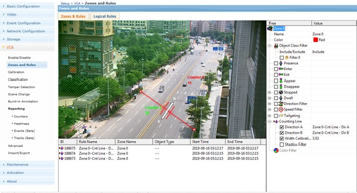
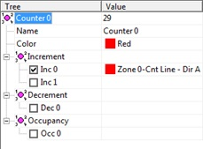
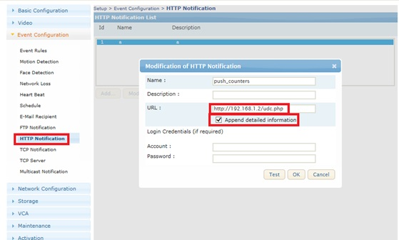
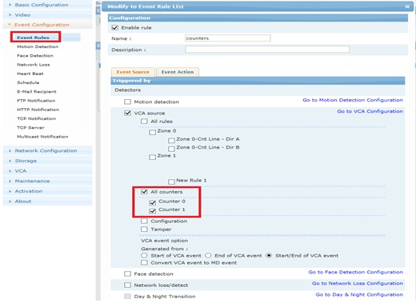
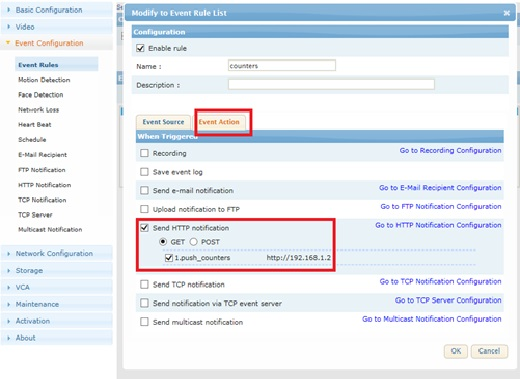
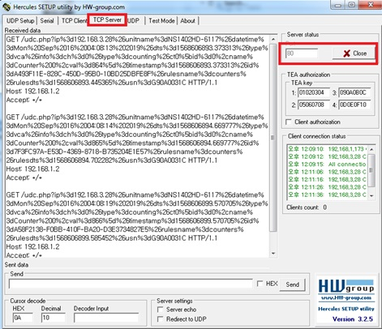

## 计数 事件 推送(HTTP)

#### 设置 Counting Line 与 计数器  
  
  
#### HTTP 推送 设置  
  
HTTP 消息推送， URL为 http://{Server_ip}:port/{script_document} ， 例：http://192.168.1.2:80/udc.php  
** 入用 Cosilan实时全屏数据显示功能 推送信息为 http://{server_ip}:5030/count

##### 计数器 跟 http 推送 联动
  
  
事件原 ： 计数器（counter 0, counter 1） 的 变化。

事件目标 ： Send HTTP notification

#### 测试
用 Hercules （可以 [下载](http://49.235.119.5/download.php?file=hercules_3-2-5.zip)）  
  
```cgi
GET /udc.php?ip%3d192.168.3.28%26unitname%3dNS1402HD-6117%26datetime%3dMon%20Sep%2016%2004:09:03%202019%26dts%3d1568606943.272814%26type%3dvca%26info%3dch%3d0%26type%3dcounting%26ct1%5bid%3d1%2cname%3dCounter%201%2cval%3d1331%5d%26timestamp%3d1568606943.272814%26id%3d17E8CB25-A297-47C4-BADD-E48BC79E0055%26rulesname%3dcounters%26rulesdts%3d1568606943.292712%26usn%3dG90A0031C HTTP/1.1
Host: 192.168.1.2
Accept: */*
```
```
/{script_name}?ip={IP}&unitname={device_name}&datetime={datetime}&dts={digital_timestamp}&type={event_type}&info={event_info}&rulesname={Rule_name}&rulesdts={Rule_timestamp}&usn={usn}
```

{event_info} : counter的 事件 消息
ch={channel_no}&type=counting&ct{id_num}[id={id}, name={Counter_name}, val={Counter_val}]×tamp={timestamp}&id={Event_id}
 - channel_no : 通道编号， 摄像头是 0， 其他 4路，8路 编码器等 多路支持设备 0~3， 0~7
 - id_num: 计数器 ID
 - id: 计数器 ID
 - counter_name : 计数器名称
 - counter_val : 计数器 数值
计数器信息 http://{device_ip}/uapi-cgi/param.fcgi?action=list&group=VCA.Ch0.ct*


Example:
```
ip=192.168.1.173&unitname=NS6202HD-6211IR&datetime=Wed Jul 03 20:36:20 2019&dts=1562157380.877006&type=vca&info=ch=0&type=counting&ct1[id=1,name=Counter 1,val=3439332]×tamp=1562157380.877006&id=D50B87C8-3F31-415E-8B17-07D074DDEEB7&rulesname=counter&rulesdts=1562157380.902422&usn=HA0A007AD
```

 udc.php
```
$IP_addr = $_SERVER['REMOTE_ADDR'];
$regdate= date("Y-m-d H:i:s");
$get_str = urldecode($_SERVER['QUERY_STRING']);
list($msg_head, $info_str) = explode("&info=", $get_str);
foreach(explode("&",$msg_head) as $tt) {
   list($key, $val) = explode("=", $tt);
   ${$key} = $val;
}
```

