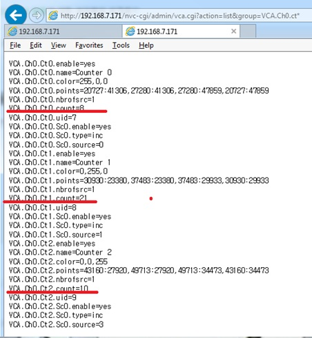
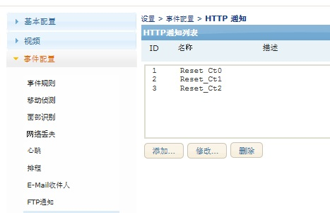
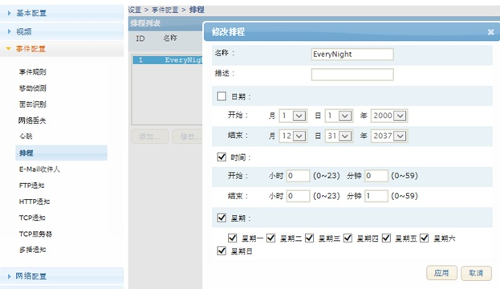
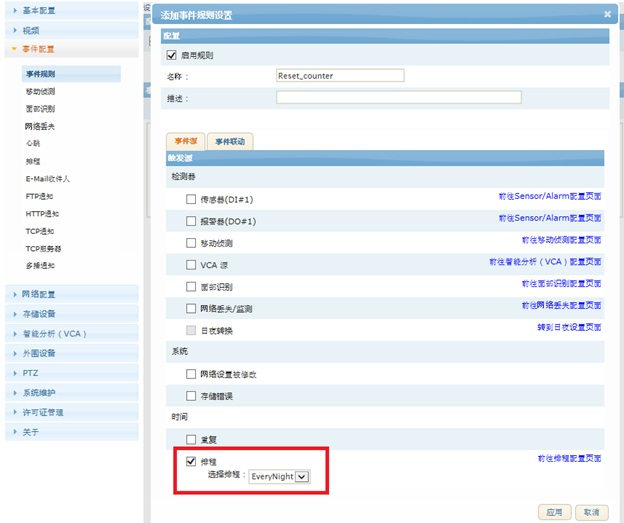
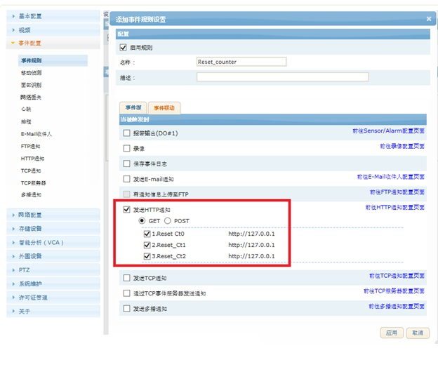

## 计数器 清零(Reset Counter)

CGI 命令：  
```code 
http://{ServerIP}/nvc-cgi/admin/vca.cgi?action=update&group=VCA.Ch0.ct0&count={count_val}
```
- {serverIP} : 设备IP 地址
- {count_va}> : 计数器的 数值， 如果 清零， count_val = 0
- http://{ServerIP}/nvc-cgi/admin/vca.cgi?action=update&group=VCA.Ch0.ct0&count=0
 
#### 计数器 查收
```code 
http://{ServerIP}/nvc-cgi/admin/vca.cgi?action=list&group=VCA.Ch0.ct*</p>
```


#### Reset Counter
```code 
http://192.168.7.171/nvc-cgi/admin/vca.cgi?action=update&group=VCA.Ch0.ct0&count=0
http://192.168.7.171/nvc-cgi/admin/vca.cgi?action=update&group=VCA.Ch0.ct1&count=0
http://192.168.7.171/nvc-cgi/admin/vca.cgi?action=update&group=VCA.Ch0.ct2&count=0
```

### 做事件联动（Event Action）, 发cgi命令= http 通知


URL：  
- Reset_Ct0 :
```
http://127.0.0.1:80/nvc-cgi/admin/vca.cgi?action=update&group=VCA.Ch0.ct0&count=0 
```
- Reset_Ct1 :
```
http://127.0.0.1:80/nvc-cgi/admin/vca.cgi?action=update&group=VCA.Ch0.ct1&count=0
```
- Reset_Ct2 :
```
http://127.0.0.1:80/nvc-cgi/admin/vca.cgi?action=update&group=VCA.Ch0.ct2&count=0
```
 


#### 做 排程（发生事件的时间段）  


#### 事件原跟事件行动 联动



Every Midnight 发生 Event 每天 0：00~：0：01, 联动 发送HTTP 通知 Reset_Ct0, Reset_Ct1 Reset_Ct2