## Testing Serial Over Ip speed

#### Test Process
Select baudrate 115200 / 460800 / 921600
Making sample data with “data.txt” according to DATA_SIZE
Bring up TCP server
Sending ”data.txt” to uart1 port of IPN hardware and receiving with TCP server from IPN and save “data_dest.txt”
Comparing destination file “data_dest.txt” with source file “data.txt”
####Python Code
```python
import sys, time
import serial
import socket
import threading
import random
from http.client import HTTPConnection #Python3
import base64

def init_serial(PORT, BAUDRATE):
    ser = serial.Serial()
    ser.port = PORT
    ser.baudrate = BAUDRATE
    ser.bytesize = serial.EIGHTBITS 
    ser.parity = serial.PARITY_NONE 
    ser.stopbits = serial.STOPBITS_ONE 
    ser.timeout = 2
    ser.xonxoff = False     #disable software flow control
    ser.rtscts = False     #disable hardware (RTS/CTS) flow control
    ser.dsrdtr = False       #disable hardware (DSR/DTR) flow control
    ser.writeTimeout = 2     #timeout for write
    # ser.inter_byte_timeout = None
    # print (ser.portstr)
    try:
        ser.open()
    except Exception as e:
        print ("error open serial port : " + str(e))
        ser.close()
        return False

    return ser

def connectCom():
    global ser, PORT, BAUDRATE
    ser = init_serial(PORT, BAUDRATE)
    if ser:
        print ("COM PORT: %s OPEND" %PORT)
    else :
        BAUDRATE("COM PORT Open Fail", 'error')

def disconnectCom():
    global ser
    ser.close()
    print ("COM Port Closed")

def write_serial(ser, data_str):
    if not ser.isOpen():
        print( "Com Port Not Opened ",'error')
        ser.close()
        return
    n = ser.write(data_str)
    # ser.write(data_str.encode('ascii'))
    # while ser.inWaiting() >0:
    #     out = ser.readline()
    return n

def th_TCP():
    TCP_HOST = ''
    TCP_PORT = 7100
    i= 0 
    try:
        s = socket.socket(socket.AF_INET, socket.SOCK_STREAM)
    except socket.error as  msg:
        print("Could not create socket. Error Code: ", str(msg[0]), "Error: ", msg[1])
        sys.exit(0)

    try:
        s.bind((TCP_HOST, int(TCP_PORT)))
    except socket.error as msg:
        print("Bind Failed. Error Code: {0} Error: {1}".format(str(msg[0]), msg[1]),"error"  )
        s.close()
        sys.exit() 

    s.listen(1)
    print ("listening")
    conn, addr = s.accept()
    print ("%s:%s" %(addr[0], str(addr[1])) + " connected")
    arr_rs =[]

    while True:
        rs = conn.recv(1024)
        arr_rs.append(rs)
        if rs.find(b"EOF;") >=0:
            break
    with open("data_dest.txt", "wb") as f:
        f.write(b''.join(arr_rs))  

    conn.close()
    s.close()

def setBaudrate(dev_ip, baudrate):
    userid = 'root'
    userpw = 'pass' 
    string = (base64.b64encode(((userid + ':' + userpw).encode('ascii')))).decode('ascii')
    authkey = "Basic " + (string)

    server = (dev_ip, 80)
    conn = HTTPConnection(*server)

    cmd_str = "/uapi-cgi/testcmd.cgi?command=stty%20-F%20/dev/tts/1%20" + str(baudrate)
    conn.putrequest("GET", cmd_str )
    conn.putheader("Authorization", authkey)
    conn.endheaders()

    rs = conn.getresponse()
    print (rs.read(1024))

    cmd_str = "/uapi-cgi/testcmd.cgi?command=stty%20-F%20/dev/tts/1"
    conn.putrequest("GET", cmd_str )
    conn.putheader("Authorization", authkey)
    conn.endheaders()

    rs = conn.getresponse()
    print (rs.read(1024))
    conn.close()

if __name__ == '__main__':
    ser = None
    PORT = "COM9"
    # BAUDRATE = 115200
    # BAUDRATE = 460800
    BAUDRATE = 921600
    DATA_SIZE = 10485

    DEV_IP = "192.168.9.52"

    setBaudrate(DEV_IP, BAUDRATE)

    with open("data.txt", "w") as f:
        for i in range(0, int(DATA_SIZE/4)): #60000
            f.write("%08X" %(random.randint(0, 900000000)))
            f.write("%08X" %(random.randint(0, 900000000)))
            f.write("%08X" %(random.randint(0, 900000000)))
            f.write("%08X\n" %(random.randint(0, 900000000)))

        f.write("EOF;\n")

    th1 = threading.Thread(target=th_TCP, args=[])
    th1.start()
    time.sleep(2)

    with open("data.txt","rb") as f:
        data = f.read()

    data_length  = len(data)
    length = 0
    connectCom()
    t1 = time.time()
    length = write_serial(ser, data)
    t2 = time.time()
    print ("data length: %d bytes, elapse time: %3.5f, actual speed: %3.2f baud" %(length, (t2-t1), (length*8/(t2-t1))))
    disconnectCom()

   time.sleep(2)
    with open("data_dest.txt","rb") as f:
        data_dest = f.read()
    data_dest_length = len(data_dest)

    print ("%d == %d" %(data_length, data_dest_length))
		
```

##### [Case 1]
* Baudrate 115200, data size 4096(34,822bytes)
* Result: No error  
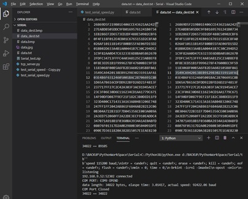

##### [Case 2]
* Baudrate 115200, data size 40960(348,166bytes)
* Result: No error
* data length: 348166 bytes, elapse time: 30.17273, actual speed: 92312.77 baud  
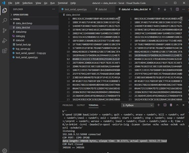

##### [Case 3]
* Baudrate 460800, data size 4096(34,822bytes)
* Result: No Error
* data length: 34822 bytes, elapse time: 0.75704, actual speed: 367978.92 baud  
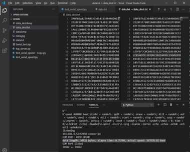

##### [Case 4]
* Baudrate 460800, data size 40960(348,166 bytes)
* Result: No Error but sometimes (1 of 10 tries) Error happened, missing some data
* data length: 348166 bytes, elapse time: 7.56943, actual speed: 367970.50 baud  
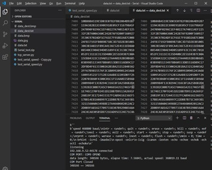
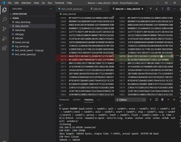
 
##### [Case 5]
* Baudrate 921600, data size 4096(34,822 bytes)
* Result : No Error
* data length: 34822 bytes, elapse time: 0.41602, actual speed: 669615.65 baud  
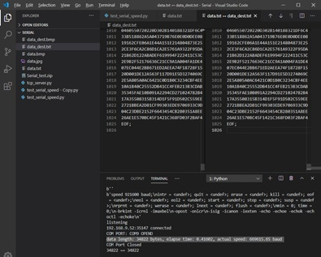

##### [Case 6]
* Baudrate 921600, data size 40960(348,166 bytes)  
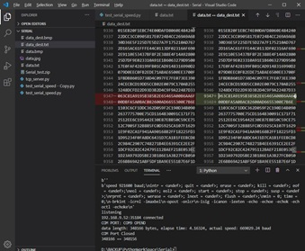 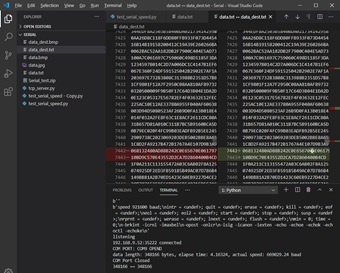
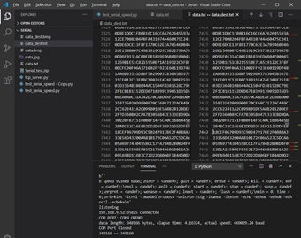 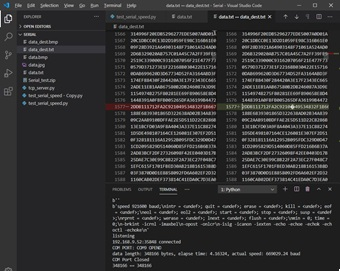
   
##### [Case 7]
* Baudrate 921600, data size 24000(348,166 bytes), (actually same as 252x288x16bit)
* Result : Some Error, Always Happen  
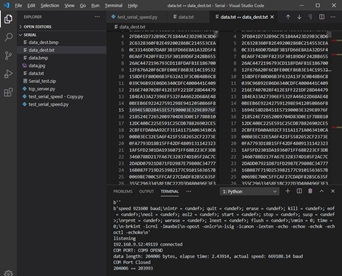 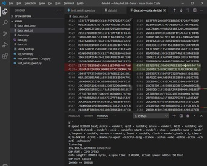
 
#### [Conclusion]
Assume , Serial-over-ip FIFO is not enough to send high speed data, check FIFO size.
Assume that this function receives 1byte data from uart1 port and sends 1 byte data to TCP immediately, there could have overhead.