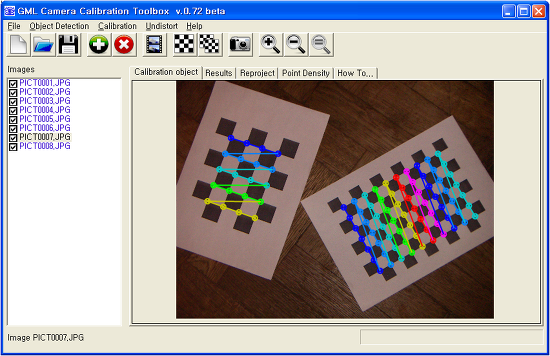
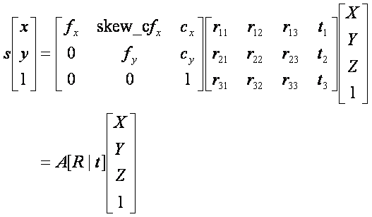
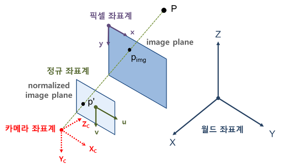
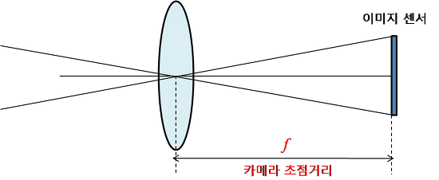
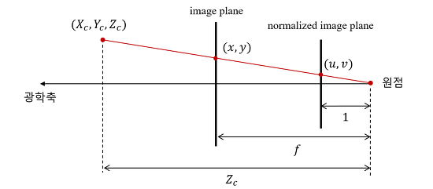
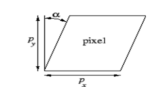
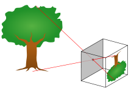
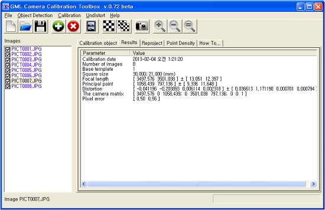
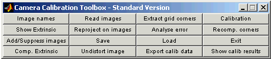

카메라 캘리브레이션 (Camera Calibration)
영상처리 2013. 2. 1. 16:59
카메라 캘리브레이션 (camera calibration)은 영상처리, 컴퓨터 비전 분야에서 번거롭지만 꼭 필요한 과정중의 하나입니다. 본 포스팅에서는 카메라 캘리브레이션의 개념, 카메라 내부 파라미터, 외부 파라미터, 카메라 핀홀 모델, 카메라 캘리브레이션 도구에 대해 관련된 개념이나 이론적 배경들을 전반적으로 정리해 보았습니다.

그림1. 카메라 캘리브레이션

0. 카메라 캘리브레이션이란?

1. 캘리브레이션 개요

2. 카메라 내부 파라미터(intrinsic parameters)

3. 카메라 외부 파라미터(extrinsic parameters)

4. 핀홀(pinhole) 카메라 모델

5. 캘리브레이션과 영상해상도 그리고 자동초점조절(auto focusing)

6. 캘리브레이션 도구(tool) 및 사용법

7. 캘리브레이션 결과가 달라지는 이유

8. 카메라 캘리브레이션 팁

0. 카메라 캘리브레이션이란?

우리가 실제 눈으로 보는 세상은 3차원입니다. 하지만 이것을 카메라로 찍으면 2차원의 이미지로 변하게 됩니다. 이 때, 3차원의 점들이 이미지 상에서 어디에 맺히는지는 기하학적으로 생각하면 영상을 찍을 당시의 카메라의 위치 및 방향에 의해 결정됩니다. 하지만 실제 이미지는 사용된 렌즈, 렌즈와 이미지 센서와의 거리, 렌즈와 이미지 센서가 이루는 각 등 카메라 내부의 기구적인 부분에 의해서 크게 영향을 받습니다. 따라서, 3차원 점들이 영상에 투영된 위치를 구하거나 역으로 영상좌표로부터 3차원 공간좌표를 복원할 때에는 이러한 내부 요인을 제거해야만 정확한 계산이 가능해집니다. 그리고 이러한 내부 요인의 파라미터 값을 구하는 과정을 카메라 캘리브레이션이라 부릅니다.

1. 캘리브레이션 개요

카메라 영상은 3차원 공간상의 점들을 2차원 이미지 평면에 투사(perspective projection)함으로써 얻어집니다. 핀홀(pinhole) 카메라 모델에서 이러한 변환 관계는 다음과 같이 모델링됩니다.

(1)

여기서, (X,Y,Z)는 월드 좌표계(world coordinate system) 상의 3D 점의 좌표, [R|t]는 월드 좌표계를 카메라 좌표계로 변환시키기 위한 회전/이동변환 행렬이며 A는 intrinsic camera matrix입니다.

그림 2. 카메라 좌표계

수식적으로 보면 카메라 캘리브레이션(camera calibration)은 위와 같은 3D 공간좌표와 2D 영상좌표 사이의 변환관계 또는 이 변환관계를 설명하는 파라미터를 찾는 과정입니다.

식(1)에서 [R|t]를 카메라 외부 파라미터(extrinsic parameter), A를 내부 파라미터(intrinsic parameter)라고 부릅니다. 그리고 A와 [R|t]를 합쳐서 camera matrix 또는 projection matrix라 부릅니다.

카메라 외부 파라미터는 카메라의 설치 높이, 방향(팬, 틸트) 등 카메라와 외부 공간과의 기하학적 관계에 관련된 파라미터이며 내부 파라미터는 카메라의 초점 거리, aspect ratio, 중심점 등 카메라 자체의 내부적인 파라미터를 의미합니다.

2. 카메라 내부 파라미터(intrinsic parameters)

카메라의 내부 파라미터로는 다음과 같은 것들이 있습니다.

초점거리(focal length): fx, fy
주점(principal point): cx, cy
비대칭계수(skew coefficient): skew_c = tanα

A. 초점거리(focal length)

흔히 초점거리라 하면 볼록렌즈의 초점을 생각하기 쉬운데, 여기서(카메라 모델) 말하는 초점거리는 렌즈중심과 이미지센서(CCD, CMOS 등)와의 거리를 말합니다.

그림 3. 카메라 모델

디지털 카메라 등에서 초점거리는 mm 단위로 표현되지만 카메라 모델에서 말하는 초점거리(f)는 픽셀(pixel) 단위로 표현됩니다. 즉, f의 단위로 픽셀이라는 의미입니다.

이미지의 픽셀(pixel)은 이미지 센서의 셀(cell)에 대응되기 때문에, 초점거리(f)가 픽셀(pixel) 단위라는 의미는 초점거리가 이미지 센서의 셀(cell) 크기에 대한 상대적인 값으로 표현된다는 의미입니다. 예를 들어, 이미지 센서의 셀(cell)의 크기가 0.1 mm이고 카메라의 초점거리가 f = 500 pixel이라고 하면 이 카메라의 렌즈 중심에서 이미지 센서까지의 거리는 이미지 센서 셀(cell) 크기의 500배 즉, 50 mm라는 의미입니다.

컴퓨터 비전 분야에서 카메라 초점거리를 물리단위(m, cm, mm, ...)가 아닌 픽셀단위로 표현하는 이유는 (이미지 픽셀과 동일한 단위로 초점거리를 표현함으로써) 영상에서의 기하학적 해석을 용이하게 하기 위함입니다.

그런데, 카메라 모델에서 초점거리를 하나의 값으로 f라 표현하지 않고 fx, fy로 구분하여 표현하는 경우가 있는데(실제로 카메라 캘리브레이션을 수행하면 fx, fy를 구분하여 반환한다) 이는 이미지 센서의 물리적인 셀 간격이 가로 방향과 세로 방향이 서로 다를 수 있음을 모델링하기 위함입니다. 이 경우 fx는 초점거리(렌즈중심에서 이미지 센서까지의 거리)가 가로 방향 셀 크기(간격)의 몇 배인지를 나타내고 fy는 초점거리가 세로 방향 센서 셀 크기(간격)의 몇 배인지를 나타냅니다. fx와 fy 모두 단위는 픽셀(pixel)이며 현대의 일반적인 카메라는 가로방향 셀 간격과 세로방향 셀 간격의 차이가 없기 때문에 f = fx = fy라 놓아도 무방합니다.

참고로, 동일한 카메라로 캘리브레이션을 수행했을 때, 이미지 해상도를 1/2로 낮추면 캘리브레이션 결과의 초점거리도 1/2로 작아집니다. 실제 물리적 초점거리가 변하는 것은 아니지만 카메라 모델에서의 초점거리는 상대적인 개념이기 때문에 해상도를 바꾸면 한 픽셀(pixel)에 대응하는 물리크기가 변하고 따라서 초점거리도 변하게 됩니다. 예컨데, 이미지 해상도를 1/2로 낮추면 이미지 센서의 2 x 2 셀(cell)들이 합쳐서 하나의 이미지 픽셀이 되기 때문에 한 픽셀에 대응하는 물리크기가 2배가 됩니다. 따라서 초점거리는 1/2이 되어야 합니다.

카메라 모델의 렌즈중심(초점)은 핀홀 카메라 모델(그림 6)에서 핀홀(pinhole)에 해당됩니다. 핀홀 카메라 모델은 모든 빛은 한 점(초점)을 직선으로 통과하여 이미지 평면(센서)에 투영된다는 모델입니다. 이러한 핀홀 모델은 3D 공간과 2D 이미지 평면 사이의 기하학적 투영(projection) 관계를 매우 단순화시켜 줍니다.

초점으로부터 거리가 1(unit distance)인 평면을 normalized image plane이라고 부르며 이 평면상의 좌표를 보통 normalized image coordinate라고 부릅니다. 물론 이것은 실제는 존재하지 않는 가상의(상상의) 이미지 평면입니다. 카메라 좌표계 상의 한 점 (Xc, Yc, Zc)를 영상좌표계로 변환할 때 먼저 Xc, Yc를 Zc(카메라 초점에서의 거리)로 나누는 것은 이 normalized image plane 상의 좌표로 변환하는 것이며, 여기에 다시 초점거리 f를 곱하면 우리가 원하는 이미지 평면에서의 영상좌표(pixel)가 나옵니다 (그림 4 참조). 그런데, 이미지에서 픽셀좌표는 이미지의 중심이 아닌 이미지의 좌상단 모서리를 기준(원점)으로 하기 때문에 실제 최종적인 영상좌표는 여기에 (cx, cy)를 더한 값이 됩니다. 즉, x = fxX/Z+cx, y = fyY/Z+cy. 카메라 모델에서 사용하는 좌표계 표현 및 변환에 대한 보다 자세한 내용에 대해서는 [영상처리] - [영상 Geometry #1] 좌표계 글을 참조하기 바랍니다.

그림 4. 카메라 투영(projection) 모델

☞ 초점거리에 대한 보다 자세한 내용에 대해서는 [영상처리] - 카메라의 초점거리(focal length) 글을 참조하기 바랍니다 (2013.10.23).

☞ 이미지평면(이미지센서)은 실제로는 렌즈 뒤쪽에 있지만, 기하학적 연산을 단순화하기 위해 위 그림처럼 렌즈 앞쪽에 위치시키는 것이 일반적입니다. (reflected model)

B. 주점(principal point)

주점 cx, cy는 카메라 렌즈의 중심 즉, 핀홀에서 이미지 센서에 내린 수선의 발의 영상좌표(단위는 픽셀)로서 일반적으로 말하는 영상 중심점(image center)과는 다른 의미입니다. 예를 들어서, 카메라 조립과정에서 오차로 인해 렌즈와 이미지 센서가 수평이 어긋나면 주점과 영상중심은 다른 값을 가질 것입니다.

영상기하학에서는 단순한 이미지 센터보다는 principal point가 훨씬 중요하며  영상의 모든 기하학적 해석은 이 주점을 이용하여 이루어집니다.

C. 비대칭 계수(skew coefficient)

비대칭 계수 skew_c는 이미지 센서의 cell array의 y축이 기울어진 정도를 나타냅니다 (skew_c = tanα).

그림 5. 카메라 비대칭 계수

요즘 카메라들은 이러한 skew 에러가 거의 없기 때문에 카메라 모델에서 보통 비대칭 계수까지는 고려하지 않는다고 합니다 (즉, skew_c = 0).

이러한 카메라 내부 파라미터들은 공개된 캘리브레이션 툴 등을 이용하면 비교적 쉽게 계산할 수 있습니다. 공개 캘리브레이션 툴 소개 및 사용법은 본 포스팅 하단을 참조하시기 바랍니다.

3. 카메라 외부 파라미터(extrinsic parameters)

카메라 외부 파라미터는 카메라 좌표계와 월드 좌표계 사이의 변환 관계를 설명하는 파라미터로서, 두 좌표계 사이의 회전(rotation) 및 평행이동(translation) 변환으로 표현됩니다.

카메라 외부 파라미터는 카메라 고유의 파라미터가 아니기 때문에 카메라를 어떤 위치에 어떤 방향으로 설치했는지에 따라 달라지고 또한 월드 좌표계를 어떻게 정의했느냐에 따라서 달라집니다.

카메라 외부 파라미터를 구하기 위해서는 먼저 캘리브레이션 툴 등을 이용하여 카메라 고유의 내부 파라미터들을 구합니다. 다음으로는 미리 알고 있는 또는 샘플로 뽑은 3D월드좌표–2D영상좌표 매칭 쌍들을 이용하여 식(1)에서 변환행렬을 구하면 됩니다. OpenCV에 있는 solvePnP함수를 이용하면 이러한 계산을 손쉽게 할 수 있습니다.

☞ 카메라 외부 파라미터 캘리브레이션 및 영상 기하학에 대한 전반적인 내용에 대해서는 [영상처리] - Extrinsic Camera Calibration - 카메라의 위치 및 자세 파악 글을 참고하기 바랍니다.

4. 핀홀(pinhole) 카메라 모델

핀홀 카메라 모델은 아래 그림과 같이 하나의 바늘구멍(pinhole)을 통해 외부의 상이 이미지로 투영된다는 모델입니다. 이 때, 이 바늘구멍(pinhole)이 렌즈 중심에 해당되며 이곳에서 뒷면의 상이 맺히는 곳까지의 거리가 카메라 초점거리입니다 (광학적으로 렌즈의 중심을 투과하는 빛은 굴절되지 않고 그대로 직선으로 투과한다고 합니다).

그림 6. 핀홀 카메라 모델

(그림출처: http://en.wikipedia.org/wiki/Pinhole_camera_model)

영상처리 분야에서 영상에 대한 모든 기하학적 해석은 이 핀홀 카메라 모델을 바탕으로 이루어집니다. 하지만, 사실 핀홀 카메라 모델은 매우 이상적인 카메라 모델이며 실제로는 렌즈계의 특성에 따른 영상 왜곡 등도 같이 고려되어야 합니다. 영상 왜곡에 대한 내용은 [영상처리] - 카메라 왜곡보정을 참조해 주시기 바랍니다.

5. 캘리브레이션과 영상 해상도 그리고 자동초점조절(auto focusing)

카메라에 있는 오토 포커싱(auto focusing) 기능을 켜면 계속 초점거리가 바뀔 수 있기 때문에 캘리브레이션 목적에는 적합하지 않습니다. 카메라에 대해 캘리브레이션을 수행하고 캘리브레이션 결과를 다른 계산 목적에 사용하고자 한다면 오토 포커싱 기능은 꺼 놓고 사용하는게 좋습니다.

카메라에는 보통 영상 해상도를 QVGA(320x240), VGA(640x480), 960x480, ... 등 다양하게 설정할 수 있습니다. 그런데, 영상 해상도를 바꾸면 카메라 캘리브레이션 결과도 바뀌는 것을 확인 할 수 있을 것입니다. 카메라 내부 파라미터중 초점거리 fx, fy, 주점 cx, cy는 픽셀 단위를 사용하는데, 카메라의 물리적인 초점거리나 이미지 센서의 크기는 변하지 않지만 한 픽셀이 나타내는 물리적 크기가 변하기 때문입니다. 그래서 만일 영상해상도를 VGA로 놓고 캘리브레이션 한 결과과 QVGA로 놓고 캘리브레이션 한 결과를 비교해 보면 QVGA의 경우가 fx, fy, cx ,cy의 값이 1/2씩 줄어들게 됩니다. 반면에 렌즈왜곡계수(k1, k2, p1, p2)는 normalized 좌표계에서 수행되기 때문에 영상 해상도와 관계없이 항상 동일합니다. 따라서, 한 해상도에서만 캘리브레이션을 수행해도 다른 모든 해상도에 대한 파라미터 값을 구할 수 있게 됩니다. 렌즈왜곡계수는 동일하며, fx,fy,cx,cy만 영상 해상도에 비례해서 조정해 주면 됩니다.

6. 캘리브레이션 도구(tool) 및 사용법

A. Dark Cam Calibrator

최근에 직접 구현한 것인데 필요하시면 한번 사용해 보시기 바랍니다 ([개발한 것들] - 카메라 캘리브레이션 프로그램 (DarkCamCalibrator)). 카메라에서 직접 영상을 획득할 수 있으며 Fisheye 왜곡모델에 대한 캘리브레이션도 가능하다는 특징이 있습니다. OpenCV를 이용하여 구현한 것으로서 캘리브레이션 성능 자체는 OpenCV 성능과 같습니다.

B. GML C++ Camera Calibration Toolbox

가장 손쉽게 이용할 수 있는 공개 캘리브레이션 툴로는 GML C++ Camera Calibration Toolbox가 있습니다. 현재 0.73버전이 가장 최신버전이며 소소코드도 같이 공개되어 있습니다.

사이트 링크: http://graphics.cs.msu.ru/en/node/909

직접 다운로드: GML_CameraCalibrationInstall_0.73.exe

그림 7. GML 카메라 캘리브레이션 툴

기본적인 사용법은 캘리브레이션 패턴(chess board)이 인쇄된 종이를 다양한 위치 및 각도에서 카메라로 촬영한 후 영상으로 저장하고 위 툴(tool)로 캘리브레이션을 수행하면 됩니다. 자세한 사용법 및 최적의 영상획득 방법 등은 프로그램 자체에 포함된 설명문(Help)을 참조하시기 바랍니다.

이 툴의 특징은 위 그림과 같이 여러 개의 캘리브레이션 패턴을 동시에 사용하여 캘리브레이션을 수행할 수 있다는 점입니다. 툴의 설명문에 보면 2개 이상의 패턴을 사용했을 때 캘리브레이션 효과가 좀더 좋다고 나와 있습니다. 물론 1개의 패턴만을 사용하는 것도 가능합니다.

위 툴을 사용하여 캘리브레이션을 수행하면 다음과 같은 형태로 결과를 볼 수 있습니다.

그림 8. GML 카메라 캘리브레이션 툴 실행 예시

캘리브레이션 결과는 위 예와 같이 추정치 ± 추정오차(3*sigma) 형태로 출력되며 각각의 항목의 의미는 다음과 같습니다.

Focal length: fx = 3497.576, fy = 3501.038
Principal point: cx = 1058.429, cy = 797.136
Distortion: k1 = -0.041196, k2 = -0.203893, p1 = 0.006114, p2 = 0.002318 (k1,k2: radial distortion 계수, p1,p2: tangential distortion 계수)

C. Camera Calibration Toolbox for Matlab

아마도 카메라 캘리브레이션 분야에 있어서 가장 대표적인 툴로 생각됩니다. Matlab으로 구현되어 있으며 다소 사용법이 복잡하지만 캘리브레이션 과정의 세세한 부분을 직접 설정할 수 있으며 보다 정밀한 캘리브레이션이 가능합니다.

사이트 링크: http://www.vision.caltech.edu/bouguetj/calib_doc/

그림 9. Caltech 카메라 캘리브레이션 툴

위 사이트는 또한 카메라 캘리브레이션 분야에 있어서 가장 대표적인 사이트로서 캘리브레이션 툴 뿐만 아니라 캘리브레이션에 대한 전반적인 이론 및 정보가 잘 정리되어 있습니다. 캘리브레이션을 연구하는 (영어권) 사람들은 주로 이 사이트를 통해 필요한 정보를 얻는 것으로 알고 있습니다.

7. 캘리브레이션 결과가 달라지는 이유 (2015.5.12 추가)

댓글로 문의를 많이 주시는 내용인데 본문에 내용을 추가하는 것도 좋을 것 같아서 추가합니다.

카메라 캘리브레이션 결과가 달라지는 것은 먼저 카메라의 auto focus 기능이 켜져 있는지 확인해야 합니다. 물론 auto focus 기능이 꺼져 있음에도 불구하고 결과가 달라질 수 있지만 그 편차는 auto focus 기능이 켜져 있는 경우에 비해 훨씬 줄어들 것입니다. 하지만, auto focusing 여부와 관계없이 근본적으로 동일한 카메라에 대해 캘리브레이션 결과가 달라질 수 있는 이유는 몇 가지 원인이 있는데 적어보면 다음과 같습니다.

캘리브레이션은 완벽한 핀홀 카메라 모델을 가정하고 파라미터를 찾지만 실제 카메라는 핀홀 카메라 모델이 아닐 수 있습니다.
카메라 캘리브레이션 과정에 렌즈계 왜곡모델이 들어가는데, 일반적으로 사용되는 렌즈계 왜곡모델은 왜곡 특성을 저차의 다항함수로 근사하는 것이기 때문에 실제의 렌즈계 왜곡과는 차이가 발생할 수 있습니다.
마지막으로 카메라 캘리브레이션은 어떤 방정식을 풀어서 딱 떨어지게 해를 찾는 것이 아니라 해에 대한 초기 추정치부터 시작해서 최적화 기법을 적용하여 반복적인 탐색 과정을 거쳐 근사적인 해를 찾는 것이기 때문에 매번 해가 달라질 수 있습니다.
결국 카메라의 내부 파라미터 자체는 고유값이지만 캘리브레이션 모델 자체가 근사적인 모델이기 때문에 사용한 이미지에 따라 최적 근사해가 달라질 수 있습니다.

8. 카메라 캘리브레이션 팁 (2015.5.12 추가)

카메라 캘리브레이션 팁도 간단하게 같이 적어봅니다. 카메라와 패턴과의 거리에 대해 문의를 많이 주시는데 패턴과의 거리는 최대한 가까울수록 좋습니다. 그 이유는 캘리브레이션 자체는 패턴과의 거리와 관계없지만 패턴과의 거리가 가까우면 영상에서 좀더 정밀하게 코너점의 위치를 찾을 수 있기 때문입니다. (경험적으로) 패턴 영상의 개수는 4개 이상이면 어느정도 캘리브레이션이 가능하지만 많을수록 좋으며 20장 이상 정도면 무난하다고 생각됩니다. 마지막으로 패턴 영상을 획득할 때에는 되도록 다양한 각도에서 영상을 획득하면 좋습니다.