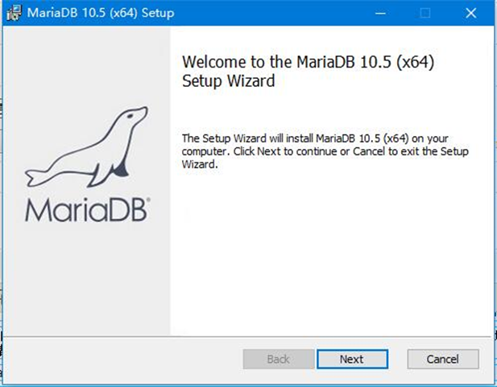
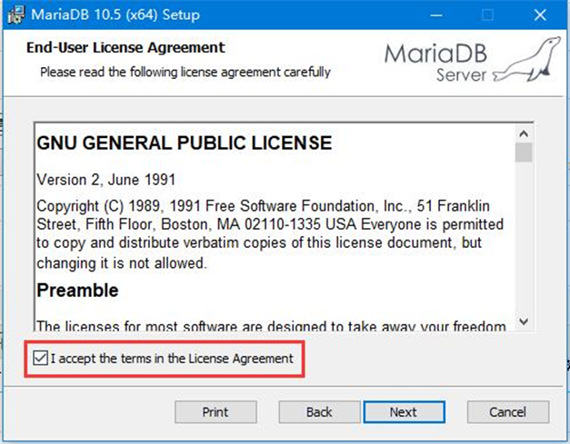
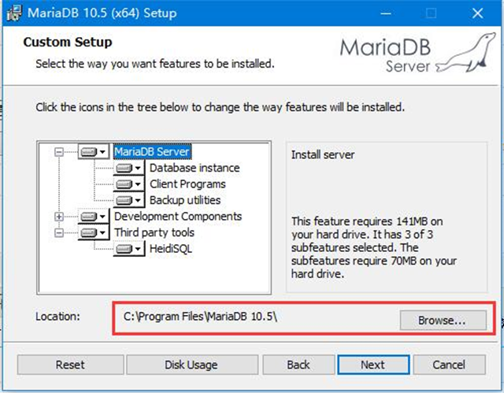
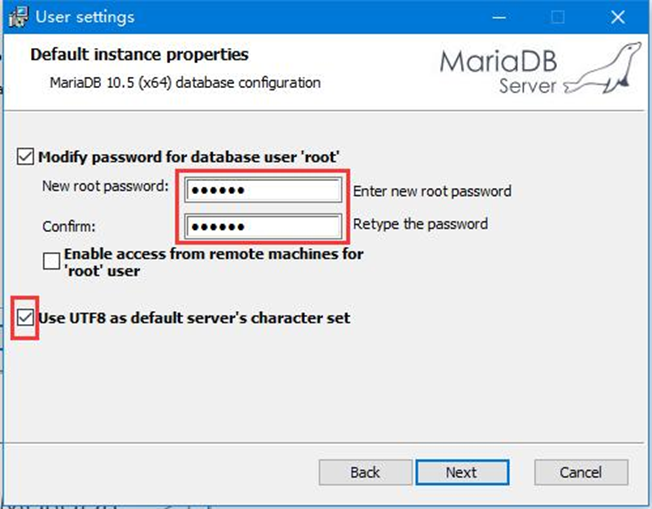
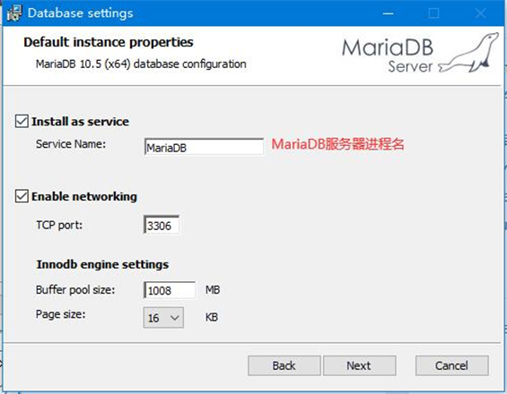
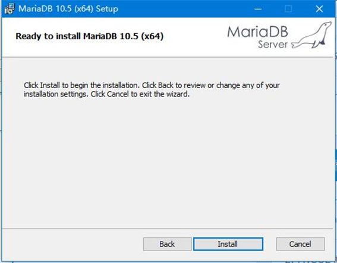

1. 如已安装的数据库软件， 不用安装，要 root的密码
2. 下载软件 http://124.61.244.239:8000/download.php?file=mariadb-10.4.24-winx64.msi
3. windows 11 有时候 不能 安装 数据库 软件， 安装mariadb-10.8:  
https://mirrors.aliyun.com/mariadb//mariadb-10.8.3/winx64-packages/mariadb-10.8.3-winx64.msi
		或者
http://124.61.244.239:8000/download.php?file=mariadb-10.8.4-winx64.msi

4. 双击运行 mariadb-10.4.24-winx64.msi  

5. 点击i accept... 接受许可协议  

6. 选择组件以及软件安装路径  

7. 设置数据库的密码  
		输入的密码要记忆, COSILAN 程序 初始化，更新的时候需要  

8. 默认下一步  

9. 点击install进行安装即可  

#### 以下 调试的 update.bat 自动调,安装 Cosilan 主程序 后 mariadb 重新开始