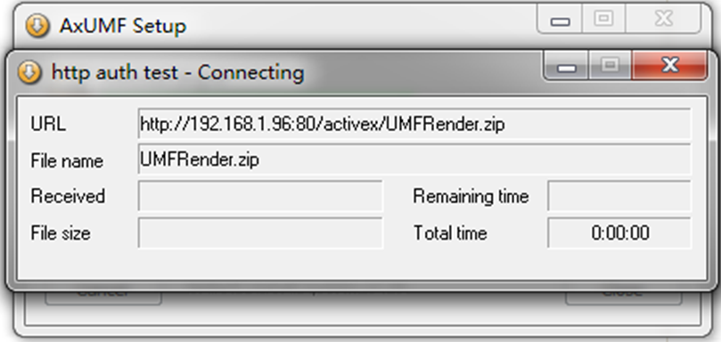

## IPN Webpage Manual - Install ActivX

### 高清客流分析摄像机 用户操作手册
使用WEB浏览器  
ActiveX安装(AxUMF.cab)  
安装ActiveX后才可以通过浏览器对设备进行完全控制。按照下面的步骤安装ActiveX。 禁用“弹出窗口阻止程序”或者点击浏览器上的“Add-on”提示安装ActiveX。

1. 如下图所示，点击网页上的安装警告信息。安装AxUMF.cab前，页面每秒会显示一张JPEG格式的抓拍截图。  

2. 点击警告对话框上的<strong>安装</strong> 按钮。安装完成后，如果页面没有反应，请刷新页面。  

3. 等待setup.exe自动下载ActiveX进行安装。在安装完成前，浏览器页面每秒会显示一张JPEG格式的抓拍截图。  

4. 如果弹出对话框要求输入用户名和密码，请输入管理员账户的默认值（区分大小写字母）：	用户名： root,	密码： pass
5. 刷新页面，检查实时图像是否正确显示。