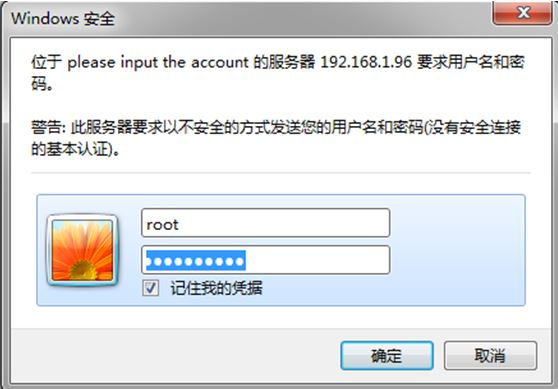
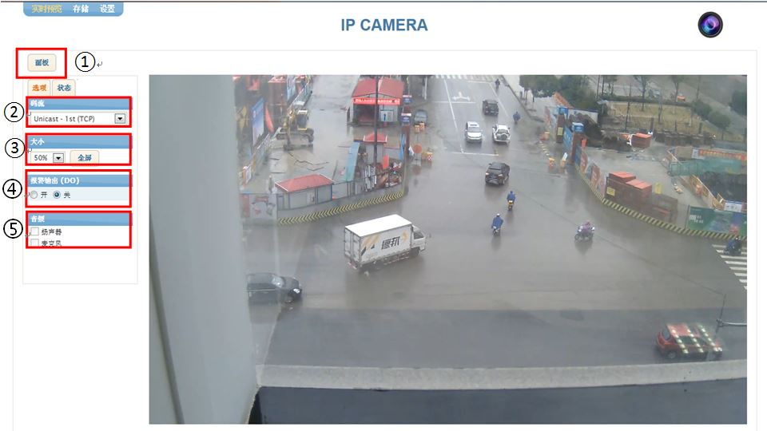
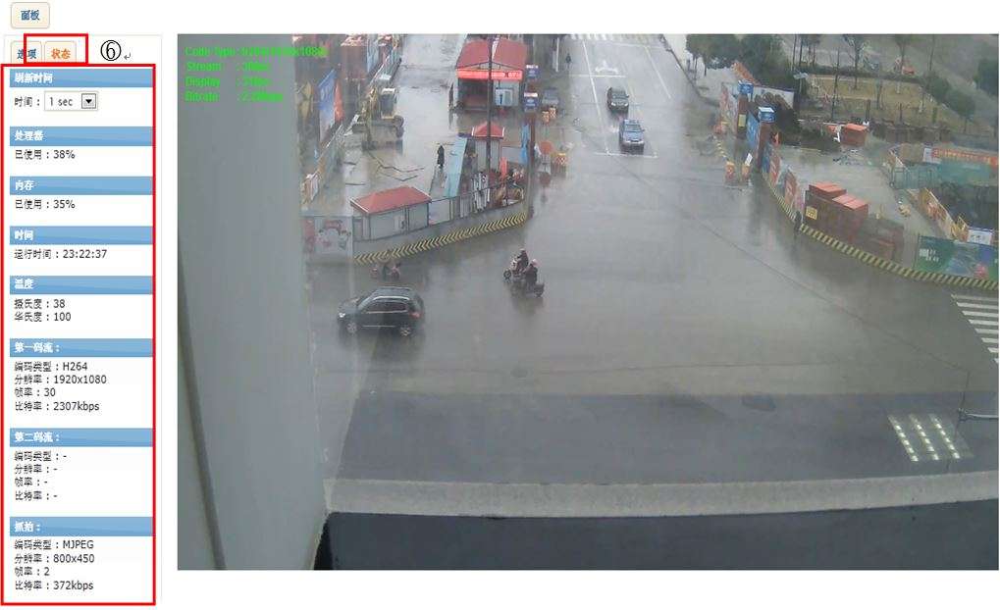

## IPN Webpage Manual - Live

#### 预览页面配置
使用浏览器登录到设备上后，页面上会显示实时预览图像。如果要从<strong>存储</strong>或者<strong>设置</strong>页面返回预览页面，请点击左上角的<strong>预览</strong>。

#### 登录
使用浏览器登录设备：  
1. 在弹出的认证窗口中，用户名处输入“root”，密码输入“pass”。
2. 点击OK登录页面。  

#### 预览页面菜单  

1. 面板：点击面板按钮可以显示或者隐藏菜单标签。
2. 码流：下拉菜单中列出摄像机中可用的码流，用户可以选择需要显示的码流。
3. 大小：用户可以选择在预览页面中显示的视频画面大小。
	- Fit：视频画面自动缩放以适应浏览器页面的大小。
	- 25%：视频画面以原画面分辨率的1/4大小显示。
	- 50%：视频画面以原画面分辨率的1/2大小显示。
	- 75%：视频画面以原画面分辨率的3/4大小显示。
	- 100%：视频画面以原画面的分辨率显示。
	- 全屏：视频画面以全屏模式显示。
4. 触发报警（DO）：用户可以激活或者禁用报警。需要首先在设置> 外围设备 > DI/DO 菜单中选择启用。
5. 音频：
	- 如果设置>码流>音频中的“启用音频输出”和设置>网络配置>RTSP/RTP中的“包含音频流”都被选中，音频-Speaker标签会被激活。
	- 如果设置>码流>音频中的“启用音频输出”和设置>网络配置>RTSP/RTP中的“包含音频流”都被选中，音频-Microphone标签会被激活。
	
#### 状态栏  

6. 状态：状态面板显示以下项目
	- 刷新时间：设置刷新时间间隔
	- 处理器：处理器使用率
	- 内存：内存使用率
	- 时间：设备运行时间
	- 温度：以 ℃和℉显示摄像机的温度
	- 第一码流/第二码流/抓拍：显示每个码流的当前信息

如果实时预览图像没有显示，   
1. 检查摄像机是否已上电，是否正常连接。 
2. 如果使用的是Internet Explorer，检查ActiveX控件是否已安装。如果使用的是其它类型的浏览器，实时预览视频将会通过QuickTime播放器播放。  

如果Direct3D加速被禁用，页面可能会无法正常显示。如果页面没有正常显示图像而是显示蓝色画面，请在开始>运行处输入“dxdiag”并回车，在弹出的设置窗口中启用DirectX特性。
