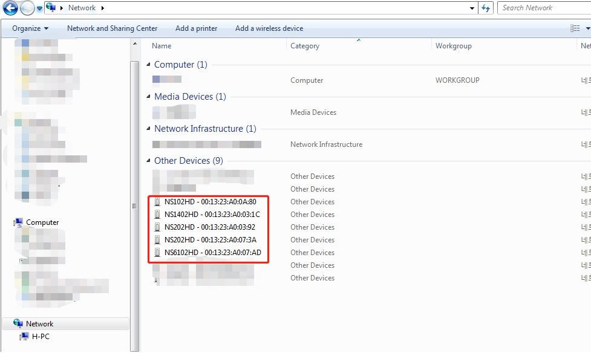

### Browsing Devices
#### IPAdminTool.exe
[下载 IpAdmintool](/download.php?file=AdminTool_v3.23.27.zip)   参考<a href="/help/view_markdwon.php?code=P1619429800" target="_blank"> 说明</a>
 
 #### Windows Browser
 
 
 #### uPnp
 通过 Upnp 协议， 发送 drowse device 信息， 回复的局域网内的设备信息。  
 ```code 
 ST = 'urn:schemas-upnp-org:device:nvcdevice'
    msg = \
        'M-SEARCH * HTTP/1.1\r\n' \
        'HOST:239.255.255.250:1900\r\n' \
        'ST:' + ST + '\r\n'\
        'MX:2\r\n' \
        'MAN:"ssdp:discover"\r\n' \
        '\r\n'
```
## 搜索IP设备

#### 用 UPNP 协议
发送 msg 到 239,255.255.250, 1900端口

```code 
s = socket.socket(socket.AF_INET, socket.SOCK_DGRAM, socket.IPPROTO_UDP)
s.settimeout(2)
s.sendto(msg.encode('ASCII'),('239.255.255.250', 1900))
```

收 回复信息
```code 
    body =set()
    try:
        while True: 
            # buffer size is 1024 bytes
            data, addr = s.recvfrom(1024) 
            body.add(data.decode('ASCII'))
    except socket.error as e:
        s.close()
```
可以 收到

```code 
HTTP/1.1 200 OK\r\n
CACHE-CONTROL: max-age=100\r\n
DATE: Sat, 05 Sep 2020 12:11:34 GMT\r\n
EXT:\r\n
LOCATION: http://192.168.4.173:49152/upnpdevicedesc.xml\r\n
OPT: "http://schemas.upnp.org/upnp/1/0/"; ns=01\r\n
01-NLS: 1246cd92-ef52-11ea-9c79-dc56e6e75747\r\n
SERVER: Linux/2.6.18_IPNX_PRODUCT_1.1.2-g3532e87a, UPnP/1.0, Portable SDK for UPnP devices/1.8.4\r\n
X-User-Agent: redsonic\r\n
ST: urn:schemas-upnp-org:device:nvcdevice\r\n
USN: uuid:H10A004AD-00:13:24:A0:04:AD::urn:schemas-upnp-org:device:nvcdevice\r\n\r\n'
```
