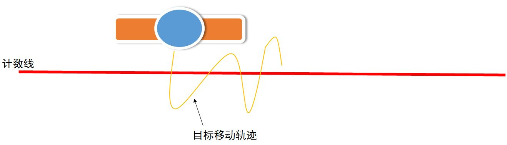
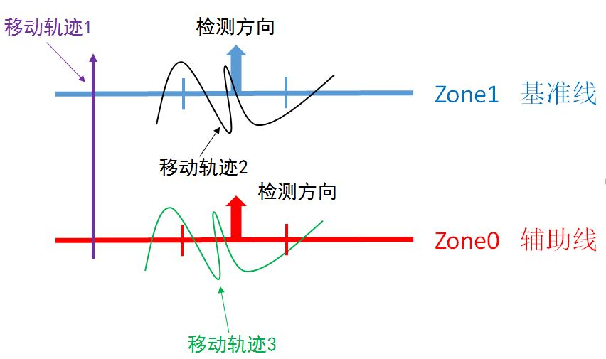
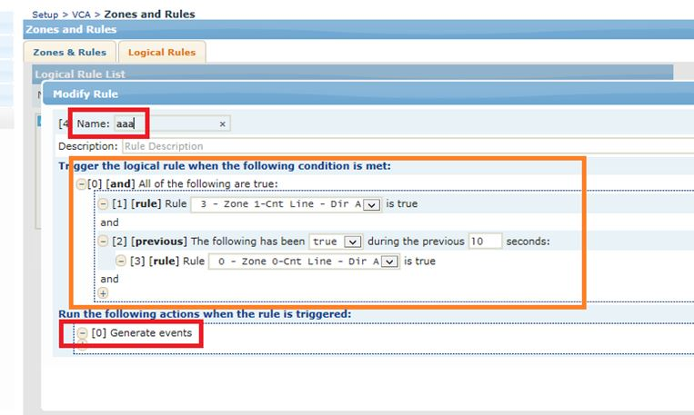
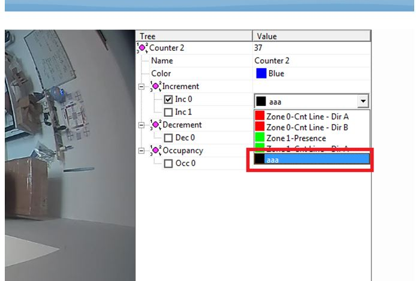
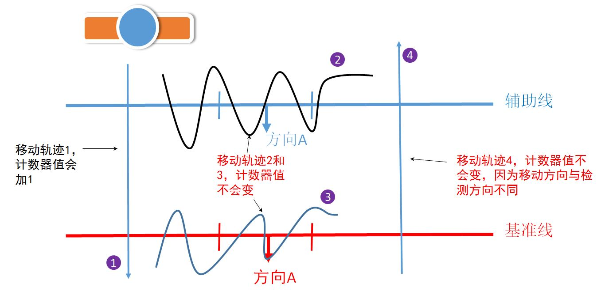
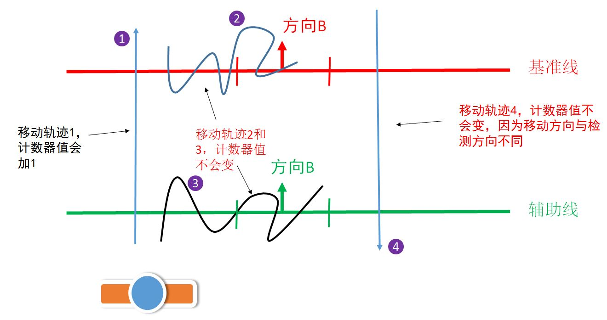
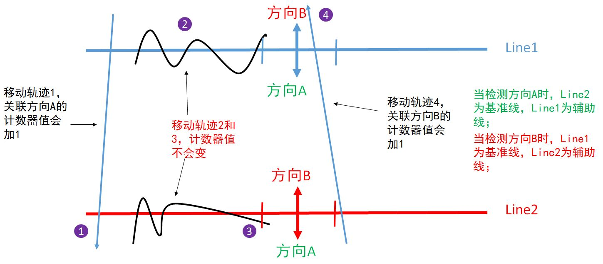
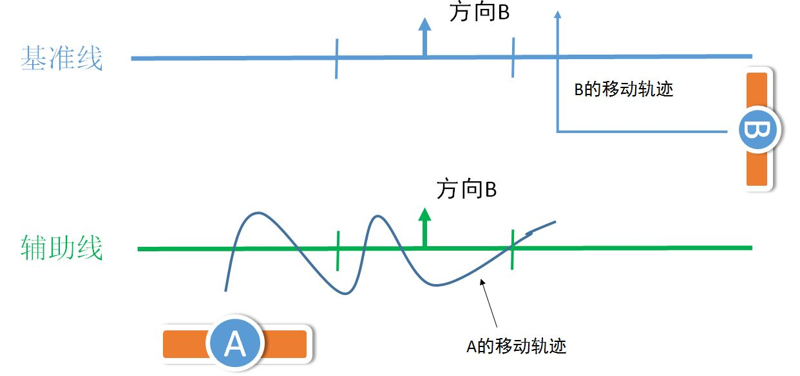
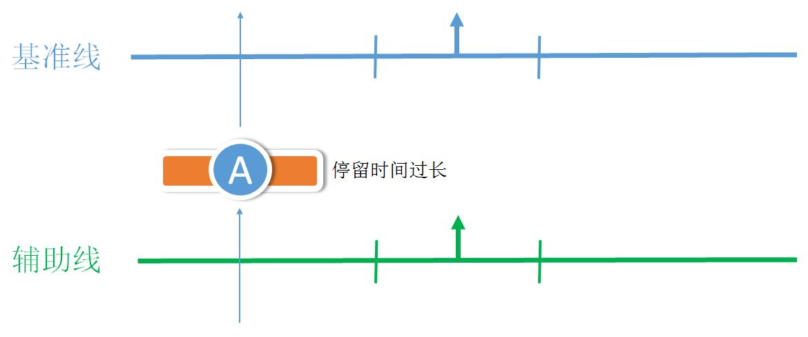

## 计数线徘徊-双线计数

问题描述：目标在计数线附近来回走动，引起计数线重复计算，导致计数结果不精确。

### 改善方案  
使用两条计数线结合逻辑规则来判断目标是正常通过还是在计数线附近徘徊，如果认定为正常通过，则计数器值加1，如果判断为徘徊则计数器值不变。

#### 判断方法，如图所示： 
- Zone1 为基准线，Zone0 为辅助线，两根计数线的检测方向设为一致，对两根线都进行宽度校准
- 以移动轨迹1为例：目标移动方向与检测方向一致，当目标经过 Zone1时，判断目标之前是否已经经过了Zone0，确认目标经过 Zone0后，计数器的值+1
- 以移动轨迹2为例：目标只在Zone1附近徘徊，追溯先前目标没有经过Zone0，所以计数器值不变
- 以移动轨迹3为例：目标只在辅助线上徘徊，没有触发基准线，所以计数器的值不变  

#### 逻辑：当触发了基准线时，回溯10秒（此时间可自定义）前，目标是否触发了辅助线，如果确认触发了辅助线，那么计数器值+1；
若未触发辅助线，则计数器值不变；
若只单单触发辅助线，计数器的值也不会变。
1. 每个方向都需要单独设置逻辑规则
2. 使用previous逻辑
3. 两个检测线的检测方向要一致
 
##### 情景1-只检测A方向

##### 情景2-只检测B方向

##### 情景3-双向检测

 
此方法可过滤部分由于目标在检测线附近徘徊造成的误报，但某些特殊情况下还是会存在误报，比如：
#### 误报情景1：
目标A一直在辅助线附近徘徊，此时目标B穿过基准线，则此时计数器的值会加1

#### 误报情景2：
目标A先穿过辅助线，停留的时间超过设置的值，再穿过基准线时，计数器的值不会+1

