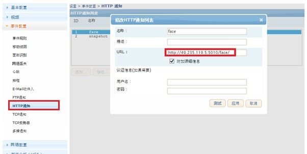
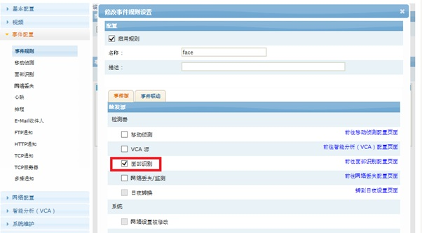
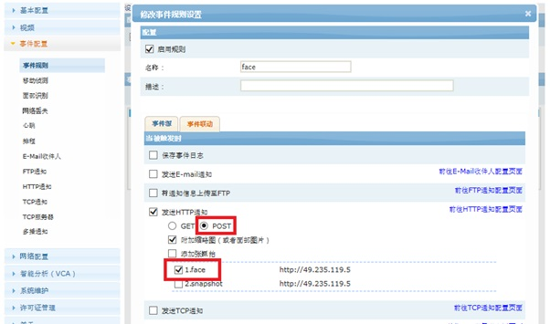

## 设置 面部检测(Face Detection)
### 人脸检测， 面部检测，
#### 功能 打开： 
事件设置->面部识别
<span style="color: red;">注意：以下功能启用时，面部识别会被禁用。</span>


信任度： 画面上检测到面部的信任度  
字符叠加： 画面上叠加方形的领域， 面部或者区域可以 第一码流，第二码流， 抓拍

#### 检测后图片推送
通过 ftp, http(POST) 方式可以推送全图片或者头像图片

#### HTTP 推送
建一个http通知规格  


```
http://{ServerIP}:{port}/{page}  

Example)
http://49.235.119.5:5010/face
```

#### 建 事件规格



事件源： 面部识别
时间联动：发送HTTP通知， POST方式（传图片）

#### HTTP 信息(POST)
``` 
Content-Type: multipart/form-data; boundary=~~
.
.
Content-Disposition: form-data; name="eventinfo"~~
.
.
Content-Disposition: form-data; name="image_x"; filename="image_x.jpg"\r\nContent-Type: image/jpeg'~~
.
.
Content-Disposition: form-data; name="snapshot"; filename="xxxxx.jpg"\r\nContent-Type: image/jpeg~~
.
.
```

Example of Paring POST Event data(python3.x)
```
def parsePostData(body): # body type byte, including image
    tmp =""
    rs = {'getstr':None, 'eventinfo':None, 'usn':None, 'productid':None, 'img_b64':None, 'snapshot_b64':None}

    regex_boundary = re.compile(b"Content-Type: multipart/form-data; boundary=([\-\w]+)", re.IGNORECASE)
    regex_getstr = re.compile(b"POST /(\S+) HTTP/1.1", re.IGNORECASE)
    regex_eventinfo = re.compile(b'Content-Disposition: form-data; name="eventinfo"\r\n\r\n(.+)\n', re.IGNORECASE)
    regex_thumbnail = re.compile(b'Content-Disposition: form-data; name="image_(\d+)"; filename="image_(\d+).jpg"\r\nContent-Type: image/jpeg', re.IGNORECASE)
    regex_snapshot = re.compile(b'Content-Disposition: form-data; name="snapshot"; filename="([\w_]+).jpg"\r\nContent-Type: image/jpeg', re.IGNORECASE)

    m = regex_boundary.search(body[0:600])
    if m:
        sbound = m.group(1)

    blocks = body.split(sbound)

    for block in blocks:
        if regex_getstr.search(block):
            rs['getstr'] = unquote((regex_getstr.search(block)).group(1).decode('ascii')).strip()
            rs['getstr'] = rs['getstr'][:255]

        elif regex_eventinfo.search(block):
            rs['eventinfo'] = regex_eventinfo.search(block).group(1).decode('ascii').strip()
            rs_t = dict(parse_qsl(urlparse("?" + rs['eventinfo']).query))
            rs['usn'], rs['productid'] = rs_t['usn'], rs_t['productid']
            tss = time.strptime(rs_t['isotime'], "%Y-%m-%dT%H:%M:%S 0800")
            rs['timestamp'] = int(time.mktime(tss)+8*3600)
            rs['datetime'] = time.strftime("%Y-%m-%d %H:%M:%S", tss)            

        elif regex_thumbnail.search(block):
            st = block.find(b'Content-Type: image/jpeg') + len(b'Content-Type: image/jpeg')
            ed = len(block)-2
            tmp = block[st:ed]
            tmp = b'data:image/jpg;base64,' + base64.b64encode(tmp.strip())
            rs['img_b64'] =  tmp.decode('ascii')

        elif regex_snapshot.search(block):
            st = block.find(b'Content-Type: image/jpeg') + len(b'Content-Type: image/jpeg')
            ed = len(block)-2
            tmp = block[st:ed]
            tmp =  b'data:image/jpg;base64,' + base64.b64encode(tmp.strip())            
            rs['snapshot_b64'] = tmp.decode('ascii')

    return rs
```

#### 测试 （Pyhton3.8）
``` 
import os, time, sys
from http.client import HTTPConnection, HTTPSConnection
from urllib.parse import urlencode
import socket
import re, base64, json

def recv_timeout(conn,timeout=2):
    conn.setblocking(0)
    total_data=[]
    data=''
    begin=time.time()
    while 1:
        if total_data and time.time()-begin > timeout:
            break
         
        elif time.time()-begin > timeout*2:
            break
         
        try:
            data = conn.recv(1024)
            if data:
                total_data.append(data)
                begin=time.time()
            else:
                time.sleep(0.1)
        except:
            pass
    return  b''.join(total_data)


try:
   s = socket.socket(socket.AF_INET, socket.SOCK_STREAM)
except socket.error:
   print ("Creating Socket Error")
   sys.exit()
                 
host = ''
port = int(sys.argv[1])
s.bind((host, port))
s.listen(1)
 
for i in range(0,10):
   conn, addr = s.accept()
   print （'client is at', addr）

   data = recv_timeout(conn) #<class 'byte'>
   conn.close()

  if data[0:20].find(b"POST /face") <0:
      print ("Invalid Face Data:%s...." %data[0:300])
      conn.close()
      continue
    
  rs = parsePostData(data)
  conn.close()
  s.close()
```

