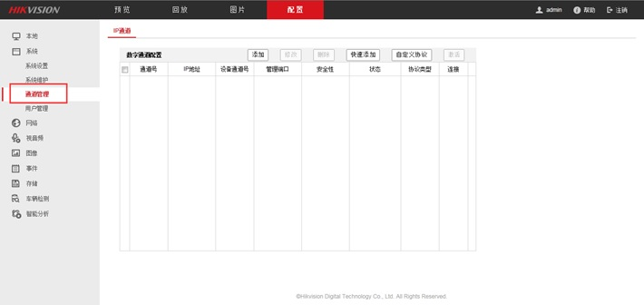
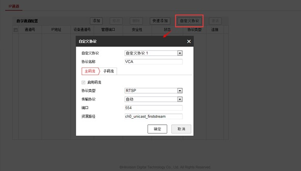
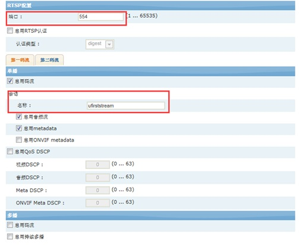
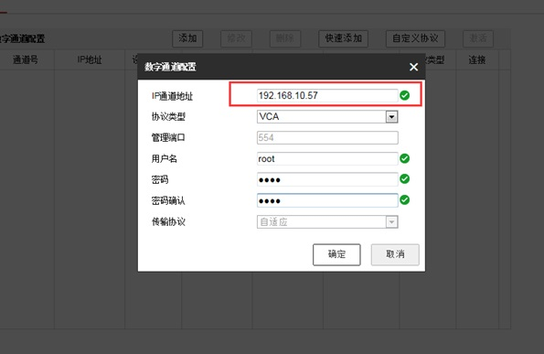
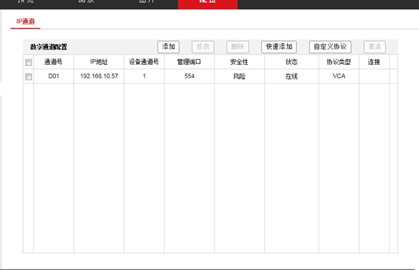

## 在海康NVR中添加VCA摄像机和编码器

### 1 介绍
有时打开NVR搜索不到想要添加的摄像机或者编码器的IP，这时候就需要通过NVR的网页设置来添加。操作过程中使用到了海康的NVR，型号：DS-7916N_E4。摄像机使用的是IPN100HD。  
注：配置界面视产品型号而定。

### 2 分三种情况操作
首先要知道NVR的IP和需要添加的摄像机（编码器）的IP地址，在IE浏览器中输入NVR的IP进入配置界面，找到有关通道管理的选项  

#### 2.1 快速添加
在通道管理的选项中，选择快速添加，可以查看到搜索到的设备的IP，选择需要添加设备的IP即可。  

#### 2.2 通过设备IP添加
当快速添加也搜索不到设备的IP时，通道管理中有直接添加的功能，在IP通道填写需要添加的设备的IP，选择协议，输入设备的用户名和密码。 

#### 2.3 新增协议添加
在通道管理中，添加新协议，协议名称可以自己编辑，端口号与资源路径需要用IE浏览器打开摄像机（编码器）的IP，在RTSP配置界面中可以看到端口号以及会话名称，会话名称中显示的信息就是我们所需要的资源路径
  
  
自定义协议设置好后，添加通道，在IP通道地址里输入需要添加的摄像机（编码器）的IP，选择刚才新建的协议，输入摄像机的用户名、密码  
  
添加成功后，IE浏览器上会显示状态为在线，NVR的显示器里会出现刚添加的摄像机所拍摄的画面

