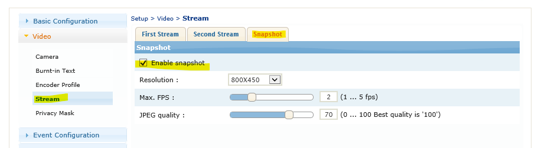
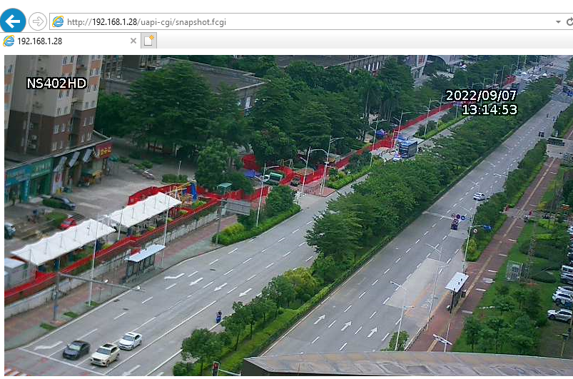
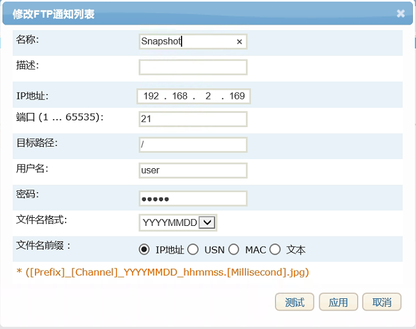
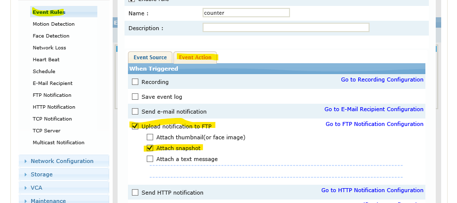

## 抓拍功能


#### 设备设置
enable snapshot function
  
设备 出厂默认是 已打开抓拍功能

#### 测试
cgi 命令 
主动 读取 设备的抓拍
```code
http://{device_ip}/uapi-cgi/snapshot.fcgi
```
  

#### 推送抓拍
1. FTP  
通过 ftp 协议 发送 图片， 可以 [下载 ftp测试软件](http://49.235.119.5/download.php?file=FTPServer.zip) 

	设置 FTP 服务器 软件  
	  

	设置 设备 FTP 推送  
	  

	设置 事件联动  
	

2. HTTP POST
POST 信息:
``` 
Event information  
Snapshot  
Etc (face detection)  
```
```code
POST / HTTP/1.1
Host: localhost:8000
User-Agent: Mozilla/5.0 (X11; Ubuntu; Linux x86_64; rv:42.0) Gecko/20100101 Firefox/42.0
Accept: text/html,application/xhtml+xml,application/xml;q=0.9,*/*;q=0.8
Accept-Language: en-US,en;q=0.5
Accept-Encoding: gzip, deflate
Connection: keep-alive
Content-Type: multipart/form-data; boundary=---------------------------
1608739476976036227291191343
Content-Length: 3268
----------------------------1608739476976036227291191343
Content-Disposition: form-data; name="eventinfo"
ip=192.168.168.153&usn=D3007A899&productid=Z004&datetime=2016-04-
04T16:40:29Z&type=face
&rulesname=faceevent&thumbnailcnt=2&hasthumbnail=yes&hassnapshot=yes
-----------------------------1608739476976036227291191343
Content-Disposition: form-data; name="snapshot";
filename="192.168.168.153_ch0_19810222_090000.000.jpg"
Content-Type: image/jpeg
����JFIF``��C
.......
----------------------------1608739476976036227291191343
Content-Disposition: form-data; name="object_0"
objectid=45821&zone=0&position=0,0,0,0
-----------------------------1608739476976036227291191343
Content-Disposition: form-data; name="image_0"; filename="image_00.jpg"
Content-Type: image/jpeg
����JFIF``��C
.......
----------------------------1608739476976036227291191343
Content-Disposition: form-data; name="object_2"
objectid=904950&zone=0&position=0,0,0,0
-----------------------------1608739476976036227291191343
Content-Disposition: form-data; name="image_1"; filename="image_01.jpg"
Content-Type: image/jpeg
����JFIF``��C
.......
-----------------------------1608739476976036227291191343--
```

  


