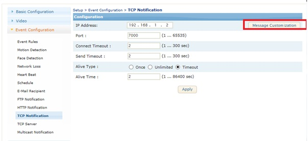
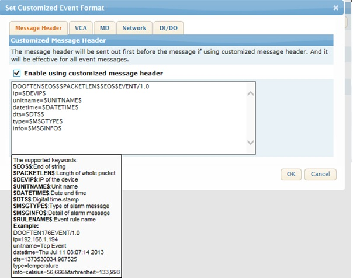
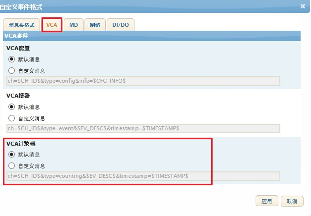
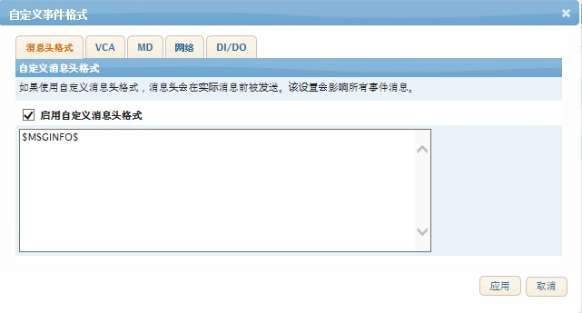

## 修改 事件信息(TCP 推送)

### 修改 事件信息， TCP Notification, TCP推送


```变量格式 $abcd$```



- $EOS$ : End of string, 一般 '\0'
- $PACKETLEN$ : Packet length, 信息长度 bytes
- $DEVIP$ : Device IP address, 设备IP地址， 设备本省的IP, 如推送到外网也是 局域网里面的地址
- $UNITNAME$ : Unit name， 设备名称
- $DATETIME$ : Datetime， 日期时间
- $DTS$ : Digital timestamp， 数字时间戳
- $MSGTYPE$ : Message type， 信息种类
- $MSGINFO$ : Message information, 信息
- $RULENAME$ : Rule name， 规格名称

也可以改 MSGINFO
如 $MSGTYPE=VCA 的话

  
```$EV_DESC$: event description, 事件描述  ```

---
Example)


只能收到
```code 
ch=0&type=counting&ct0[id=0,name=Counter 0,val=1484520]×tamp=1597896056.572724
```
