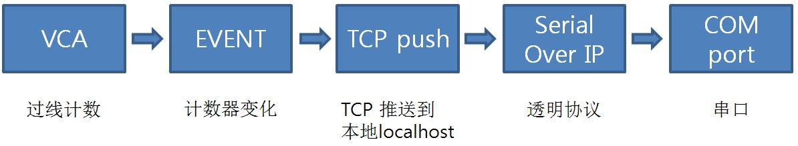
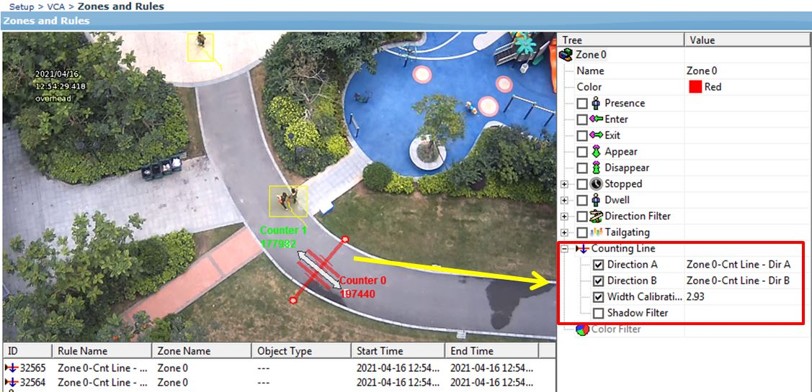
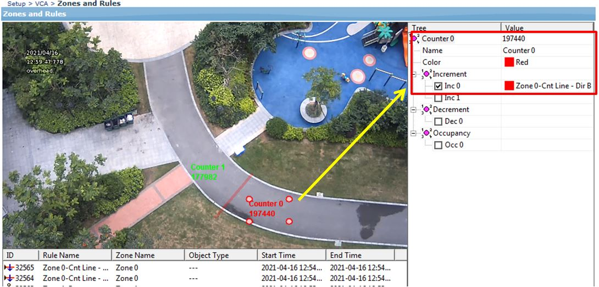
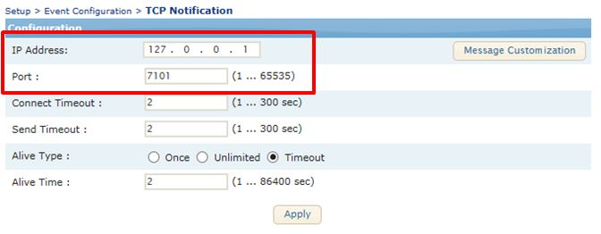
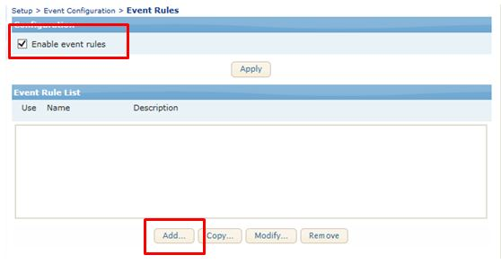
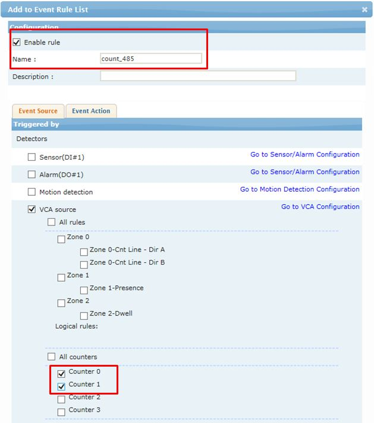
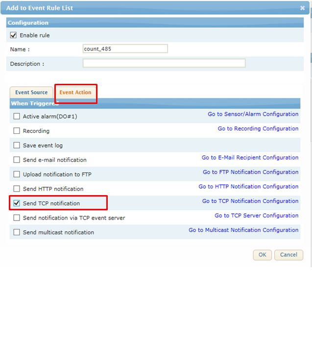

## 计数报警串口(RS485)推送

### 概念、原理

智能分析 规格里面 过线计数事件发生的话TCP信息推送， tcp 推送的时候发到设备本地(localhost, 127.0.0.1)  
透明协议是TCP(或者UDP)转换串口信息， 串口信息转换TCP(或者UDP)信息 的 协议。  

##### STEP1. 设置VCA 过线计数跟计数器

##### STEP2. 设置事件，TCP规则， 事件规则  
事件配置 -> TCP通知 ： IP地址为本地（127.0.0.1）， 记住端口。  
  
  
  
  

** 过线计数 计数器变化 通过TCP推送到本地

##### STEP3. 设置 透明协议(Serial over IP)  
** Mode 设置 SerialOverIP, SerialOverIP模式选择TCP服务器， 端口数字跟STEP2.的 端口一致。  

##### 测试
用 Hercules(<a href="http://49.235.119.5/download.php?file=hercules_3-2-5.zip" target="_blank">可以下载</a>) 测试， 设置 Serial 后打开串口。
> ** 过线计数发生时串口有事件信息了。   
<strong>推送信息修改</strong>：[参考这里](/help/view_markdown.php?pk=16) 