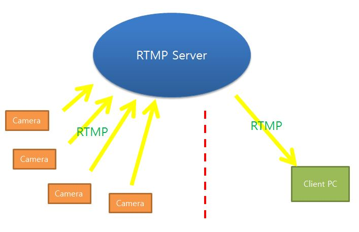
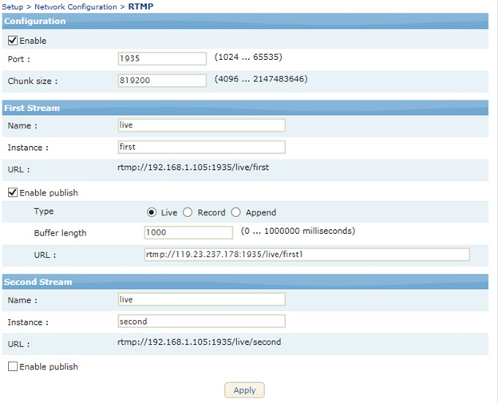
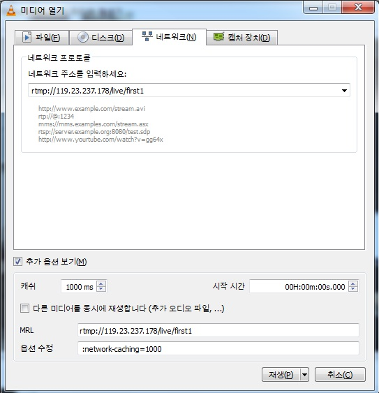
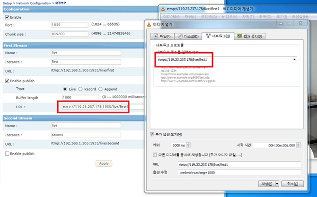

## RTMP PUSH (视频推送)

#### 概念
设备（摄像机）跟 客户端 不在 同一个局域网里面的时候， 提供可看视频、音频的办法
设备通过 rtmp 协议 发送到 rtmp 服务器， rtmp 服务器在 设备段可以连接，同时客户端也可以连接。
普通情况下 rtmp 服务器在 云端 或者 公网上。


#### 设备设置
  
Enable publish,  
```
URL : rtmp://<serverIP:port>/streampath /streamkey  
rtmp://119.23.237.178:1935/live/first1  
```
---

### RTMP 服务器安装(conf nginx with rtmp module)
- Linux Centos.
- NGINX
- RTMP 只要 实时的画面（不存储在服务器端）
	 
Centos
#### Install Lib
```code 
sudo yum install pcre pcre-devel openssl openssl-devel zlib zlib-devel -y
```
#### Download nginx && rtmp-module
```code
 cd ~/download/
 wget http://nginx.org/download/nginx-1.8.0.tar.gz
 wget https://github.com/arut/nginx-rtmp-module/archive/v1.1.7.zip
 ```
#### Extract zip
 ```code
 tar -xvf nginx-1.8.0.tar.gz
 unzip v1.1.7.zip
``` code
#### Configure
``` code 
cd nginx-1.8.0
./configure --add-module=../nginx-rtmp-module-1.1.7/
make
```
#### Install
```code 
sudo make install
```
#### Configuration usr/local/nginx/conf/nginx.conf
```code 
vi usr/local/nginx/conf/nginx.conf
.
.
.
rtmp {
       server {  
               listen 1935;  
               chunk_size 4096;  
 
               application live {  
                       live on;  
                       record off;  
               }
       }
}
.
.
.
```

<p> <s>#只要 Live， 下面的设置 不需要。</s></p>
<p><s># Add systemd </s></p>
<p><s># /usr/lib/systemd/system/nginx.service</s></p>

```code 
[Unit]
   Description=nginx - high performance web server
   Documentation=http://nginx.org/en/docs/
   After=network.target remote-fs.target nss-lookup.target
[Service]
   Type=forking
   PIDFile=/run/nginx.pid
   ExecStartPre=/usr/local/nginx/sbin/nginx -t -c /usr/local/nginx/conf/nginx.conf
   ExecStart=/usr/local/nginx/sbin/nginx -c /usr/local/nginx/conf/nginx.conf
   ExecReload=/bin/kill -s HUP $MAINPID
   ExecStop=/bin/kill -s QUIT $MAINPID
   PrivateTmp=true
[Install]
   WantedBy=multi-user.target
```

[Autoload]
```code 
   systemctl enable nginx.service
```
Config
이부분 생략하고…
Add rtmp{} Before http{};
rtmp_auto_push on;

```code
rtmp {
       server {
               listen 1935;
               chunk_size 4096;
               timeout 10s;
               # application record {
               #       live on;
               #       record all;
               #       record_path /Users/thonatos/workspace/localhost_cdndl/local_assets/flv/;
               #       # record_max_size 1M;
               #}
               application hls {
                       live on;
                       hls on;
                       hls_path /tmp/hls;
                       hls_fragment 5s;
                       # on_publish http://localhost:8035/event/status;
                       # on_done http://localhost:8035/event/status;
                       # on_publish_done http://localhost:8035/event/status;
               }
       }
}
```

```code
Add server in http{};
server {
   listen     8000;
location /hls {
   # Serve HLS fragments
   types {
       application/vnd.apple.mpegurl m3u8;
       video/mp2t ts;
   }
   root /tmp;
   add_header Cache-Control no-cache;
}
}
```
<p> 如果 已经装了 apache 服务器， web 端口要变更</p>
<p>#Web port 设置变更</p>

```code 
http {
   include      mime.types;
   default_type application/octet-stream;
 
   #log_format main '$remote_addr - $remote_user [$time_local] "$request" '
   #                 '$status $body_bytes_sent "$http_referer" '
   #                 '"$http_user_agent" "$http_x_forwarded_for"';
 
   #access_log logs/access.log main;
   sendfile       on;
   #tcp_nopush    on;
   #keepalive_timeout 0;
   keepalive_timeout 65;
 
   #gzip on;
   server {
       listen      8200;
       server_name localhost;
       #charset koi8-r;
       #access_log logs/host.access.log main;
       location / {
           root  html;
           index index.html index.htm;
       }
	}
}
```

只要 live 下面设置 不需要
```code
#Usage
send steam & play.
#Send
ffmpeg -re -i input.mp4 -c copy -f flv rtmp://192.168.3.8/hls/live
#Play
ffplay http://192.168.1.122:8080/hls/live.m3u8
```

<p>测试</p>

```code 
$ sudo /usr/local/nginx/sbin/nginx -s stop
$ sudo /usr/local/nginx/sbin/nginx
```
<p>客户端PC 上， </p>
<p> VLC Player， 版本 2.2.x 以上</p>



```code
rtmp://｛服务器地址｝/live/first1 #same as camera setting.
```

#### Install on Ubuntu
Most people who stream enjoy using services such as Twitch.tv or Ustream to deliver video to viewers, and that works well enough. But sometimes you want some more control over your stream, or you want other people to be able to stream to you, or you want to stream to multiple places, or any number of things that requires you to have access to an actual RTMP stream from an RTMP server. This guide will cover the very basics of setting up a simple RTMP server on a Linux computer. Don't worry, it's not too complicated, but having familiarity with Linux will certainly help.  

A couple things you can do with your own RTMP server that you might be interested in:
	- Stream to multiple external channels
	- Import other people's streams to incorporate for your own purposes (I use it in my casts for multiple camera angles, like in this video I did of a Tribes Ascend broadcast with multiple camera angles)
	
Alright, so how do you do these kinds of things?  
Step 1: Get a Server Box
	> Believe it or not, RTMP is actually extremely light on system resources. Essentially it just grabs data from the input and forwards it on to the output, simple data transfer. Don't believe me? My RTMP server for a long time was a Raspberry Pi, a $35 mini-computer, sitting under my desk, and it was capable of hosting at least 3 simultaneous streams, and I never even stressed it to see how many more it could handle. So I assure you, even a cheap old box would suffice.
	> If you don't have your own box, a VPS can also work. I recommend Linode or Digital Ocean as providers. Just make sure you have enough bandwidth...remember that bandwidth usage will be (the size of a stream) * (the number of people uploading + the number of people downloading). So when I have 2 streamers stream to my server, and I download both of them, I can chew up 10GB of bandwidth in 2 hours.  
	> I recommend using Ubuntu for the server software for the sake of ease, but you can obviously use whatever you want. As long as you get the dependencies for nginx somewhere besides apt, you can follow this guide just fine.  
	> Note to Windows users: This guide focuses on using Linux. If you want to use Windows, you can find Windows binaries for nginx with the RTMP module already included here: http://nginx-win.ecsds.eu/download/  
	> Note to Mac users: You can install nginx with the RTMP module via Homebrew: http://brew.sh/homebrew-nginx/  
	> If you are hosting your server in your home, you will have to forward TCP port 1935 to the box...this varies by router, so look up how to set up port forwarding for your router. Also, I recommend using a dynamic DNS service to overcome dynamic IP issues that come up with residential hosting.  

Step 2: Installing nginx with RTMP module  
	> Log into your box, and make sure you have the necessary tools to build nginx using the following command:
	```code 
	$ sudo apt-get install build-essential libpcre3 libpcre3-dev libssl-dev
	```
	> Now a bit of info about nginx (pronounced "engine-X"). nginx is an extremely lightweight web server, but someone wrote a RTMP module for it, so it can host RTMP streams too. However, to add the RTMP module, we have to compile nginx from source rather than use the apt package. Don't worry, it's really easy. Just follow these instructions. :)
	> From your home directory, download the nginx source code:
	```code 
	$ wget http://nginx.org/download/nginx-1.15.1.tar.gz
	```
		> As of this writing, the latest stable version of nginx is 1.15.1. You can find the latest version on the nginx download page.
		> Next, get the RTMP module source code from git:
	```code 
	$ wget https://github.com/sergey-dryabzhinsky/nginx-rtmp-module/archive/dev.zip
	```
		> Unpack/unzip them both, and enter the nginx directory:
	```code 
	$ tar -zxvf nginx-1.15.1.tar.gz
	$ unzip dev.zip
	$ cd nginx-1.15.1
	```
		> Now we build nginx:
	```code 
	$ ./configure --with-http_ssl_module --add-module=../nginx-rtmp-module-dev
	$ make
	$ sudo make install
	```
		> configure에서 에러가 나오는 경우가 있는데, gzip lib가 없는 경우가 그렇다.  설치하면 됨. 
	```code 
	# apt install zlib1g-dev;
	```
	 > And nginx is installed! By default it installs to /usr/local/nginx, so to start the server run the following command:
	```code 
		$ sudo /usr/local/nginx/sbin/nginx
	```
	> And to test to make sure nginx is running, point your browser to http://<your server ip>/ and you should get the "Welcome to nginx!" page.

Step 3: Configuring nginx to use RTMP  
	> Open your config file, located by default at /usr/local/nginx/conf/nginx.conf and add the following at the very end of the file:
```code 
rtmp {
       server {  
               listen 1935;  
               chunk_size 4096;  
 
               application live {  
                       live on;  
                       record off;  
               }
       }
}
```
	> This is an extremely basic configuration with a "live" application that simply forwards the RTMP stream on to whoever requests it. 
	> You can play with it some more later. Here's the whole configuration guide, which shows you how to forward streams to other places (such as Twitch), save recordings of uploads, output stats, etc.  
	> Restart nginx with:
```code 
	$ sudo /usr/local/nginx/sbin/nginx -s stop
	$ sudo /usr/local/nginx/sbin/nginx
```

Step 4: Testing!  
	> Your server should now be ready to accept RTMP streams! Let's try it out.  
	> Create a new profile in OBS, and change your Broadcast Settings thusly:
	> Streaming Service: Custom
	> Server: rtmp://<your server ip>/live
	> Play Path/Stream Key: test
	> You may be wondering where that play path "test" came from. Well, we just made it up, just now. You can basically make up any play path and stream to it, and put that path into an RTMP player, and it will play back. For simple purposes, authentication isn't necessary in my experience.  
	> You should now be able to start streaming to your server. If you hit "Start Streaming" and don't get an error from OBS, that's a good sign.
	> So how do you watch it? The easiest way to do so is with VLC (v2.1.0 or later). Just Open a Network Stream and enter in rtmp://<your server ip>/live/test as the URL. If it all worked right, then you should now be seeing your stream in VLC!
	> You now have a working RTMP server! Congrats!

What now? 
You can add the stream to OBS itself using the Media source or VLC source, or use something like JWPlayer to play back the RTMP stream on a web site you set up.
You can also use your RTMP server to forward to other streaming services and channels! Underneath the "record off;" line in your nginx.conf, add the following:  
push rtmp://<other streaming service rtmp url>/<stream key>  
And any stream streamed to that application will be forwarded on to the other service, as well as being served up from the server! You can add multiple "pushes" to forward the stream to multiple locations.