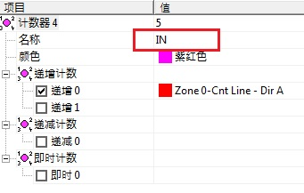
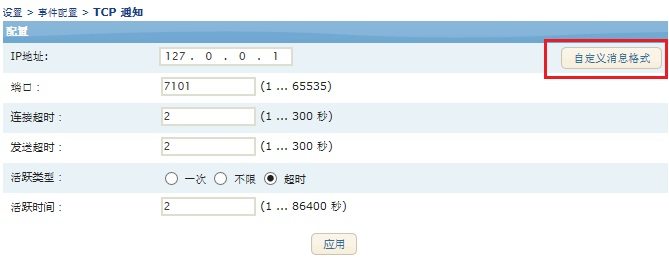
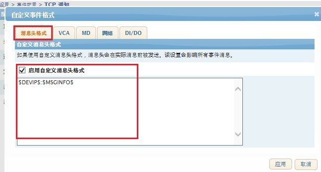
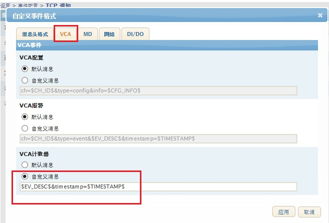
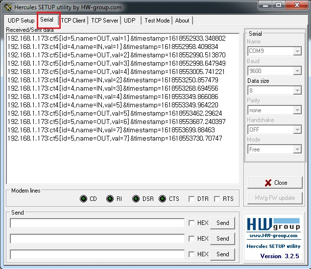
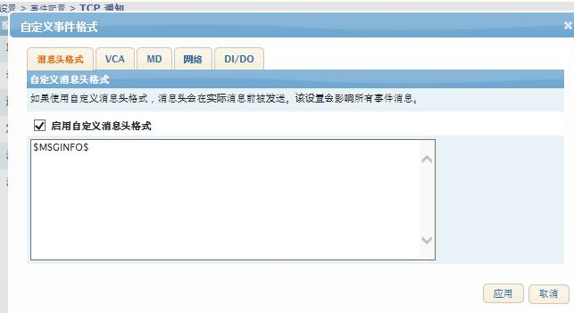
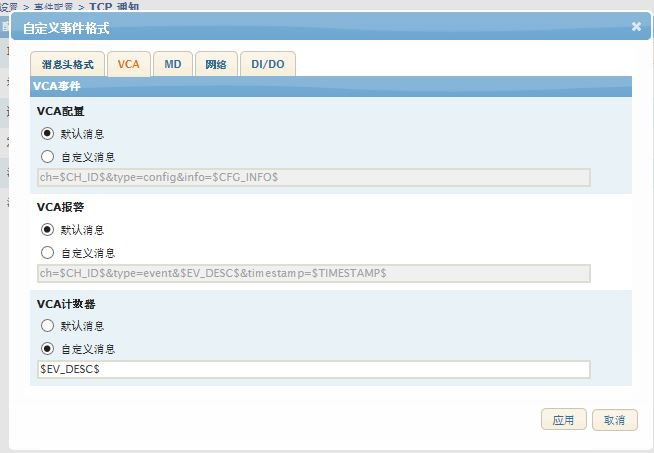
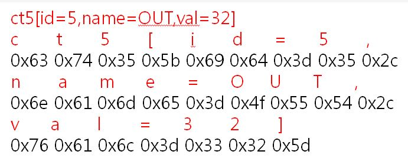

## 计数信息简化（RS485信息）

### 目标
#### 默认事件信息(TCP)
```code 
DOOFTEN305EVENT/1.0 ==> DOOFTEN: event header, 305:packet length（事件信息长度）
ip=192.168.1.28 ==> 设备IP地址
unitname=NS1402HD-6117 ==>设备名称
datetime=Thu Aug 20 11:45:24 2020 ==> 事件发生时间
dts=1597895124.710534 ==> digital timestamp（数字时间戳）
type=vca ==> 事件种类
info=ch=0&type=counting&ct0[id=0,name=Counter 0,val=1484238]×tamp=1597895124.710534 ==>事件信息
id=741AA02A-004B-465E-9D09-FC9FC057E5B5 ==>事件推送id
rulesname=counter ==> 时间规格名称
rulesdts=1597895124.925337 ==>事件规格发生时间（事件推送时间）
```
#### 简化
设备IP地址：计数信息&发生事件(DTS)
```code 
192.168.1.173:ct5[id=5,name=OUT,val=1]×tamp=1618552933.348802
192.168.1.173:ct4[id=4,name=IN,val=1]×tamp=1618552958.409834
192.168.1.173:ct5[id=5,name=OUT,val=2]×tamp=1618552990.513870
192.168.1.173:ct5[id=5,name=OUT,val=3]×tamp=1618552998.647949
192.168.1.173:ct5[id=5,name=OUT,val=4]×tamp=1618553005.741221
192.168.1.173:ct4[id=4,name=IN,val=2]×tamp=1618553250.857479
192.168.1.173:ct4[id=4,name=IN,val=3]×tamp=1618553268.694556
192.168.1.173:ct4[id=4,name=IN,val=4]×tamp=1618553349.866086
192.168.1.173:ct4[id=4,name=IN,val=5]×tamp=1618553349.964220
```

#### 设置
1. 改成计数器名称IN和OUT  
 

2. 改TCP通知-> 自定义消息格式  
  
  
``` 输入 $DEVIP$:$MSGINFO$  ```
  
``` 输入 $EV_DESC$×tamp=$TIMESTAMP$ ```  

#### 测试）

```code
192.168.1.173:ct5[id=5,name=OUT,val=7]×tamp=1618553730.70747
192.168.1.173:ct4[id=4,name=IN,val=8]×tamp=1618553918.763296
```
#### 改TCP 自定义消息格式为（最简单的 计数信息）


```code 
ct4[id=4,name=IN,val=30]
ct4[id=4,name=IN,val=32]
ct5[id=5,name=OUT,val=36]
ct5[id=5,name=OUT,val=38]
ct5[id=5,name=OUT,val=39]
ct4[id=4,name=IN,val=33]
ct5[id=5,name=OUT,val=40]
```
Hex Code 是
```code 
ct5[id=5,name=OUT,val=32]
	=> 0x63 0x74 0x35 0x5b 0x69 0x64 0x3d 0x35 0x2c 0x6e 0x61 0x6d 0x65 0x3d 0x4f 0x55 0x54 0x2c 0x76 0x61 0x6c 0x3d 0x33 0x32 0x5d
```
  
处理设备 用 这个 信息 处理。