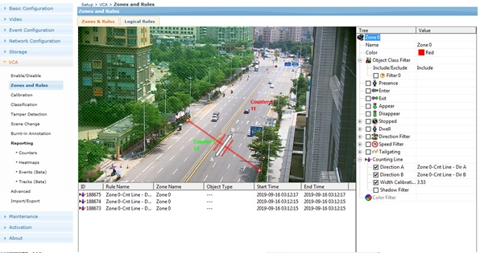
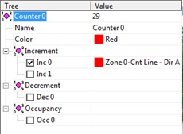
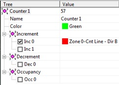
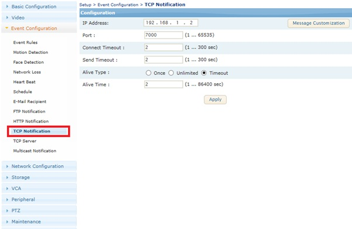
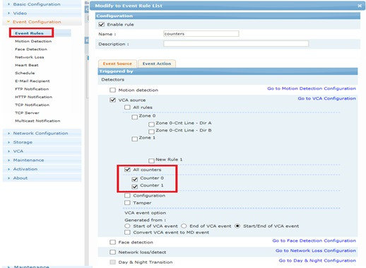
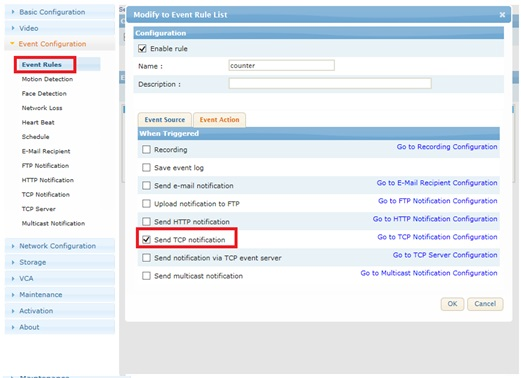
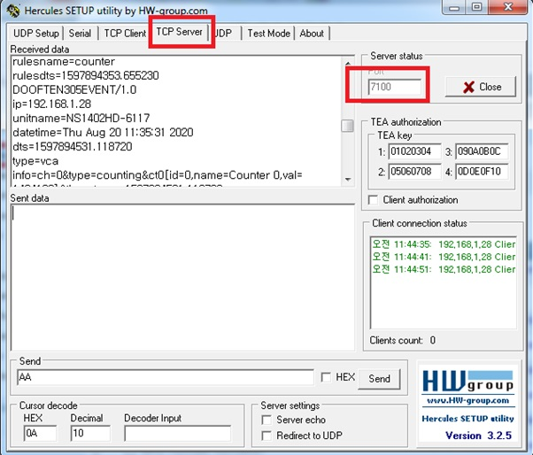

## 计数 事件 推送(TCP)

#### 设置 Counting Line 与 计数器 
  
 

#### TCP PUSH Setting (TCP Notification) 

TCP 消息推送， IP address 为 服务器的 IP 地址  

#### 计数器 跟 http 推送 联动  


事件原 ： 计数器（counter 0, counter 1） 的 变化。  
事件目标 ： TCP notification

#### 测试
用 Hercules （可以 http://[ts_server]/download.php?file=hercules_3-2-5.zip 下载）  


#### Event 格式
```code 
DOOFTEN$EOS$$PACKETLEN$$EOS$EVENT/1.0
ip=$DEVIP$
unitname=$UNITNAME$
datetime=$DATETIME$
dts=$DTS$
type=$MSGTYPE$
info=$MSGINFO$
```
Example)
```code 
DOOFTEN305EVENT/1.0 ==> DOOFTEN: event header, 305:packet length（事件信息长度）
ip=192.168.1.28 ==> 设备IP地址
unitname=NS1402HD-6117 ==>设备名称
datetime=Thu Aug 20 11:45:24 2020 ==> 事件发生时间
dts=1597895124.710534 ==> digital timestamp（数字时间戳）
type=vca ==> 事件种类
info=ch=0&type=counting&ct0[id=0,name=Counter 0,val=1484238]×tamp=1597895124.710534 ==>事件信息
id=741AA02A-004B-465E-9D09-FC9FC057E5B5 ==>事件推送id
rulesname=counter ==> 时间规格名称
rulesdts=1597895124.925337 ==>事件规格发生时间（事件推送时间）
```
 - {event_info} : counter的 事件 消息  
		 ch={channel_no}&type=counting&ct{id_num}[id={id}, name={Counter_name}, val={Counter_val}]timestamp={timestamp}&id={Event_id}
 
Example:
```code 
info=ch=0&type=counting&ct0[id=0,name=Counter 0,val=1484238]×tamp=1597895124.710534  => info=[事件信息]
ch=0: 视频通道0, 摄像机只有一个通道， 一般情况 0
type=counting: 事件种类是 计数（计数器变化，counting)
ct0[id=0, name=Counter 0, val=1484238]: 计数器 id=0, 名称=Counter 0， 数值= 1484238
timestamp=1597895124.710534: 事件（计数器变化）发生时间（dts)
```
