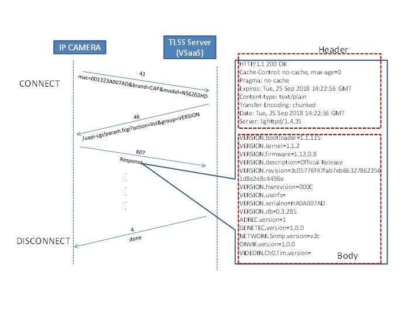
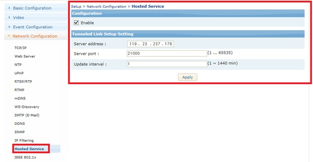

##托管服务 (TLSS, Tunneled Link Setup Setting, Hosted Service, VSaaS)

### Tunneled Link Setup Setting, VSaaS(Video service as a service)
Draft by Hans Kim (2018-09-25)


#### 动作原理（protocol)
1. 摄像机 主动连接TLSS 服务器： 发送自己身份（mac=00xxxxxx&brand=cap&model=NS202HD)
2. TLSS 服务器收到身份后 发cgi命令（/uapi-cgi/param.fcgi?action=list~)
3. 设备反应 对应的信息发给TLSS 服务器
4. 服务器可以再发cgi命令，设备回复
5. 服务器 结束通讯的时候 发 'done' 命令
 

#### packet 格式
```|PACKET LENGTH | MESSAGE |  ```
- PACKET LENGTH : 信息或者命令的长度， 4bytes integer
- MESSAGE : CGI 命令 或者 设备的回复信息
 

为了使用VSaaS功能，必须要有VSaaS服务器  
#### 设备设置
为了使用VSaaS，首先要通过链接设备的Web，设置VSaas相关参数。  
- SETUP -> System Options -> Hosted Service
- 打勾设置Enable
- 输入target server IP/Domain
- 输入target server port
- 输入update interval




#### 设备与服务器之间通信API
设备启动或隔一定时间段链接服务器时，最初会传送以下形态的数据。

Connection: (Camera->server)  
Socket Received : %length%  
Socket Received : mac=%mac%&brand=%brand%&model=%model%  
%length% : 信息长度, 4bytes integer.
Example)  
 - Socket Send : 41
 - Socket Send : mac=001323A007AD&brand=CAP&model=NS6202HD

 CGI 命令(Server -> Camera)  
 Socket Send : %length%  
 Socket Send :%HTTP API%  
 Example)  
 - Socket Send : 125  
 - Socket Send : /cgi-bin/operator/countreport.cgi?reportfmt=csv&from=now-06:00&to=now&counter=active&sampling=600&order=Descending&value=diff 
 
 收到回复信息（Camera -> Server)  
 Socket Received : %length%  
 Socket Received :%message%  
 Example)  
 - Socket Received : 2014  
 - Socket Received : 200 OK \n Records:60 Counter:2,0:Counter 0,1:Counter 1\n2020-04-01 06:00, 123,342,32\n2020-04-01 07:00,32~  
 
 结束通讯  
 Socket Send : 4  
 Socket Send : done\0 
 
 #### Socket Connection Timeout
 值固定为7秒， 设备连接服务器（发送身份）后 7秒钟 没有收到cgi 命令， 7秒钟后再发身份。或者 发送回复信息后 没有收到另外cgi命令或者done\0命令， 7秒周后再连接。
 
 #### 可用的CGI命令
 ```  
 所有参数 ：/uapi-cgi/param.fcgi?action=list  
 计数报表：/cgi-bin/operator/countreport.cgi?reportfmt=csv&from=now-06:00&to=now&counter=active&sampling=600&order=Descending&value=diff  
热力图：uapi-cgi/reporthm.cgi?reportfmt=csv&from=yesterday&to=today&table=3&individual=no  
```
所有的 cgi命令， 参考VCAsys HTTP API Specification.pdf  

<span style="color: red;">测试程序(python2.7)</span>
```python 
import socket
import sys
import struct
import time
 
def recv_timeout(the_socket, timeout=2):
   the_socket.setblocking(0)
   total_data=[];
   data='';
   begin=time.time()
   while True:
       if total_data and time.time()-begin > timeout:
           break
        
       elif time.time()-begin > timeout*2:
           break
        
       try:
           data = the_socket.recv(1024)
           if data:
               total_data.append(data)
               begin=time.time()
           else:
               time.sleep(0.1)
       except:
           pass
   return ''.join(total_data)
 
 
                 
def send_command(the_socket, cmd=''):
    length = len(cmd)
    num = struct.pack("BBBB", length&0xFF, (length>>8)&0xFF, (length>>16)&0xFF, (length>>24)&0xFF)
    rs = "send_message:length :%d num:%4d\n\r %s" %(length, len(num), cmd)
    the_socket.send(num)
    the_socket.send(cmd)
               
    return rs
     
     
def recv_message(the_socket):
   the_socket.setblocking(1)
   data_num = the_socket.recv(4)
   num = ord(data_num[0]) + (ord(data_num[1])<<8) + (ord(data_num[2])<<16) + (ord(data_num[3])<<24)
   rs = recv_timeout(the_socket)
   info = "received message: %d, %d,%02X %02X %02X %02X" %(len(rs), num, ord(data_num[3]),ord(data_num[2]),ord(data_num[1]),ord(data_num[0])) 
   print info
   return rs

     
try:
   s = socket.socket(socket.AF_INET, socket.SOCK_STREAM)
    
except socket.error:
   print ("Creating Socket Error")
   sys.exit()
                     
host = ''
port = int(sys.argv[1])
s.bind((host, port))
s.listen(1)
     
for i in range(0,10):
   conn, addr = s.accept()
   print 'client is at', addr
   print recv_message(conn)
     
   print send_command(conn, "/uapi-cgi/param.fcgi?action=list&group=VERSION")
   rs = recv_message(conn)
   print rs
                     
   print send_command(conn, "/uapi-cgi/param.fcgi?action=list&group=BRAND")
   rs = recv_message(conn)
   print rs
     
   print send_command(conn, "/cgi-bin/operator/countreport.cgi?reportfmt=csv&from=now-06:00&to=now&counter=active&sampling=600&order=Descending&value=diff")
   rs = recv_message(conn)
   print rs
   
   print send_command(conn, "done\0")
 
conn.close()
s.close()
```

<span style="color: red;">测试程序(C, GCC)</span>
```c
#include <sys/types.h>
#include <sys/socket.h>
#include <netinet/in.h>
#include <arpa/inet.h>
#include <netdb.h>
#include <stdio.h>
#include <string.h> 
#include <unistd.h> 
#include <stdlib.h>
  
#define SERV_TCP_PORT  21000 
  
int send_cgi(int newsockfd, char cgi_str[1024])
{
    int retcode;
    int size;
 
    size = strlen(cgi_str);
    retcode = send(newsockfd,&size, 4, 0);
    if (retcode < 0) {
        printf("*** ERROR - send() failed1 \n");
        return -1;
    }
    retcode = send(newsockfd, cgi_str, size, 0);
    if (retcode < 0) {
        printf("*** ERROR - send() failed2 \n");
        return -1;
    }
    printf("\nsent message(%d) : %s\n", size, cgi_str);
    return 0;
}
 
char* receive_stream(int newsockfd)
{
    char in_buff[1440]; 
    char* result;
    unsigned int size=0, ptr=0;
    unsigned int num = 0;
 
    if ((size = recv(newsockfd, in_buff, 4,0)) < 0 ) { 
         puts( "Server: readn error1!");
         exit(1);
    }
    num = (in_buff[0]&0xFF) | ((in_buff[1]&0xFF)<<8) | ((in_buff[2]&0xFF)<<16) | ((in_buff[3]&0xFF)<<24);
    printf("\nString Length = %d : %02X %02X %02X %02X", num, in_buff[0],in_buff[1],in_buff[2],in_buff[3]);
    result = (char*)malloc(sizeof(char)*num);
    while(num > 0) {
         size = recv(newsockfd, in_buff, 1440,0);
         if (size < 0 ) {
              puts( "Server: readn error2!");
              exit(1);
         }
         else if(size == 0) {
              break;
          }
                                  
         strcpy(result+ptr, in_buff);
         num -= size;
         ptr += 1440;
//       printf("reading newsockfd from Client = %d::%d\n", num, size);
//       printf("Server: Received String = %s \n", in_buff);
    }
    printf(":%d\n", strlen(result));
    return result;
}
 
 
int main ( int argc, char* argv[] ) {
    int sockfd, newsockfd, clilen;
    struct sockaddr_in cli_addr;
    struct sockaddr_in serv_addr;
    char* temp;
    int size, i;
 
//  create tcp socket to get sockfd
    if ( (sockfd = socket(AF_INET, SOCK_STREAM,0)) < 0 ) {
         puts( "Server: Cannot open Stream Socket.");
         exit(1);
    }
 
    bzero((void *) &serv_addr, sizeof(serv_addr));
    serv_addr.sin_family = AF_INET;
    serv_addr.sin_addr.s_addr = htonl( INADDR_ANY );
    serv_addr.sin_port = htons(SERV_TCP_PORT);

//  bind your socket with the address info  
    if ( bind(sockfd, (struct sockaddr*) &serv_addr, sizeof(serv_addr))<0 ) {
         puts( "Server: Cannot bind Local Address.");
         exit(1);
    }
//  set listen args   
    listen(sockfd, 5);
    clilen = sizeof( cli_addr );
    while(1) {
         newsockfd = accept(sockfd,(struct sockaddr*) &cli_addr, &clilen);
         if ( newsockfd < 0 ) {
               puts("Server: accept error!");
               exit(1);
         }
                                  
         temp = receive_stream(newsockfd);
         printf("%s", temp);
                                  
         send_cgi( newsockfd,"/uapi-cgi/param.fcgi?action=list&group=VERSION" );
         temp = receive_stream(newsockfd);
         printf("\n======================\n%s", temp);
                                  
         send_cgi( newsockfd,"/uapi-cgi/param.fcgi?action=list&group=BRAND" );
         temp = receive_stream(newsockfd);
         printf("\n======================\n%s", temp);
                                  
         send_cgi( newsockfd,"/cgi-bin/operator/countreport.cgi?reportfmt=csv&from=now-06:00&to=now&counter=active&sampling=600&order=Descending&value=diff" );
         temp = receive_stream(newsockfd);
         printf("\n======================\n%s", temp);
 
         send_cgi( newsockfd,"/uapi-cgi/reporthm.cgi?reportfmt=csv&from=yesterday&to=today&table=3&individual=no" );
         temp = receive_stream(newsockfd);
         printf("\n======================\n%s", temp);
                                  
         send_cgi(newsockfd,"done\0");
         close( newsockfd );             
 
   }
   close( newsockfd );             
   close( sockfd );
 
   return 0;
}
```

测试软件(windows64) : 这是测试用的软件, 可能有很多问题。  
[下载](http://49.235.119.5/download.php?file=test_tlss-win64.exe)


